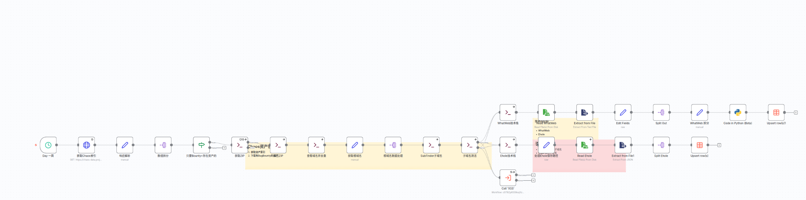
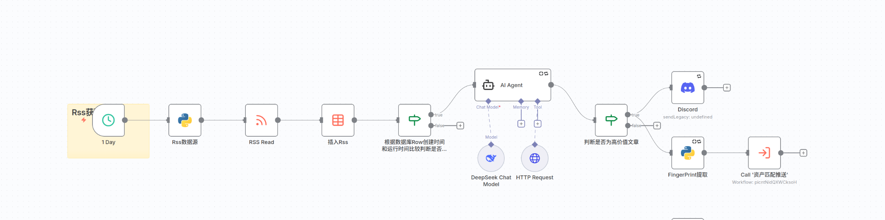
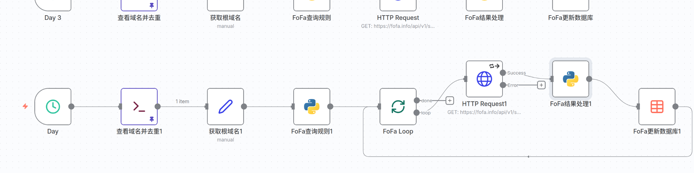
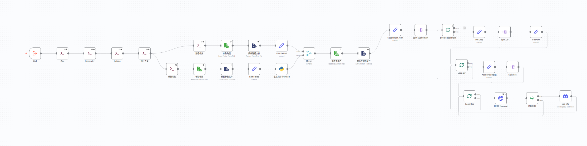

- https://www.youtube.com/watch?v=PemrRgzckVE&t=2s
- https://github.com/ethicxlhuman/n8n-for-bug-bounty
## n8n

### 环境安装
- https://github.com/n8n-io/n8n


```bash
npx n8n
```

- [http://localhost:5678](http://localhost:5678)


### Demo！！！

1. 触发条件：  每隔12小时 执行一次：   
2. 进行Http请求 ：信息收集：  
### 案例1： 判断CVE是否对BugBounty有用

- n8n社区的力量： https://n8n.io/workflows/?q=New+CVE
	- https://n8n.io/workflows/8283-monitor-new-cves-for-bug-bounty-hunting-with-gemini-ai-and-slack-alerts/


## Hiroki-N8N

### V1
- [子域名+资产收集](media/子域名+资产收集.json)  ： Chaos下载资产   
- [Rss](media/RSS.json) ： 收集相关文章 ---> AI判断与漏洞赏金相关性 ---> Discord   
- [FoFa](media/FoFa.json) : 子域名和资产收集到的子域名 ，给FoFa进行资产收集   
- [CVE] : 每隔20min 监控CVE更新，AI判断与漏洞赏金相关性 ，并提取指纹
- [资产匹配](media/资产匹配推送.json)： 当Rss / CVE 提取的指纹与FoFa数据库和Chaos数据库 匹配时， 进行推送   
- [路径收集+XSS](media/路径收集+XSS.json)：爬虫+XSS检测 （循环子域名 --> 循环路径和Payload ）   


### V2

- 使用 Nuclei检测Xss
```bash
⼦域名劫持
Nginx 的错误配置
Apache 的错误配置
各种未授权⾯板泄露
Elasticsearch 未授权
Springboot heap dump 泄露
缓存相关漏洞
HAE铭感信息 + AI KEY泄露
```
- 根据N神 完善 路径FUZZ 和参数收集  

