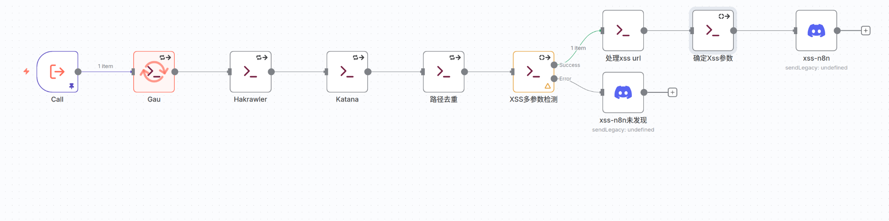

- https://www.youtube.com/watch?v=PemrRgzckVE&t=2s
- https://github.com/ethicxlhuman/n8n-for-bug-bounty
## n8n

### 环境安装
- https://github.com/n8n-io/n8n


```bash
npx n8n
```

- [http://localhost:5678](http://localhost:5678)


### Demo！！！

1. 触发条件：  每隔12小时 执行一次：     
2. 进行Http请求 ：信息收集：    
### 案例1： 判断CVE是否对BugBounty有用

- n8n社区的力量： https://n8n.io/workflows/?q=New+CVE
	- https://n8n.io/workflows/8283-monitor-new-cves-for-bug-bounty-hunting-with-gemini-ai-and-slack-alerts/


## Hiroki-N8N

### V1
- [子域名+资产收集](media/子域名+资产收集.json)  ： Chaos下载资产 （**在根域名数据处理这里要loop ，然后 让xss返回 ，这样不容易炸**）  
- [Rss](media/RSS.json) ： 收集相关文章 ---> AI判断与漏洞赏金相关性 ---> Discord   
- [FoFa](media/FoFa.json) : 子域名和资产收集到的子域名 ，给FoFa进行资产收集   
- [CVE] : 每隔20min 监控CVE更新，AI判断与漏洞赏金相关性 ，并提取指纹（n8n丟失了 GG）
- [资产匹配](media/资产匹配推送.json)： 当Rss / CVE 提取的指纹与FoFa数据库和Chaos数据库 匹配时， 进行推送   
- [路径收集+XSS](media/路径收集+XSS.json)：爬虫+XSS检测 （循环子域名 --> 循环路径和Payload ） 
	- 这里后面 改成了 ：先循环子域名 ，然后再根据**子域名**提取参数和路径，然后合并路径和参数 循环（要不然容易炸）


### V2
#### Xss 
- [Xss v2](media/xss%20v2.json)        
  
- 多参数：`multiple` / 单参数：`single`
- **多参数检测 不是error 分支， 而是 IF stdout 是否为空，为空则没有xss，不为空则存在**

- 使用 Nuclei检测Xss


### Todo

```bash
⼦域名劫持
Nginx 的错误配置
Apache 的错误配置
各种未授权⾯板泄露
Elasticsearch 未授权
Springboot heap dump 泄露
缓存相关漏洞
HAE敏感信息 + AI KEY泄露
```
- 根据N神 完善 路径FUZZ 和参数收集  
- ==AI验证漏洞== 我感觉 只需要 漏洞可能预期响应 的附近HTML结构 就可以
```ai
https://xxxxx.com/?q=z'z"z>z< ----> response
	response | grep "z'z"z>z<"  ----> 漏洞预期响应相关代码
		AI提示词验证漏洞存在 ---> 给出验证poc


----------------------

系统提示词：

背景：我正在对URL参数进行XSS漏洞检测，通过Fuzz测试发现参数值在响应中未正确转义。

测试方法：向所有参数注入测试向量 z'z"z<z/z 并检查响应中的转义情况

当前发现：在以下响应片段中检测到未转义的特殊字符：

<h2 align=center>欢迎用户1z'z"z<z/z123\x1</h2>


分析要点：
• 单引号、双引号、尖括号等特殊字符未被转义
• 输入出现在 <h2> 标签的文本内容中

请求：
1. 确认这是否是XSS漏洞
2. 识别存在漏洞的具体参数
3. 提供最简化的有效Payload
4. 解释漏洞利用原理

期望输出格式：
• 漏洞确认：[是/否]
• 存在漏洞的参数：[参数名]
• 简化Payload：[具体payload]
• 漏洞原理：[简要说明]


示例输入：
	link: https://xxx.com/?q=z'z"z>z<z/z
	code:<h2 align=center>欢迎用户1z'z"z<z/z123\x1</h2>
	 
示例输出：
漏洞确认：是
存在漏洞的参数：name
简化Payload：<script>alert(1)</script> 或 '>
漏洞原理：name参数值未经HTML编码直接插入到<h2>标签中，攻击者可以插入任意HTML/JavaScript代码，闭合当前标签并执行恶意脚本。
```
