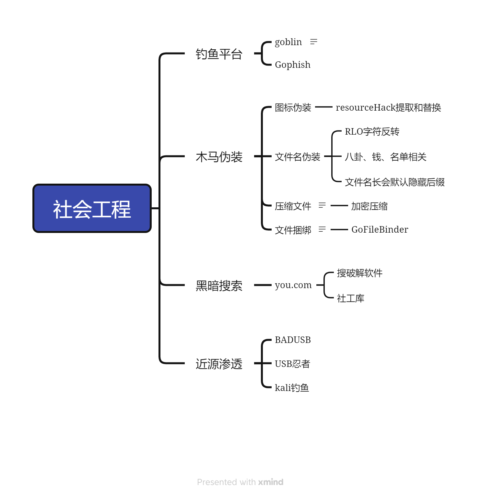

  
## 运营
1. 小红书 / 抖音 / 脉脉  -- 黑市买号（认证 / 可以增加成功率） / 找入职的成员 --- 伪装学妹 / 学弟 /不同部门的人，发马
2. 微信号 --- 朋友圈更新不频繁 ， 一个月一两条 ， 两三年养号


## 钓鱼平台


### 搭建钓鱼平台
- SMTP 25 端口 + gophish钓鱼平台（SPF记录smtp服务的ip地址） admin@root.com
	- SPF伪造漏洞  字典  /   key（域名）=value（ip地址）
	- 相近的字母域名   
	- qq邮箱 / google邮箱 （ 这样就不能伪造邮箱）

1. 确定服务器是否满足自建smtp服务 `telnet smtp.qq.com 25`   
2. 安装`postfix`
3. 修改配置文件：`/etc/postfix/main.cf`  
```main.cf
myhostname = mail.test.com
mydomain = test.com
myorigin = $mydomain
inet_interfaces = all
inet_protocols = ipv4
mydestination = $myhostname, localhost.$mydomain, localhost,$mydomain
mynetworks = 192.168.0.0/16，127.0.0.0/8
home_mailbox = Maildir/
smtpd_banner = $myhostname ESMTP
```
4. 启动`systemctl start postfix`
5. 安装mailx发送测试邮件
```bash
yum install mailx
echo "email content" | mail -s "title" xxxx@qq.com
```
6. 安装go-phish
```bash
wget https://github.com/gophish/gophish/releases/download/v0.12.1/gophish-v0.12.1-linux-64bit.zip
unzip gopphish-*.zip
```
修改配置⽂件config.json  
admin_server是后台管理⻚⾯，将127.0.0.1 改为 0.0.0.0，默认开放的端⼝3333。  
phish_server是钓⻥⽹站，默认开放80端⼝。
## CobaitStrike克隆页面
