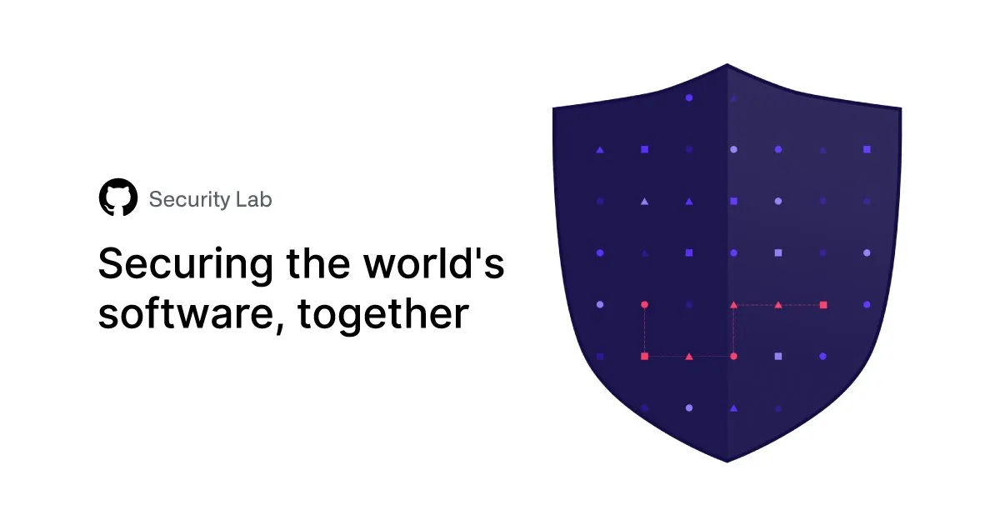
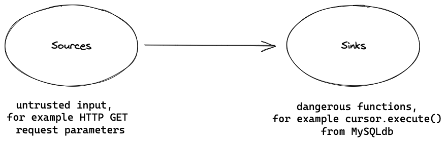
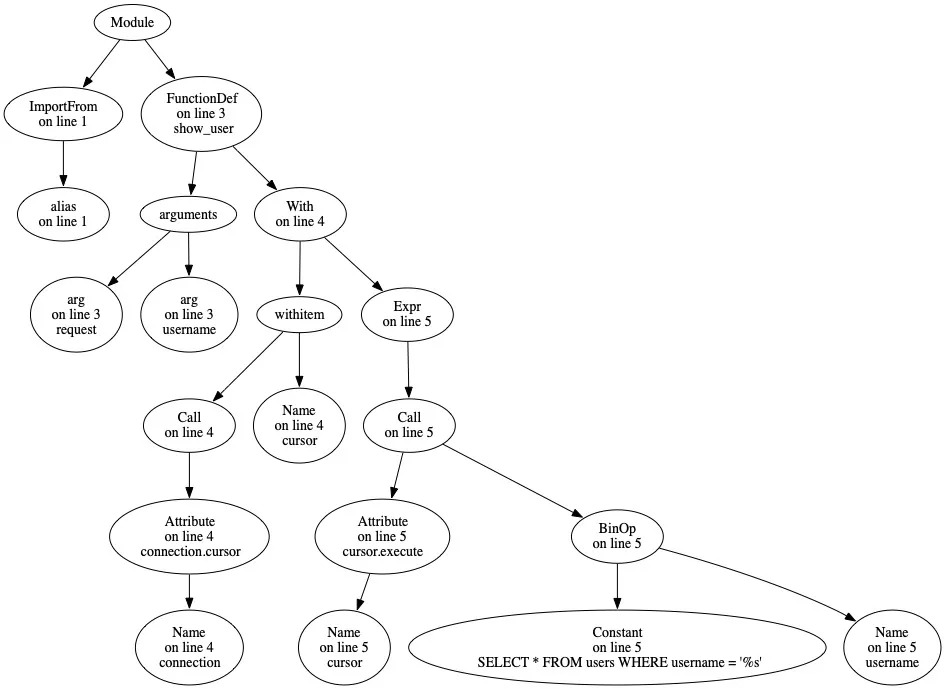
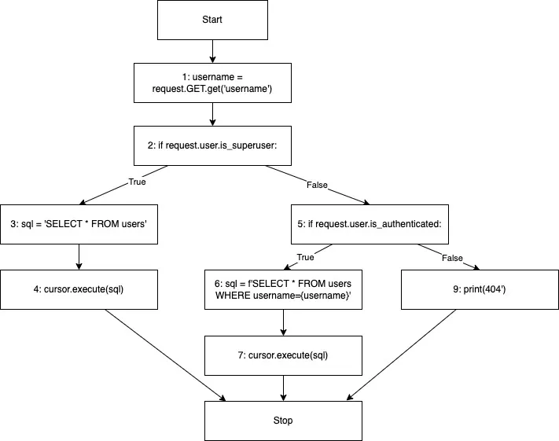
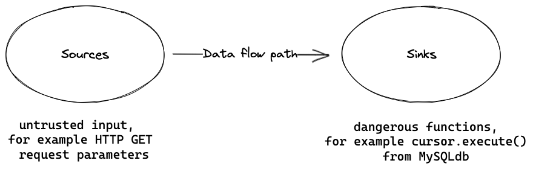
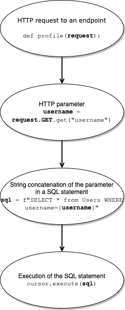
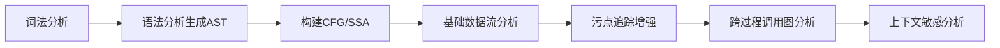

#codeview #codeql
#代码审计 

>静态分析（静态代码分析或静态程序分析）是一种无需执行代码本身即可分析应用程序代码以发现潜在错误的过程。该技术可用于执行各种检查、验证并突出显示代码中的问题。在GitHub，我们通过语义分析引擎CodeQL进行代码扫描来实现静态分析。
  

## 漏洞检测 -- sources and sinks

- 静态分析擅长检测的一类漏洞是==注入漏洞==，这类漏洞包含数十种子类型
- 注入漏洞的**核心成因**在于：程序将不受信任的用户可控输入传递给了敏感或危险函数。在静态分析中，我们用**数据流**（data flow）、**源点**（sources）和**汇点**（sinks）等术语来描述这一过程。
- 用户输入通常来自应用程序的入口点——即数据的源头。例如HTTP请求的GET/POST参数，或程序的命令行参数，这些都被称为 **"源点"(sources)**。
- 以SQL注入为例，Python中MySQLdb库的`MySQLCursor.execute()`方法，或是能执行任意表达式的内置函数`eval()`，都属于若未经净化直接传入不可信数据就会引发危险的函数，这类高危函数被称为 **"汇点(sinks)"**。需要注意的是，函数本身具有危险性并不等同于必然存在可被利用的漏洞——许多汇点通过正确使用完全可以规避风险。
- 只有当未净化的用户可控输入通过代码路径直达危险函数时，漏洞才会真正形成。换言之，必须存在从源点到汇点的完整**数据流**路径。  
	- 举个🌰：若Django框架中通过GET请求获取的用户可控参数，未经处理就直接传入MySQLdb库的`cursor.execute()`函数，就可能引发SQL注入。
	- 再举个🌰：在用户输入表单中，若将POST请求的参数直接传递给`eval()`函数执行，则可能导致代码注入漏洞。


## 寻找 sources and sinks

既然已知漏洞通过**源点**（sources）进入程序，并在**汇点**（sinks）触发执行，我们可通过两种路径检测漏洞：  
1️⃣ **正向追踪**：从源点出发，分析数据是否流向敏感函数（汇点）  
2️⃣ **逆向溯源**：从汇点回溯，检查是否有未净化的源点数据流入  

例如，在Python Django项目中手动检测时，可使用`grep`工具搜索`request.GET`等源点：  
```python
username = request.GET.get("username")  # 正确匹配的源点示例
```  
但此方法存在两大痛点：  

**痛点一：噪声干扰**  
`grep`会同时匹配无关内容：  
```python
def request_check(req): ...          # 误报：无害函数名  
# This processes a request from the server    # 误报：注释中的关键词  
```  
导致大量**误报（false positives）**，需人工二次筛选。  

**痛点二：覆盖范围有限**  
- 单次仅能检测一类源点（如GET请求），忽略POST请求、命令行参数等其他入口  
- 即使仅关注GET请求，一个项目可能包含数十处调用，但其中真正流向汇点的屈指可数  
- 数据在程序中可能经历复杂传播路径（变量赋值、函数传参等），人工追踪效率低下  

同理，若从汇点（如`eval()`）逆向溯源：  
```python
eval(user_input)                     # 危险汇点  
```  
需排查项目中所有`eval`调用，并逐条验证是否接收未净化的用户输入——这对于大型代码库犹如大海捞针。  

**传统正则匹配的局限性**  
- 误报率高：无法理解代码语义，仅依赖关键词匹配  
- 扩展性差：无法追踪跨文件/跨函数的数据流  
- 维护成本高：需为不同框架/语言定制正则规则  

**静态分析工具的进化**  
早期安全审查工具（如Fortify、Checkmarx）正是为解决这些问题而生。它们通过构建**代码属性图（CPG）**，实现：  
✅ 精确识别源点与汇点（避免误报）  
✅ 自动化数据流分析（追踪污染传播路径）  
✅ 支持多语言/框架的漏洞模式库  


### 早期静态分析工具——词法模式匹配


静态分析的许多步骤与编译器工作流程异曲同工——事实上，编译器本身就在执行某种静态分析（如类型检查）。类型检查通过验证对象类型是否符合上下文预期，能有效消除整类错误。这启发我们将编译器技术（如词法分析）引入安全审查领域。  

**痛点突破：噪声过滤**  
传统`grep`工具会误抓注释和函数名中的关键词，而**词法分析（Lexical Analysis）** 可解决此问题。该技术将源代码字符流转换为 **词法单元（Token）** 流，自动忽略无关语义的字符（如注释、空格）。每个Token包含类型、行列位置及内容信息。  

以存在SQL注入漏洞的Django代码为例：  
```python
from django.db import connection

def show_user(request, username):
    with connection.cursor() as cursor:
        cursor.execute("SELECT * FROM users WHERE username = '%s'" % username)
```  
`from django.db import connection`经词法分析后生成以下Token流（使用Python的`tokenize`库解析）：  
```lua
# 表示文件编码声明，类型63是ENCODING类型的token
# 这里指定了文件使用utf-8编码
TokenInfo(type=63 (ENCODING), string='utf-8', start=(0, 0), end=(0, 0), line='')

# 类型62是NL（New Line）换行符，表示空行
TokenInfo(type=62 (NL), string='\n', start=(1, 0), end=(1, 1), line='\n')

# 开始解析第二行代码（Python的token行号从0开始）
# 类型1是NAME，表示标识符/关键字，这里的"from"是Python导入语法关键字
TokenInfo(type=1 (NAME), string='from', start=(2, 0), end=(2, 4), line='from django.db import connection\n')

# "django"是导入的包名
TokenInfo(type=1 (NAME), string='django', start=(2, 5), end=(2, 11), line='from django.db import connection\n')

# 类型54是操作符（OP），这里的点号表示包层级分隔符
TokenInfo(type=54 (OP), string='.', start=(2, 11), end=(2, 12), line='from django.db import connection\n')

# "db"是django包的子模块
TokenInfo(type=1 (NAME), string='db', start=(2, 12), end=(2, 14), line='from django.db import connection\n')

# "import"是导入关键字
TokenInfo(type=1 (NAME), string='import', start=(2, 15), end=(2, 21), line='from django.db import connection\n')

# "connection"是要导入的具体对象
TokenInfo(type=1 (NAME), string='connection', start=(2, 22), end=(2, 32), line='from django.db import connection\n')

# 类型4是NEWLINE，表示语句结束的换行符
TokenInfo(type=4 (NEWLINE), string='\n', start=(2, 32), end=(2, 33), line='from django.db import connection')  
```  

**知识库驱动的漏洞检测**  
早期工具（如ITS4、Flawfinder、RATS）引入**漏洞知识库**，其中预定义危险函数（汇点）特征。当Token流匹配到知识库中的汇点模式时，工具会标记潜在风险。例如检测到`cursor.execute()`调用时触发告警，并提示SQL注入风险。  

**阶段性成果与遗留问题**  
✅ 通过词法分析消除注释/函数名误报  
✅ 基于知识库实现源点/汇点的自动化识别  
⚠️ 但工具仍会报告大量**无害汇点调用**（如已净化的用户输入）  

**关键挑战：建立源汇关联**  
真正的漏洞需存在**从源点到汇点的数据流路径**。如何自动化验证这种关联？这引出了静态分析的核心课题——  
> **数据流分析（Data Flow Analysis）**  
> 通过追踪变量赋值、函数传参等路径，构建程序中数据的流动轨迹，判断污染数据是否抵达危险函数。  
- 词法分析 → 语法分析 → 控制流/数据流分析 → 上下文敏感分析

### 语法模式匹配、抽象语法树与控制流图


最早的静态分析工具仅利用编译器理论中的一项技术——词法分析。提高漏洞检测精度的关键方法之一是通过引入更多编译器理论中的技术。随着时间推移，静态分析工具逐步采用了编译器领域的更多技术，例如语法解析（parsing）和抽象语法树（AST）。尽管存在多种静态分析方法，我们将重点探讨最流行的技术之一——结合污点分析（taint analysis）的数据流分析（data flow analysis）。

---

#### 从token到AST
在完成代码的令牌（token）扫描后，可以将其转换为更抽象的表示形式，以便更高效地查询代码结构。常见方法之一是将代码解析为解析树（parse tree）并构建抽象语法树（AST）——我们更关注后者。抽象语法树是源代码的树形表示形式，它使我们能够从处理令牌流转向处理具有语义结构的代码表示。AST中的每个节点都有其类型，这些类型反映了代码的"语义"（即代码的"含义"）。例如，一个方法调用会被表示为树中的一个节点，其限定符（qualifier）和参数则作为子节点存在。通过抽象语法树，我们可以更便捷地在分析中定位目标代码。在此阶段，利用AST可以高精度检测某些简单漏洞，例如禁用了CSRF保护或应用程序在调试模式下运行。

---

##### 可视化示例：Python代码的AST表示
为直观展示，我们以存在SQL注入漏洞的Python程序为例，展示其AST。通过Python的`ast`和`astpretty`模块，可将代码解析为抽象语法树。以下是程序的部分AST：

```python
```less
Module(
    body=[
        ImportFrom(
            lineno=2,
            col_offset=0,
            end_lineno=2,
            end_col_offset=32,
            module='django.db',
            names=[alias(lineno=2, col_offset=22, end_lineno=2, end_col_offset=32, name='connection', asname=None)],
            level=0,
        ),
        FunctionDef(
            lineno=5,
            col_offset=0,
            end_lineno=7,
            end_col_offset=78,
            name='show_user',
            args=arguments(
                posonlyargs=[],
                args=[
                    arg(lineno=5, col_offset=14, end_lineno=5, end_col_offset=21, arg='request', annotation=None, type_comment=None),
                    arg(lineno=5, col_offset=23, end_lineno=5, end_col_offset=31, arg='username', annotation=None, type_comment=None),
                ],
                vararg=None,
                kwonlyargs=[],
                kw_defaults=[],
                kwarg=None,
                defaults=[],
            ),
            body=[
                With(
                    lineno=6,
                    col_offset=4,
                    end_lineno=7,
                    end_col_offset=78,
                    items=[
                        withitem(
                            context_expr=Call(
                                lineno=6,
                                col_offset=9,
                                end_lineno=6,
                                end_col_offset=28,
                                func=Attribute(
                                    lineno=6,
                                    col_offset=9,
                                    end_lineno=6,
                                    end_col_offset=26,
                                    value=Name(lineno=6, col_offset=9, end_lineno=6, end_col_offset=19, id='connection', ctx=Load()),
                                    attr='cursor',
                                    ctx=Load(),
                                ),
                                args=[],
                                keywords=[],
                            ),
                            optional_vars=Name(lineno=6, col_offset=32, end_lineno=6, end_col_offset=38, id='cursor', ctx=Store()),
                        ),
                    ],
                    body=[
                        Expr(
                            lineno=7,
                            col_offset=8,
                            end_lineno=7,
                            end_col_offset=78,
                            value=Call(
                                lineno=7,
                                col_offset=8,
                                end_lineno=7,
                                end_col_offset=78,
                                func=Attribute(
                                    lineno=7,
                                    col_offset=8,
                                    end_lineno=7,
                                    end_col_offset=22,
                                    value=Name(lineno=7, col_offset=8, end_lineno=7, end_col_offset=14, id='cursor', ctx=Load()),
                                    attr='execute',
                                    ctx=Load(),
                                ),
                                args=[
                                    BinOp(
                                        lineno=7,
                                        col_offset=23,
                                        end_lineno=7,
                                        end_col_offset=77,
                                        left=Constant(lineno=7, col_offset=23, end_lineno=7, end_col_offset=66, value="SELECT * FROM users WHERE username = '%s'", kind=None),
                                        op=Mod(),
                                        right=Name(lineno=7, col_offset=69, end_lineno=7, end_col_offset=77, id='username', ctx=Load()),
                                    ),
                                ],
                                keywords=[],
                            ),
                        ),
                    ],
                    type_comment=None,
                ),
            ],
            decorator_list=[],
            returns=None,
            type_comment=None,
        ),
    ],
    type_ignores=[],
)
```


---

##### AST的可视化与代码对照
通过Python的`ast`模块解析代码，并使用`graphviz`库生成简化的AST图形表示（为提高可读性，图中省略了部分细节）。以下是原始代码与AST的对照：

**代码片段**：
```python
1. from django.db import connection  # 导入数据库连接模块
2.
2. def show_user(request, username):  # 定义视图函数
3.     with connection.cursor() as cursor:  # 获取数据库游标
4.         cursor.execute("SELECT * FROM users WHERE username = '%s'" % username)  # 存在SQL注入风险的查询
```
  
**AST关键节点**：
- `Module`：代码模块根节点
  - `ImportFrom`：对应第1行的`from ... import`语句
  - `FunctionDef`：第3行的函数定义
    - `args`：函数参数列表（`request`, `username`）
    - `With`：第4行的`with`上下文块
      - `Call`：`connection.cursor()`方法调用
      - `Assign`：将游标赋值给`cursor`
    - `Expr`：第5行的表达式
      - `Call`：`cursor.execute()`方法调用
        - `BinOp`：字符串格式化操作（`%`），此处导致SQL注入漏洞
---

##### 方法调用节点与AST的查询能力
正如前文所述，AST中的方法调用会被表示为特定类型节点。通过可视化（如上图），我们可以清晰地看到第5行的`Call`节点（对应方法调用），其限定符（如`cursor`）和参数（如SQL语句）均以子节点形式呈现。

**基于AST的代码查询示例**：  
1. **定位特定方法调用**：搜索`django.db`库中所有的`execute`方法调用节点  
   ```python
   # AST查询伪代码示例
   find_nodes(type=Call, qualifier="django.db.execute")
   ```
   → 仅返回目标方法调用，过滤其他无关节点类型  

2. **识别危险调用模式**：筛选参数非字符串字面量（string literal）的`execute`调用  
   ```python
   # 添加参数类型过滤条件
   filter(call_node => call_node.arguments[0].type != "Str")
   ```
   → 排除安全调用（如`cursor.execute("SELECT * FROM safe_table")`）  
   → 捕获高风险调用（如示例中`"SELECT ... %s" % username`的动态拼接）  


#### 控制流图（CFG）增强分析精度
为进一步提升分析准确性，需结合**控制流图**（Control Flow Graph, CFG）。CFG描述程序所有可能执行路径中基本语句（primitive statements）的执行顺序：  
- **节点**：对应代码中的基本语句（如赋值、条件判断）  
- **边**：表示语句间的执行顺序可能性  

以下列存在条件分支的SQL注入代码为例：  
```python
1. username = request.GET.get("username")  # 获取用户输入
2. if request.user.is_superuser:           # 管理员分支
3.    sql = "SELECT * FROM users"          # 静态安全查询
4.    cursor.execute(sql)                  
5. elif request.user.is_authenticated:     # 认证用户分支
6.    sql = f"SELECT * FROM users WHERE username={username}"  # 动态拼接（高危！）
7.    cursor.execute(sql)                  
8. else:                                   # 未认证分支
9.    print("404")                        
```


---

#####  技术价值解析
1. **CFG的漏洞定位优势**  
   - 明确漏洞触发条件：示例中**仅当用户通过认证但非管理员时**（第5-7行），动态SQL拼接才会被执行  
   - 识别跨条件数据流：跟踪`username`从第1行输入到第6行查询的完整传播路径  

2. **AST与CFG的协同分析**  
   ```mermaid
   graph LR
   A[词法分析] --> B[生成AST]
   B --> C[识别execute调用]
   C --> D[构建CFG]
   D --> E{动态参数流入execute?}
   E -->|是| F[标记为潜在漏洞]
   E -->|否| G[排除误报]
   ```
   通过AST定位敏感方法调用，结合CFG验证数据流可行性，实现**高精度漏洞检测**。  

---

### 数据流分析与污点追踪

#### 数据流分析的原理与局限
通过控制流图（CFG），我们可以验证特定**数据源**（source）与**危险函数调用点**（sink）之间是否存在数据流连接，这种技术称为**数据流分析**。该技术结合控制流图、调用图（Call Graph）和静态单赋值形式（SSA）来模拟数据在代码中的传播路径。但其核心限制在于：仅追踪**值保持不变的数据**。例如，当字符串经过拼接操作（如`str1 + str2`）生成新值时，数据流分析将丢失原变量的追踪路径——这正是前文示例中动态SQL拼接场景的典型问题。

#### 污点追踪的技术突破
污点追踪（taint tracking）采用差异化规则解决上述问题：
1. **污染标记**：将用户可控的输入（如`request.GET.get("username")`）标记为"受污染"（tainted）
2. **传播规则**：即使数据经过转换（如字符串插值、对象属性赋值），污染状态仍持续传递
3. **终结点检测**：当污染数据流入危险函数（如`cursor.execute()`）时触发告警
  
**代码示例**：
```python
1. from django.db import connection
2.
2. def profile(request):
3.    with connection.cursor() as cursor:
4.        username = request.GET.get("username")  # 污染源
5.        sql = f"SELECT * FROM users WHERE username={username}"  # 污染传播
6.        cursor.execute(sql)  # 污染终结点
```
  
**分析过程对比**：
| 分析类型        | 追踪能力                        | 示例结果判断               |
|-----------------|--------------------------------|---------------------------|
| 数据流分析      | 丢失变量`username`到变量`sql`的关联    | 漏报SQL注入               | 
| 污点追踪        | 保持`username→sql`的污染链     | 准确告警                  |

#### 误报控制与净化机制
静态分析工具通过**净化函数识别**降低误报：
1. **内置净化库**：自动识别标准安全函数（如`MySQLdb.escape_string()`）
2. **传播阻断**：当污染数据流经净化函数时终止追踪链
3. **自定义扩展**：支持用户定义项目特有净化方法

**误报处理场景**：
```python
# 安全场景：污染数据被净化
safe_username = sanitize(username)  # 自定义净化函数
cursor.execute(f"SELECT * FROM users WHERE username={safe_username}")  # 不触发告警
```

#### 其他内部表示形式
| 表示形式            | 核心作用        | 应用场景      |
| --------------- | ----------- | --------- |
| 调用图（Call Graph） | 描述函数间调用关系   | 跨函数数据流分析  |
| SSA形式           | 确保每个变量仅赋值一次 | 提升数据流分析精度 |

#### 静态分析工具架构全景
典型静态分析工具的三层架构：
1. **解析层**：将源码转换为AST/CFG等中间表示
2. **表示层**：构建多种代码模型（AST/CFG/SSA/调用图）
3. **分析层**：基于模型执行数据流/污点追踪等算法

#### 技术演进路线



## Todo
- [ ] 写一个简单的静态分析工具
- [ ] 在不同的脆弱性中找到潜在的源和汇
	- [ ] https://codeql.github.com/codeql-query-help/python/
- [ ] 分析最新的注入漏洞之一
	- [ ] [Cve-2025-3248](obsidian://open?vault=Noah-s_Ark&file=%E5%85%A8%E6%A0%88%E4%BB%A3%E7%A0%81%E5%AE%A1%E8%AE%A1%2FPython%2FCve%E7%A0%94%E7%A9%B6%2FCVE-2025-3248)

## link
- https://ieeexplore.ieee.org/document/4221615?arnumber=4221615

