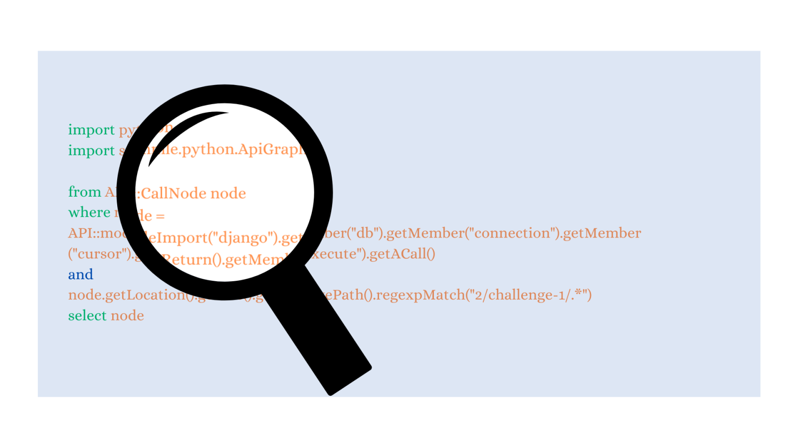
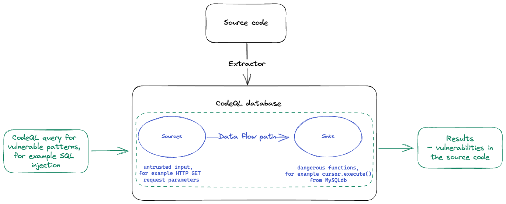

#codeview #codeql
#代码审计 

  

## 概述
- https://github.blog/developer-skills/github/codeql-zero-to-hero-part-2-getting-started-with-codeql/
### Codeql
>CodeQL 是由 Semmle（2019 年被 GitHub 收购）开发的强大静态代码分析工具，其核心技术源自牛津大学团队十余年的研究成果。该工具通过**数据流分析（data flow analysis）**和**污点分析（taint analysis）**技术，能够检测代码缺陷、评估代码质量并识别安全漏洞。目前支持的语言包括 C/C++、C#、Go、Java、Kotlin、JavaScript、Python、Ruby、TypeScript 和 Swift。

CodeQL 的核心原理是将代码转化为可分析的数据结构。其工作流程分为两步：  
1. **构建事实数据库**：通过解析目标代码，生成包含程序结构、变量关系等信息的数据库；  
2. **QL 查询分析**：使用专有的 **QL 查询语言**（一种声明式逻辑查询语言），对数据库进行模式匹配，从而定位漏洞（例如 SQL 注入）。    

QL 语言具有高表达力与灵活性，支持开发者自定义查询规则。CodeQL 的查询库完全开源，任何开发者均可编写、共享和优化检测规则，共同完善漏洞检测生态。

### 常见用途

CodeQL 不仅支持漏洞的自动化扫描，还可作为探索代码库和辅助人工测试的工具。其应用场景包括但不限于：

- **自动化漏洞扫描**：支持对源代码中数百种漏洞类型进行扫描。参见此处的 [CWE 支持列表](https://github.com/github/codeql/blob/main/docs/codeql-cli/supported-cwes.md)。
- **变体分析**：若在代码库中发现某类漏洞（例如 SQL 注入），可利用 CodeQL 检查代码库其他位置是否存在同类漏洞的不同变体。
- **辅助人工代码审查**：我们可以针对已分析的代码库“向 CodeQL 提问”，例如：
    - **攻击面分析**：我的攻击面在哪里？应从何处开始审计？
    - **源定位**：代码库中存在哪些sources（即不受信任的用户输入）？
    - **汇识别**：代码库中存在哪些sinks（危险函数）？
    - **数据流追踪**：源是否最终流向危险或不受信任的功能？

## Codeql使用
### Github Action 使用Codeql
体验 CodeQL 最便捷的方式是在 GitHub 仓库中启用 **CodeQL GitHub Action 代码扫描功能**。GitHub Actions 作为持续集成/持续交付（CI/CD）平台，可自动化实现构建、测试及部署流程。其中，"Action" 指代 GitHub Actions 平台上执行复杂但高频任务的定制化应用模块。**代码扫描（code scanning）** 便是此类 Action 之一，其核心功能即通过 CodeQL 执行扫描。  

**快速配置**：对于 Python、JavaScript 等解释型语言项目，配置过程高度自动化且无需编译；而 C/C++ 等编译型语言项目需额外步骤，可参考[官方指南](https://docs.github.com/en/code-security/code-scanning/automatically-scanning-your-code-for-vulnerabilities-and-errors/configuring-the-codeql-workflow-for-compiled-languages)进行设置。  

#### 挑战1 ： 