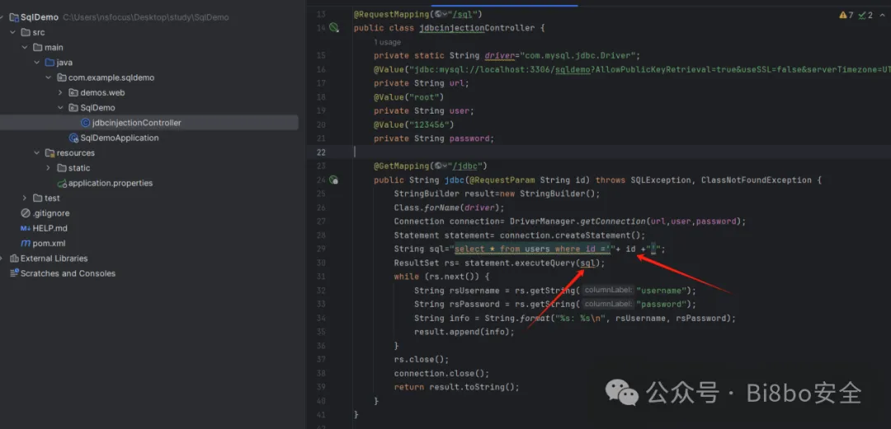
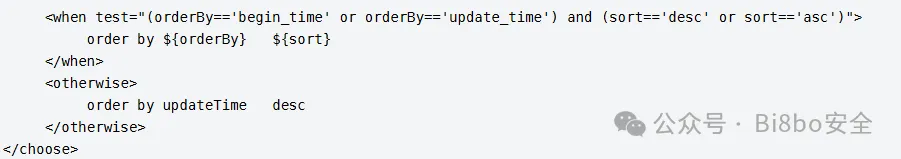

#codeview
#java 

## 审计注意点
>是否使用预编译技术，预编译是否完整。定位 SQL 语句上下文，查看是否有参数直接拼接，是否有对模糊查询关键字的过滤。Mybatis 框架则搜索 ${}，四种情况无法预编译：like 模糊查询、order by 排序、范围查询 in、动态表名/列名，只能拼接，所以还是需要手工防注入，此时可查看相关逻辑是否正确。


### 关键函数或字符串查找
```Java
Statement  
createStatement
PrepareStatement
like '%${
in(${
in (${
select
update
insert
delete
${
setObject(
setInt(
setString(
setSQLXML(
createQuery(
createSQLQuery(
createNativeQuery(
```

## JDBC

### Statement  动态拼接
>SQL语句动态拼接导致的SQL注入漏洞是先前最为常见的场景

**存在漏洞前提**
1. 动态拼接参数
2. 使用java.sql.Statement 执行SQL语句
3. 未定义参数类型

>- `createStatement() `：创建一个 Statement 对象，之后可使用 `executeQuery() `方法执行SQL语句。
>- `executeQuery(String sql)` 方法：执行指定的 SQL 语句，返回单个 ResultSet 对象。

  
根据案例可以看到用户可以传入参数id，id未经过任何处理直接拼接到SQL语句里，然后使用executeQuery()执行了SQL语句。运行代码进行调试测试。
  


### PrepareStatement 错误的预编译
>预编译（`使用? 作为占位符将SQL语句进行预编译，确定语句结构，再传入参数进行执行查询`）是能够有效防止注入的，但是存在预编译使用错误的情况，最后导致SQL注入的产生

#### 预编译正确写法

- `setstring(1,username)` 将第一个? 替换为username
  

#### 错误配置
- 虽然使用了preparestatement方法
- 但是还是动态拼接，所以还是有sql注入漏洞
  
在上述案例中就是虽然使用了preparestatement预编译，但是未对参数进行标记而导致了SQL注入产生。启动代码调试  
  


### Order by注入
>在SQL语句中， order by 语句用于对结果集进行排序。而order by 语句后面需要是字段名或者字段位置，无论是preparestatement还是mybatis中，都无法直接预编译，因为会将传入的参数用单引号包裹，从而认为传入的是字符串而不是字段名，因此在使用order by时，无法使用预编译进行防止注入。

**不能使用预编译处理的sql连接**
- order by 
- in 
- like 

  
启动代码，使用sqlmap直接跑，可以看到存在注入 
  

### 审计实战
- https://gitee.com/getrebuild/rebuild/tree/3.5.4/
搭建好系统后可以再pom.xml里看使用了什么框架，不存在mybatis框架就直接在代码里查看是否存在未预编译得代码。


## Mybatis
>在mybatis中`${}`和`#{}`的区别就是一个没有预编译一个有，其中`${}`是未进行预编译直接进入数据库查询的，所以需要查看当前参数是否为用户所控制，如果是用户可控的情况下，那么说明存在SQL注入。

- mybatis 本质上也是封装了jdbc ，所以`#{}`可以理解成`PrepareStatement`预编译代码
- `#{}`对传入的参数进行预编译转义处理
	- `select * frome user where id =#{number}`
- `${}`对传入的参数不做处理直接拼接
	- `select * frome user where id =${number}`
### 常规$注入
>参数为用户所控制的情况下，未对传入的参数进行过滤就会造成SQL注入
- 源码地址: https://gitee.com/mingSoft/MCMS/tree/5.2.8/

**寻找方法**
- 在xxxmaper.xml 下找Mybits注入（Xml文件）
- 全局搜索id，进入dao层（java文件）
- ctrl+ 进入sever层（）---> controller层


  
可以看到直接使用了$，我们需要从下往上追，首先我们需要找到其对应的映射器，其位置一般位于最上方。  
  
我们需要进入这个dao文件搜索出现存在$的id，就比如上述出现queryChildren。
  
其中也可能会存在在当前dao文件里未找到该id的情况，这个时候我们需要查看他的父类，也就是上述图片中的IBasedao文件。那么我们找到这个id后就需要追踪谁调用了这个方法，直接Ctrl+鼠标左键追踪即可查看到。  
  
继续往上追，可以看到存在四个调用，这个时候就需要判断哪个调用用户可控且不存在过滤。  
  
这里我直接进入存在注入的点进行分析，可以看到传入的参数为categoryEntity，继续追categoryEntity来源。
  
根据图上可以看到，categoryEntity来源于categoryid,而categoryid来源于目录{categoryId}，再分析代码，只判断了categoryId是否为0，那么整个流程已经理清。
  
所以构造URL进行注入。
  


### Dao层使用注解

```
@select(
@update(
@insert(
```
  


### 无法预编译造成的sql注入
#### Order by注入
>与JDBC预编译中order by注入一样，在 order by 语句后面需要是字段名或者字段位置。因此也不能使用Mybatis中预编译的方式。如果我们要防止注入，只能限制用户传入的数据使我们想要的数据，使用白名单方式即可，下面两种修复方式均可


  

  

#### In注入
>in在查询某个范围数据是会用到多个参数，在Mybtis中如果直接使用占位符 #{} 进行查询会 将这些参数看一个整体，进而引发报错，所以开发人员可能会直接使用$，从而导致了SQL注入的产生，而我们正确的做法应该是foreach配合占位符 #{} 实现IN查询。这样就不会导致注入的产生。


  

#### Like注入
Like语句在查询时直接使用#{}会报错，如果开发人员经验不太充足的情况下可能会直接使用${}进行查询，从而导致SQL注入的产生。正确做法应该是`like CONCAT(CONCAT('%',#{item.value}),'%')`。  
  


## 参考资料

- [课件](课件/SQL注入漏洞.pdf)
