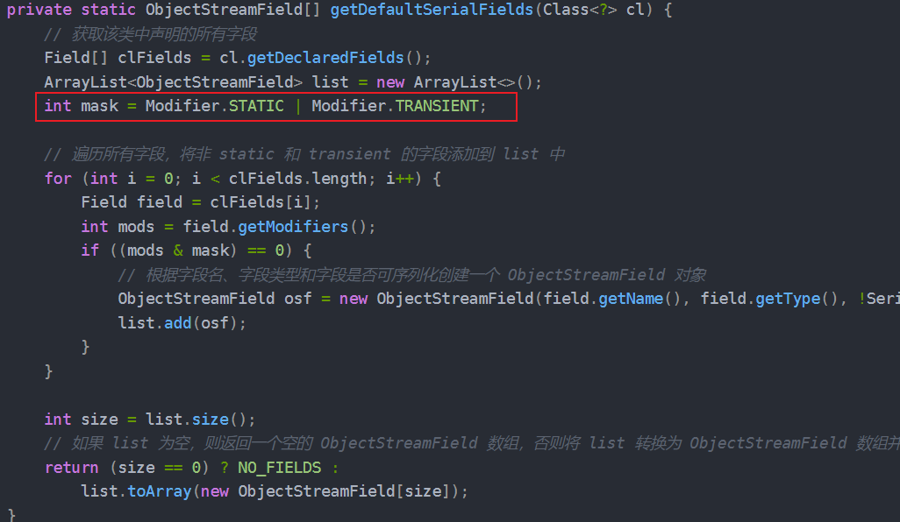

- [ ] [反序列化1 -- p神](https://wx.zsxq.com/group/2212251881/topic/421452521558848)
- [ ] [反序列化2 -- p神](https://t.zsxq.com/A6ZFF)
- [ ] [反序列化3 -- p神](https://wx.zsxq.com/group/2212251881/topic/548841448822424)

## 概述
1. **序列化** 就是把Java对象转换成字节序列的过程
2. **反序列化** 是指把字节序列恢复成Java对象的过程
3. 场景：   

## 原生序列化与反序列化
- Person.java
```java
package org.example;  
  
import java.io.Serializable;  // 导入序列化接口


/**
 * 实现Serializable接口表示该类可被序列化
 * 反序列化漏洞常因序列化机制被滥用导致
 * ⚠️ 危险：当反序列化不可信数据时可能触发漏洞
 */
public class Person  implements Serializable{  
    
    
    // 私有属性会被序列化存储
    private String name;  
    private int age;  
	
	// 默认构造器 -- 反序列化时会被调用
    public Person(){  
  
    }  
	
	// 带构造器
    public Person(String name, int age){  
        this.name = name;  
        this.age = age;  
    }  
	  
	  
	// toString方法 -- 演示对象内容
    @Override  
    public String toString(){  
        return "Person [name=" + name + ", age=" + age + "]";  
    }  
}
```
- SerializationTest.java
```java
package org.example;  
  
import java.io.FileOutputStream;  
import java.io.ObjectOutputStream;  
  
public class SerializationTest {  
	// 序列化方法：将对象转换为字节流存储
    public static void serialize(Object obj) throws Exception{  
        ObjectOutputStream oos = new ObjectOutputStream(new FileOutputStream("Person.ser"));  // 序列化数据存储文件
        oos.writeObject(obj);  // 调用 oos 的 writeObject方法，将对象进行序列化操作
    }  
    public static void main(String[] args) throws Exception{  
        Person person = new Person("aa",22);  
        System.out.println(person);  
        serialize(person);  
    }  
}
```

- UnserializeTest.java
```java
package org.example;  
  
import java.io.FileInputStream;  
import java.io.IOException;  
import java.io.ObjectInputStream;  
  
public class UnserializeTest {  
    public static Object unserialize(String Filename) throws IOException, ClassNotFoundException{  
        ObjectInputStream ois = new ObjectInputStream(new FileInputStream(Filename));  
 Object obj = ois.readObject();  
 return obj;  
 }  
  
    public static void main(String[] args) throws Exception{  
        Person person = (Person)unserialize("ser.bin");  
 System.out.println(person);  
 }  
}
```


### 特别注意
1. 只有实现 了**Serializable** 或者 **Externalizable** 接口的类的对象才能被序列化为字节序列。（不是则会抛出异常）    
	1. Serializable 用来标识当前类可以被 ObjectOutputStream 序列化，以及被 ObjectInputStream 反序列化。如果我们此处将 Serializable 接口删除掉的话，会导致如下结果。
2. 在反序列化过程中，如果父类没有实现 Serializable 接口，父类的字段不会被序列化，而是通过无参构造函数重新初始化。需要特别注意这一点以避免数据丢失。
```java
import java.io.*;

class Parent {
    int parentField;

    public Parent() {
        this.parentField = 42; // 默认值
    }
}

class Child extends Parent implements Serializable {
    int childField;

    public Child(int parentField, int childField) {
        this.parentField = parentField;
        this.childField = childField;
    }
}

public class SerializationTest {
    public static void main(String[] args) throws Exception {
        Child child = new Child(10, 20);

        // 序列化
        ObjectOutputStream oos = new ObjectOutputStream(new FileOutputStream("object.dat"));
        oos.writeObject(child);
        oos.close();

        // 反序列化
        ObjectInputStream ois = new ObjectInputStream(new FileInputStream("object.dat"));
        Child deserializedChild = (Child) ois.readObject();
        ois.close();

        // 输出结果
        System.out.println("Parent Field: " + deserializedChild.parentField); // 42 (父类字段未被序列化)
        System.out.println("Child Field: " + deserializedChild.childField);   // 20
    }
}

------------输出结果——---------
Parent Field: 42
Child Field: 20
```
1. 一个实现-Serializable接口的子类也是可以被序列化的。
```java
import java.io.*;

class Parent implements Serializable {
    private static final long serialVersionUID = 1L;
    int parentField;

    public Parent(int parentField) {
        this.parentField = parentField;
    }
}

class Child extends Parent {
    private static final long serialVersionUID = 1L;
    int childField;

    public Child(int parentField, int childField) {
        super(parentField);
        this.childField = childField;
    }
}

public class SerializationExample {
    public static void main(String[] args) throws IOException, ClassNotFoundException {
        Child child = new Child(10, 20);

        // Serialize the object
        ObjectOutputStream oos = new ObjectOutputStream(new FileOutputStream("child.ser"));
        oos.writeObject(child);
        oos.close();

        // Deserialize the object
        ObjectInputStream ois = new ObjectInputStream(new FileInputStream("child.ser"));
        Child deserializedChild = (Child) ois.readObject();
        ois.close();

        System.out.println("Parent Field: " + deserializedChild.parentField);
        System.out.println("Child Field: " + deserializedChild.childField);
    }
}

------------输出结果——---------
Parent Field: 10
Child Field: 20

```

#### Static和transient标识成员变量不能被序列化
1. 静态成员变量是不能被序列化
	1. 序列化是针对对象属性的，而静态成员变量是属于类的。
2. transient 标识的对象成员变量不参与序列化
```cardlink
url: https://www.cnblogs.com/JavaBuild/p/18263716
title: "面试官：告诉我为什么static和transient关键字修饰的变量不能被序列化？ - JavaBuild - 博客园"
description: "一、写在开头 在上一篇学习序列化的文章中我们提出了这样的一个问题： “如果在我的对象中，有些变量并不想被序列化应该怎么办呢？” 当时给的回答是：不想被序列化的变量我们可以使用transient或static关键字修饰；transient 关键字的作用是阻止实例中那些用此关键字修饰的的变量序列化；当对"
host: www.cnblogs.com
favicon: https://assets.cnblogs.com/favicon_v3_2.ico
```
  
    

#### transient 修饰的字段如何序列化
>Serializable接口标示的序列化方式里，transient字段是不可被序列化的，因为在序列化过程中调用的ObjectStreamClass对象，里面有个方法为getDefaultSerialFields()，已经明确的标记出了transient修饰符不可被序列化！  

```cardlink
url: https://www.cnblogs.com/JavaBuild/p/18271305
title: "面试官：transient关键字修饰的变量当真不可序列化？我：烦请先生教我！ - JavaBuild - 博客园"
description: "一、写在开头 在这篇文章中记录一下之前自己面试时学到的东西，是关于transient关键字的，当时面试官问我IO的相关问题，基本上全答出来了，关于如何不序列化对象中某个字段时，我果断的选择了static和transient，但面试官紧接着问了我：“transient关键字修饰的变量当真不可序列化吗？"
host: www.cnblogs.com
favicon: https://assets.cnblogs.com/favicon_v3_2.ico
```

```java
public class Test implements Externalizable {
 
    private transient String text = "我可以被序列化！！！";
 
    public static void main(String[] args) throws Exception {
        Test test = new Test();
        //序列化
        ObjectOutputStream out = new ObjectOutputStream(new FileOutputStream("E:\\transient.txt"));
        out.writeObject(test);
        //反序列化
        ObjectInputStream in = new ObjectInputStream(new FileInputStream("E:\\transient.txt"));
        test = (Test)in.readObject();
        System.out.println(test.text);
        //关闭流
        out.close();
        in.close();
    }
 
    @Override
    public void writeExternal(ObjectOutput out) throws IOException {
        out.writeObject(text);
    }
 
    @Override
    public void readExternal(ObjectInput in) throws IOException, ClassNotFoundException {
        text = (String) in.readObject();
    }
}
```

### 序列化产生的安全问题

- `writeObject` 和 `readObject`可以被开发者重写
- 只要服务端反序列化数据，客户端传递类的 `readObject` 中代码会自动执行，基于攻击者在服务器上运行代码的能力

#### 常见形式

1. ~~入口类的readObject直接调用危险方法~~ 基本不存在
2. 入口参数中包含可控类，该类有危险方法，`readObject` 时调用
3. 入口类参数中包含可控类，该类又调用其他有危险方法的类，readObject-时调用
	1. 类型定义为object，调用equals 、 hashcode、toString
	2. 重点：相同类型 同名函数
4. 构造函数/静态代码块等类加载时隐式执行

#### 攻击路线
1. 首先的攻击前提：继承 Serializable
2. 入口类：source （重写 readObject 调用常见的函数；==参数类型宽泛，比如可以传入一个类作为参数；==最好 jdk 自带）
3. 找调用链 gadget chain 相同名称、相同类型
4. 执行类 sink （RCE SSRF 写文件等等）比如 `exec` 这种函数

