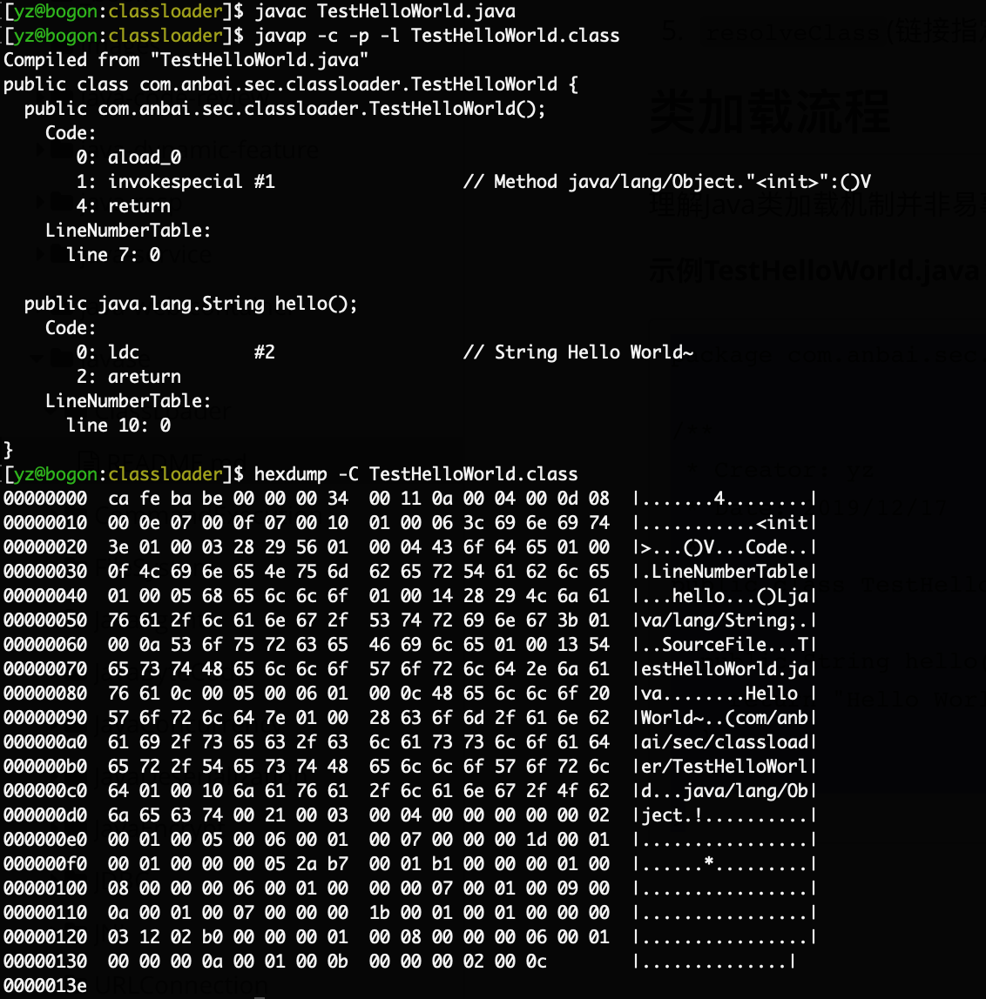

## ClassLoader（类加载机制）

>Java是一个依赖于`JVM`((java虚拟机)实现的跨平台的开发语言，
>1. Java程序运行前需要先编译成`class`文件，
>2. java类初始化会调用`java.lang.ClassLoader`加载类字节码，
>3. `ClassLoader`会调用JVM的native方法（`defineClass0/1/2`）来定义一个`java.lang.Class`实例

 - **JVM架构图**    
### Java类
- `TestHelloWorld.java`
```java
package com.anbai.sec.classloader;

/**
 * Creator: yz
 * Date: 2019/12/17
 */
public class TestHelloWorld {

    public String hello() {
        return "Hello World~";
    }

}
```

- 编译`javac TestHello.java`
- 反汇编：`javap -c -p -l TestHelloWorld.class` 
- 查看文件二进制内容 ：`hexdump -C TestHelloWorld.class`   
- JVM 在执行 `TestHelloWorld` 之前会先解析 class 二进制内容，JVM 执行的其实就是如上 `javap` 命令生成的字节码。