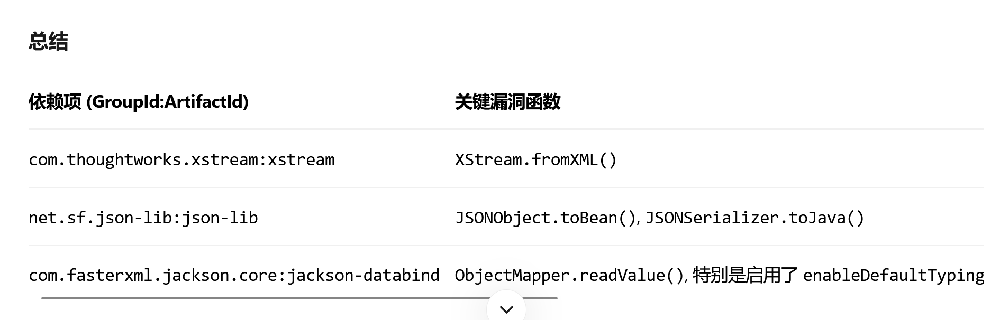

- https://github.blog/changelog/2023-08-13-new-dataflow-api-for-writing-custom-codeql-queries/


## 基础


### Codeql基本流程
1. 定义source谓词
2. 定义sink谓词
3. t补全，引入数据流 ，补全代码
4. [3.全局污点分析(⭐)](2.CodeQl语法.md#3.全局污点分析(⭐))

```java
import /* 导入必要库 */
import java
import semmle.code.java.dataflow.DataFlow
import semmle.code.java.dataflow.TaintTracking

// 定义污点跟踪配置模块
module MyConfig implements DataFlow::ConfigSig {
  // 定义源点
  predicate isSource(DataFlow::Node source) {
    /* 源点判断逻辑 */
  }
  
  // 定义汇点
  predicate isSink(DataFlow::Node sink) {
    /* 汇点判断逻辑 */
  }
  
  // 可选：定义额外数据流步骤
  predicate isAdditionalFlowStep(DataFlow::Node node1, DataFlow::Node node2) {
    /* 自定义流传播逻辑 */
  }
}

// 实例化污点跟踪模块
module MyFlow = TaintTracking::Global<MyConfig>;
import MyFlow::PathGraph

// 执行查询
from MyFlow::PathNode source, MyFlow::PathNode sink
where MyFlow::flowPath(source, sink)
select source, sink, "污点路径描述"
```


## Day1 : Apache Struts 不安全反序列化漏洞分析
> 使用不安全的第三方组件如何快速寻找反序列化漏洞
- https://github.blog/security/vulnerability-research/apache-dubbo-all-roads-lead-to-rce/
- CVE-2017-9805
  
```java
import java

import semmle.code.java.dataflow.DataFlow

import semmle.code.java.dataflow.FlowSources

  

module S052 implements DataFlow::ConfigSig {

  predicate isSource(DataFlow::Node source) { source instanceof RemoteFlowSource }

  

  predicate isSink(DataFlow::Node sink) {

    exists(MethodCall fromXml |

      fromXml.getMethod().hasName("readValue") and    // 改相关联函数即可

      sink.asExpr() = fromXml.getArgument(0)

    )

  }

}

  

module S052_s2t = TaintTracking::Global<S052>;

  

from DataFlow::Node source, DataFlow::Node sink

where S052_s2t::flow(source, sink)

select source, "源流入汇：", sink
```

### 1.查找Xml规范化（sink）

>[XStream](https://x-stream.github.io/index.html)是一个Java框架，用于将Java对象序列化为Apache Struts使用的XML。它提供了一个方法`XStream.fromXML`来将XML转换为Java对象。默认情况下，不以任何方式验证输入，并且容易受到远程代码执行漏洞的攻击。在本节中，我们将识别代码库中对`fromXML`的调用。

  

1. 找到程序中所有方法调用
```java
import java

from MethodCall call
select call
```
2. 查询每个方法调用所调用的方法
```java
import java

from MethodCall call, Method method
where method = call.getMethod()
select call,"调用的方法：",method
```
3. 查找程序中对名为`fromXML`的方法的所有调用。
```java
import java

from MethodCall call,Method method
where method = call.getMethod() and method.hasName("fromXML")
select "程序中对名为fromxml的方法的调用：",call


因为现在只使用方法调用，不需要打印方法
import java

from MethoCall Fromxml
wher Fromxml.getMethod().hasName("fromXML")
select "程序中对名为fromxml的方法的调用：",Fromxml
```
4. `XStream.fromXML`方法将第一个参数（即索引`0`处的参数）转换为参数。更新您的查询以报告已验证的参数。
```java
import java

from MethodCall call,Expr arg  // Expr 保存参数表达式
where 
	call.getMethod().getName() = "fromXML" and
	arg = call.getArgument(0) // MethodCall.getArgument(int i) 返回第i个索引处的参数。
select call,arg
```
5. 封装谓词
```java
import java


predicate isXMLDeserialized(Expr arg) {
  exists(MethodCall fromXML |
    fromXml.getMethod().hasName("fromXml") and
    arg = fromXml.getArgument(0)
  )
}

from Expr arg
where isXMLDeserialized(arg)
select arg
```
[`exists`](https://help.semmle.com/QL/ql-handbook/formulas.html#exists)是一种引入具有有限作用域的临时变量的机制。你可以把它们看作是自己的`from`-`where`-`select`。  我们使用它来引入`fromXML`临时变量，类型为`MethodCall`。

### 2.从ContentTypeObject中查找toObject方法的实现（Source）


1. 创建一个名为`ContentTypeHandler`的CodeQL类来查找接口`org.apache.struts2.rest.handler.ContentTypeHandler`
```java
import java

class ContentTypeHandler extends RefType{
	ContentTyperHandler(){
		this.hasQualifiedName("org.apache.struts2.rest.handler","ContentTypeHandler")
		//RefType.hasQualifiedName(string packageName, string className) 来标识具有给定包名和类名的类
	}
}
```
2. 创建一个名为`ContentTypeHandlerToObject`的CodeQL类，用于在直接超类型包括`Method`的类上标识名为`toObject`的`ContentTypeHandler`
```java
import java


class ContentTypeHandler extends RefType{
	ContentTyperHandler(){	
	this.hasQualifiedName("org.apache.struts2.rest.handler","ContentTypeHandler")
		//RefType.hasQualifiedName(string packageName, string className) 来标识具有给定包名和类名的类
	}
}

class ContentTypeHandlerToObject extends Method {
	ContentTypeHandlerToObject(){
		this.getDeclaringType().getAnAncestor() instanceof ContentTypeHandler 
		// 标识方法的声明类型，使用Method.getDeclaringType()
		// 标识该类型的超类型，RefType.getASuperType()
		// RefType.getAnAncestor()
		and
	    this.hasName("toObject")
	}
}
```
3. toObject方法第一个参数视为不可信的用户输入
```java
import java

class ContentTypeHandler extends RefType{
	ContentTyperHandler(){	
	this.hasQualifiedName("org.apache.struts2.rest.handler","ContentTypeHandler")
		//RefType.hasQualifiedName(string packageName, string className) 来标识具有给定包名和类名的类
	}
}

class ContentTypeHandlerToObject extends Method {
	ContentTypeHandlerToObject(){
		this.getDeclaringType().getASupertype() instanceof ContentTypeHandler 
		// 标识方法的声明类型，使用Method.getDeclaringType()
		// 标识该类型的超类型，RefType.getASuperType()
		and
	    this.hasName("toObject")
	}
}

from ContentTypeHandlerToObject toObjectMethod,Expr arg
where arg = toObjectMethod.getParameter(0)
// Method.getParameter(int index)获取第i个索引参数
select 'toObject方法的第一个参数:' ,arg
```
### 3.不安全的XML文档化

```java
import java
import semmle.code.java.dataflow.DataFlow
import semmle.code.java.dataflow.TaintTracking


class ContentTypeHandler extends RefType{
	ContentTyperHandler(){	
	this.hasQualifiedName("org.apache.struts2.rest.handler","ContentTypeHandler")
		//RefType.hasQualifiedName(string packageName, string className) 来标识具有给定包名和类名的类
	}
}

class ContentTypeHandlerToObject extends Method {
	ContentTypeHandlerToObject(){
		this.getDeclaringType().getASupertype() instanceof ContentTypeHandler 
		// 标识方法的声明类型，使用Method.getDeclaringType()
		// 标识该类型的超类型，RefType.getASuperType()
		and
	    this.hasName("toObject")
	}
}

predicate isXMLDeserialized(Expr arg) {
  exists(MethodCall fromXML |
    fromXML.getMethod().getName() = "fromXML" and
    arg = fromXML.getArgument(0)
  )
}

module XmlTaintConfig implements DataFlow::ConfigSig {
  predicate isSource(DataFlow::Node source) {
	exists(ContentTypeHandlerToObject toObjectMethod |
	 source.asParameter() = toObjectMethod.getParameter(0)
	)
  }

  predicate isSink(DataFlow::Node sink) {
    exists(Expr arg |
      sink.asExpr() = arg and
      isXMLDeserialized(arg)
    )
  }
}

/************************ 执行部分 ************************/
module XmlFlow = TaintTracking::Global<XmlTaintConfig>;
import XmlFlow::PathGraph

from XmlFlow::PathNode source, XmlFlow::PathNode sink
where XmlFlow::flowPath(source, sink)
select "Unsafe XML deserialization",source, "数据源汇入：",sink
```
  
  

## Day2 : Apache Dubbo RCE学习
- https://github.com/github/codeql-dubbo-workshop
- 源码：https://github.com/li-yazhou/dubbo-dubbo-2.7.8
- https://github.com/github/codeql-dubbo-workshop/blob/master/workshop.md
- https://cn.dubbo.apache.org/zh-cn/docsv2.7/dev/design/
- https://github.blog/security/vulnerability-research/apache-dubbo-all-roads-lead-to-rce/#first-things-first-identifying-the-attack-surface

### 环境搭建
1. 克隆源代码 ：`git clone https://github.com/li-yazhou/dubbo-dubbo-2.7.8`
2. 生成数据库： `codeql database create database/dubbo-db  --language="java"  --command="mvn clean install -DskipTests" --source-root=source/dubbo-dubbo-2.7.8`   

### 识别攻击面
- `RemoteFlowSource`代表了 CodeQL 认为 ​**​可能被攻击者控制或来自不可信外部来源​**​ 的数据在代码中的位置。这些是漏洞分析的起点（Source）。
- `source.getLocation()`: 获取 `source`节点在源代码文件中的具体位置（行号、列号）
	- `.getFile()`: 获取包含这个位置的源代码文件对象。
	- `.getRelativePath()`: 获取这个文件相对于项目根目录的路径（字符串）。
	- `.matches("%/src/test/%")`: 检查这个路径是否匹配模式 `%/src/test/%`。`%`是通配符，表示匹配 `src/test/`目录及其任何子目录下的文件。
- `source.getEnclosingCallable().getDeclaringType()`:
	- `source.getEnclosingCallable()`: 获取直接包含 `source`节点的可调用单元（通常是一个方法 `Method`或构造函数 `Constructor`）。
	- `.getDeclaringType()`: 获取声明这个可调用单元的类（`Class`或 `Interface`）
	- **`source`所在的类​**
- `source.getSourceType()`: 返回一个字符串，描述 CodeQL 认为这个 `source`属于哪种类型的远程源（例如，`"HttpServletRequest getParameter"`, `"HttpServletResponse"`, `"Reverse DNS lookup"`等）​
```java
import java
import semmle.code.java.dataflow.FlowSources // 导入数据流和“远程流源”相关的库

from RemoteFlowSource source // 从所有被定义为“远程流源”的节点中选取，每个节点命名为 `source`
where
  not source.getLocation().getFile().getRelativePath().matches("%/src/test/%") // 条件：排除位于测试目录下的源
select
  source, // 选择：源节点本身（代表代码中具体的位置）
  source.getEnclosingCallable().getDeclaringType(), // 选择：包含这个源节点的函数/方法所属的类
  source.getSourceType() // 选择：这个源的类型描述（字符串）
```
  

- 建模 ：https://cn-sec.com/archives/824616.html 暂时没用
### 建模
- 拓展：`semmle.code.java.dataflow.FlowSources.RemoteFlowSource`
```java
class NettySource extends RemoteFlowSource {
  NettySource() {
    ...
  }
  override string getSourceType() { result = "Netty Source" }
}
```

### 污点分析
#### 序列化层
- 调用链：   
- https://web.archive.org/web/20210307122327/https://dubbo.apache.org/zh/docs/v2.7/dev/impls/serialize/   
-   
1. 找序列化`Serialization`接口的方法声明
```java
import java

from Interface iface, Method method
where
  iface.getPackage().getName() = "org.apache.dubbo.common.serialize" and
  iface.getName() = "Serialization" and
  method.getDeclaringType() = iface
select method, method.getName()
```
  

```java
ObjectInput deserialize(URL url, InputStream input) throws IOException;
```
2. 这个接口方法会返回一个反序列化器的实现实例，是一个 `ObjectInput` 类型的对象，这个 `ObjectInput` 也是一个接口，看到他的接口方法：
```java
import java


// 首先找到 ObjectInput 接口本身
from Interface objectInput
where objectInput.hasQualifiedName("org.apache.dubbo.common.serialize", "ObjectInput")
select objectInput, "这是 ObjectInput 接口"
```
  
>所有方法都是 `read` 开头的，且都是返回一个反序列化对象，那么所有的  `ObjectInput#read*` 方法都应该被认为是 `sink` ；
- 所有远程数据流即`source instanceof RemoteFlowSource` 作为`source`
- `org.apache.dubbo.common.serialize.ObjectInput#read*` 作为 `sink`

```java
// sink 寻找

import java

from MethodCall call
where
  // getCallee()返回一个 Method对象
  call.getCallee().getName().matches("read%") and
  call.getCallee()
      .getDeclaringType()
      .getASourceSupertype*()
      .hasQualifiedName("org.apache.dubbo.common.serialize", "ObjectInput")
select call, call.getCallee().getDeclaringType(), call.getCallee().getName()
```
### 数据流分析
  

```java
import java
import semmle.code.java.dataflow.DataFlow
import semmle.code.java.dataflow.FlowSources

module S052 implements DataFlow::ConfigSig {
  predicate isSource(DataFlow::Node source) { source instanceof RemoteFlowSource }

  predicate isSink(DataFlow::Node sink) {
    exists(MethodCall fromXml |
      fromXml.getMethod().hasName("readValue") and
      sink.asExpr() = fromXml.getArgument(0)
    )
  }
}

module S052_s2t = TaintTracking::Global<S052>;

from DataFlow::Node source, DataFlow::Node sink
where S052_s2t::flow(source, sink)
select source, "源流入汇：", sink

```
 
- **​`call.getQualifier()`​**​：
    - 获取方法调用的​**​限定符​**​（qualifier）
    - 在 `object.method()`形式的调用中，`object`就是限定符
    - 在 `input.readObject()`中，`input`就是限定符
- **​`sink.asExpr()`​**​：
	-  将 `sink`（数据流节点）转换为其代表的表达式
    - 在数据流分析中，`sink`是一个抽象节点，`asExpr()`将其映射回具体的代码表达式
- **​`call.getQualifier() = sink.asExpr()`​**​：
	- 将方法调用的限定符（对象）标记为 Sink 节点
    - 表示我们关心数据是否流向了这个对象
>CodeQL只会分析用户自己的代码，如果用户代码引用了第三方依赖，数据流到了第三方依赖，因为CodeQL不分析第三方依赖，所以此时对于CodeQL来讲，这个调用是一个黑盒，于是数据流就断开了；
  

```java
// 万能钥匙
predicate isstep(Expr expSrc, Expr expDst) {
  exists(MethodCall mc |
    expSrc = mc.getAnArgument() and
    expDst = mc
  )
}
```


## Day3： Apache Kylin rce
- https://mp.weixin.qq.com/s/55WmXyox0aGV26DRXahH0w


### 环境搭建
1. 源码下载
```bash
git clone https://github.com/apache/kylin.git
cd kylin

---- Windows遇到Git的长路径问题
# 在仓库目录中执行
git config core.longpaths true
git clean -fd
git reset --hard
git checkout kylin-3.0.2

```
2. 构建数据库
- https://aecous.github.io/2025/03/12/Codeql%E5%85%A8%E6%96%B0%E7%89%88%E6%9C%AC%E4%BB%8E0%E5%88%B01/ 
- https://docs.github.com/zh/code-security/codeql-cli/getting-started-with-the-codeql-cli/preparing-your-code-for-codeql-analysis#creating-databases-for-compiled-languages
```bash
#### 1. 删除现有数据库

Remove-Item -Recurse -Force kylin-db

#### 2. 创建新数据库

codeql database init --language=java --source-root=source/kylin kylin-db

#### 3. 复制源代码到数据库的src目录

# 创建src目录
mkdir kylin-db\src

# 复制源代码（只复制包含漏洞的模块，如server-base）
Copy-Item -Path source/kylin/server-base/src/main/java -Destination kylin-db/src -Recurse -Force

#### 4. 索引文件

codeql database index-files --language=java --include-extension=.java kylin-db

#### 5. 最终化数据库

codeql database finalize kylin-db
```

- 坑点 ： 构建 CodeQL 数据库时没有包含 Apache Commons Lang 3 的源代码，所以找不到方法调用  
```java
import java
import semmle.code.java.dataflow.DataFlow
import semmle.code.java.dataflow.TaintTracking
import semmle.code.java.security.TaintedPathQuery

predicate isjoin(Expr expSrc, Expr expDst) {
  exists(MethodCall mc |
    expSrc = mc.getAnArgument() and
    expDst = mc
  )
}

predicate isAdd(Expr expSrc, Expr expDst) {
  exists(AddExpr add |
    (
      expSrc = add.getLeftOperand() or
      expSrc = add.getRightOperand()
    ) and
    add = expDst
  )
}

module Test2 implements DataFlow::ConfigSig {
  predicate isSource(DataFlow::Node node) {
    exists(MethodCall mc |
      mc.getMethod().hasName("runDiagnosisCLI") and
      node.asExpr() = mc.getAnArgument()
    )
  }

  predicate isSink(DataFlow::Node node) {
    exists(MethodCall mc |
      mc.getMethod().getName().matches("%join%") and
      node.asExpr() = mc.getArgument(0)
    )
  }

  predicate isAdditionalFlowStep(DataFlow::Node node1, DataFlow::Node node2) {
    isAdd(node1.asExpr(), node2.asExpr())
    or
    isjoin(node1.asExpr(), node2.asExpr())
  }
}

module Flow = TaintTracking::Global<Test2>;

from Flow::PathNode source, Flow::PathNode sink
where Flow::flowPath(source, sink)
select source.getNode(), sink.getNode(), "Flow from source to sink."

```

- 重新构建数据库
```java
codeql database create database/kylin-db  --language="java"  --command="mvn compile -DskipTests -Dmaven.scala.skip=true" --source-root=source/kylin  --overwrite

codeql database create source/kylin-db  --language="java"  --command="mvn compile -DskipTests -Dmaven.scala.skip=true" --source-root=source/kylin
```

```java
predicate isAdd(Expr expSrc, Expr expDst) {

  exists(AddExpr add |

    (

      expSrc = add.getLeftOperand() or

      expSrc = add.getRightOperand()

    ) and

    add = expDst

  )

}


predicate isjoin(Expr expSrc, Expr expDst) {

  exists(MethodCall mc |

    expSrc = mc.getAnArgument() and

    expDst = mc

  )

}

predicate isAdditionalFlowStep(DataFlow::Node node1, DataFlow::Node node2) {

    isjoin(node1.asExpr(), node2.asExpr())

  }
```


1. 第一版本
```java
import java
import semmle.code.java.dataflow.DataFlow
import semmle.code.java.dataflow.TaintTracking


module KylinRce implements DataFlow::ConfigSig {
  predicate isSource(DataFlow::Node source) {
    exists(Parameter p |
      p.getAnAnnotation().getType().hasQualifiedName("org.springframework.web.bind.annotation", "PathVariable") 
      and source.asParameter() = p
    )
  }

  predicate isSink(DataFlow::Node sink) {
     exists(MethodCall m |
      (m.getMethod().hasName("execute") 
        and m.getMethod().getDeclaringType().getQualifiedName() = "org.apache.kylin.common.util.CliCommandExecutor")
      and sink.asExpr() = m.getArgument(0)
    )
  
  }

  
}

module Flow = TaintTracking::Global<KylinRce>;

from Flow::PathNode source, Flow::PathNode sink
where Flow::flowPath(source, sink)
select source.getNode(), sink.getNode(), "Flow from source to sink."

```
   

2. 终极版本
```java
/**
 * @name Apache Kylin RCE via PathVariable injection
 * @description User-controlled data from PathVariable annotations flows to command execution
 * @kind path-problem
 * @id java/kylin-rce-pathvariable
 * @problem.severity error
 * @precision high
 * @tags security
 *       external/cwe/cwe-078
 */

import java
import semmle.code.java.dataflow.DataFlow
import semmle.code.java.dataflow.TaintTracking
import semmle.code.java.dataflow.FlowSources
import semmle.code.java.security.CommandLineQuery

module KylinRce implements DataFlow::ConfigSig {
  predicate isSource(DataFlow::Node source) { source instanceof RemoteFlowSource }

  predicate isSink(DataFlow::Node sink) { sink.asExpr() instanceof ArgumentToExec }
}

module Flow = TaintTracking::Global<KylinRce>;

from Flow::PathNode source, Flow::PathNode sink
where Flow::flowPath(source, sink)
select sink.getNode(), source, sink, "Tainted data from $@ reaches command execution.",source.getNode(), "user input"

```