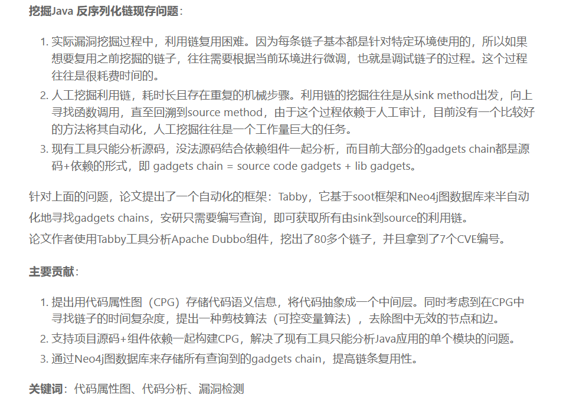

## 参考链接

- https://cina666.github.io/2025/03/24/%E5%B7%A5%E5%85%B7tabby%E7%9A%84%E5%AD%A6%E4%B9%A0%E4%B9%8B%E8%B7%AF/
- https://xz.aliyun.com/news/14030
- https://github.com/tabby-sec/tabby


## 适用范围
> Codeql分析链子好难受，不能跨库查 ，污点分析流也很乱（我太菜了）不知道这个能不能改善

- 挖掘目标项目中的反序列化利用链，支持大多数序列化机制，包括 Java 原生序列化机制、Hessian、XStream 等
- 挖掘目标项目中的常见 Web 漏洞，支持分析 WAR/JAR/FATJAR/JSP/CLASS 文件
- 搜索符合特定条件的函数、类，譬如检索调用了危险函数的静态函数
  
## 环境配置
1. 官方文档： https://www.yuque.com/wh1t3p1g/tp0c1t/rmm0aimycci76ysm
2. Java17
3. Tabby
	1. Tabby-core： https://github.com/tabby-sec/tabby/releases  
	2. Tabby-vul-finder： 修改配置文件   `mvn clean package -DskipTests` 
	3. https://github.com/tabby-sec/tabby-path-finder 
4. **Neo4J （5.x版本）：** https://we-yun.com/doc/neo4j/5.26.4/  
	1. 修改配置: `D:\CodeView\Tabby\neo4j\conf\neo4j.conf` 
	3. 插件安装：：   
		- https://github.com/neo4j/apoc/releases/tag/5.26.12
		- https://github.com/neo4j-contrib/neo4j-apoc-procedures/releases?q=5.26.1&expanded=true 
		- https://github.com/tabby-sec/tabby-path-finder       
		4. 验证     
5. **IDEA：** https://github.com/tabby-sec/tabby-intellij-plugin/releases  

- Neo4j常用命令
```bash
console: 直接启动 neo4j 服务器  
install-service | uninstall-service | update-service ： 安装/卸载/更新 neo4j 服务  
start/stop/restart/status: 启动/停止/重启/状态  
-V 输出更多信息
```