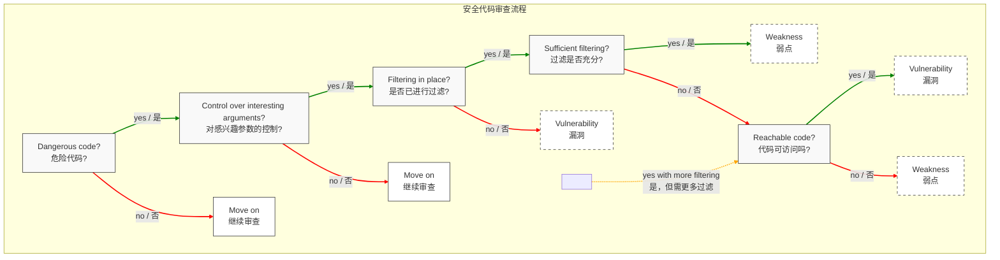

- https://pentesterlab.com/videos/code-review-reviewing

```mermaid
graph TD
    subgraph 安全代码审查流程
        A[Dangerous code?<br/>危险代码?] -->|yes / 是| B[Control over interesting arguments?<br/>对感兴趣参数的控制?]
        A -->|no / 否| C1[Move on<br/>继续审查]
        
        B -->|yes / 是| D[Filtering in place?<br/>是否已进行过滤?]
        B -->|no / 否| C2[Move on<br/>继续审查]
        
        D -->|yes / 是| E[Sufficient filtering?<br/>过滤是否充分?]
        D -->|no / 否| F1[Vulnerability<br/>漏洞]
        
        E -->|yes / 是| G1[Weakness<br/>弱点]
        E -->|no / 否| H[Reachable code?<br/>代码可访问吗?]
        
        style E fill:#f9f9f9,stroke:#333,stroke-width:1px
        note1[ ] -.->|yes with more filtering<br/>是，但需更多过滤| H
        linkStyle 8 stroke:orange,stroke-width:2px;
        
        H -->|yes / 是| F2[Vulnerability<br/>漏洞]
        H -->|no / 否| G2[Weakness<br/>弱点]
    end

    %% 样式定义，确保颜色与描述一致
    classDef decisionBox fill:#f9f9f9,stroke:#333,stroke-width:1px
    classDef resultBox fill:#fff,stroke:#333,stroke-width:1px,stroke-dasharray: 5 5
    classDef endBox fill:#fff,stroke:#333,stroke-width:1px
    
    class A,B,D,E,H decisionBox
    class C1,C2 endBox
    class F1,F2,G1,G2 resultBox
    
    %% 链接样式（箭头颜色）
    linkStyle 0 stroke:green,stroke-width:2px;
    linkStyle 1 stroke:red,stroke-width:2px;
    linkStyle 2 stroke:green,stroke-width:2px;
    linkStyle 3 stroke:red,stroke-width:2px;
    linkStyle 4 stroke:green,stroke-width:2px;
    linkStyle 5 stroke:red,stroke-width:2px;
    linkStyle 6 stroke:green,stroke-width:2px;
    linkStyle 7 stroke:red,stroke-width:2px;
    linkStyle 9 stroke:green,stroke-width:2px;
    linkStyle 10 stroke:red,stroke-width:2px;
```

1. 危险函数：    
2. 无危险 ；参数不可控   
3. 危险 ： 用户可控 ：   
4. 过滤 ： 要检查过滤是否能被Bypass     
5. 如果无法bypass ，则看看后面的对Arg1修改的函数 是否可以产生一些有意思的漏洞    