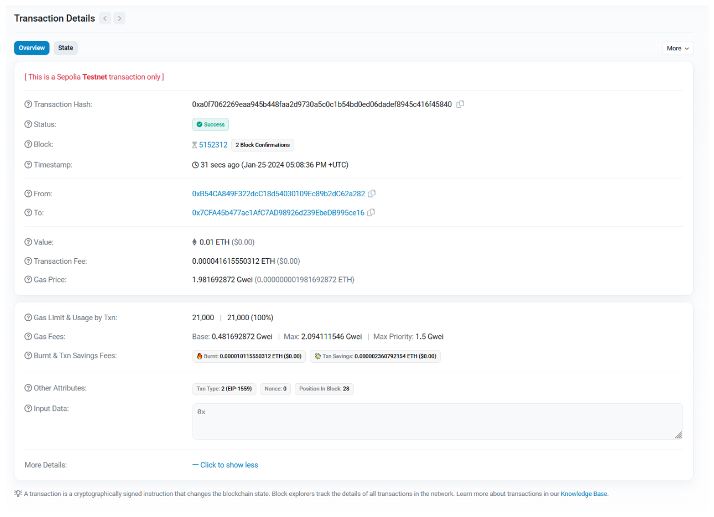
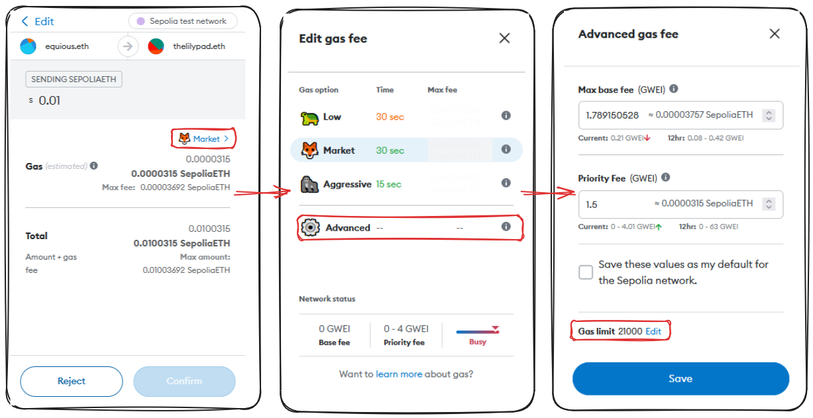
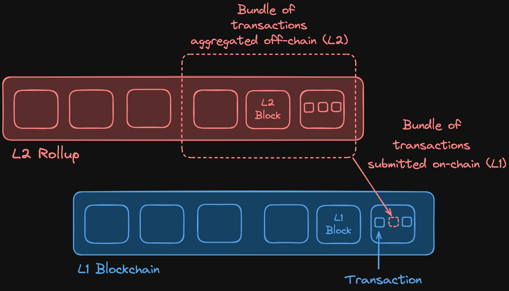
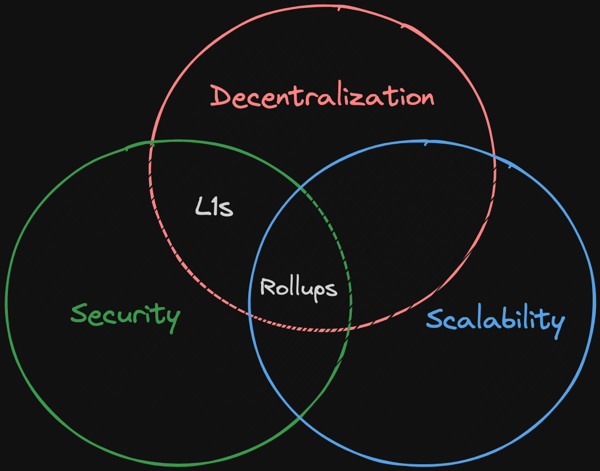
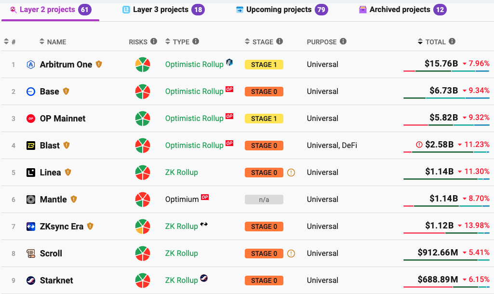
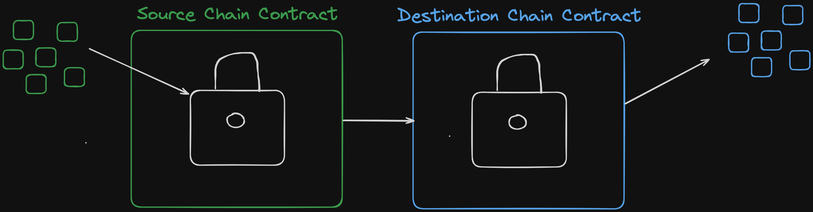
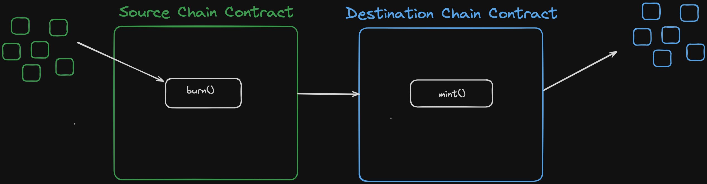

### Web3
（建立信任，最小化协议）
  


## 学习资源 ⭐
- https://updraft.cyfrin.io/courses/blockchain-basics
- https://github.com/Cyfrin/path-solidity-developer-2023
- https://discord.com/invite/cyfrin

## 区块链是什么 ⭐

### 比特币和区块链
- 比特币白皮书（作者为匿名用户萨图希·纳克莫托）描述了如何通过密码学让比特币在去中心化网络中进行对等事务。这使得比特币成为抵御审查的金融工具，并被称为“数字黄金”。就像黄金一样，比特币有一个固定的数量。可以在[比特币白皮书](https://bitcoin.org/bitcoin.pdf)中了解更多。
- 区块链是一种一个安全、分散式的数字账本，记录跨多个计算机的交易（A digital ledger that records transactions across many computers in a secure and decentralized manner.）

### 以太坊和智能合约
以太坊，它基于区块链基础设施，但具有额外的能力。通过以太坊，可以在去中心化网络中创建分散事务、组织和协议，没有中央中介。这是通过智能合约而实现的。
 
 >智能合约是一组在去中心化方式下执行的指令，不需要中央或第三方中介。（A smart contract is an agreement that is deployed on a decentralized blockchain. Once deployed, it cannot be altered, and its terms are public.）
 >
 >  
 
 - 比特币开发者将比特币视为一种价值存储手段~~（比特币具有智能合约，但是图灵不完备，这意味着它们不具备编程语言的所有功能）~~
 - 以太坊既是一种价值存储，也是一种实用工具
[0.BlockChain_basics](#L2%20链路)
### Oracle问题
智能合约面临着一个重大限制——它们无法与外部世界交互或访问数据。这就是所谓的Oracle问题。

区块链是确定性的系统，因此发生在其中的一切都出现在其内部。为了使智能合约更加有用并能够处理真实世界的数据，它们需要来自外部的数据和计算。

~~（Oracles）履此职务。它们是一种设备或服务，提供给区块链或执行外部计算。为了维持去中心化，必须使用分布式Oracle网络，而不是依赖单一来源。这使得智能合约结合了链上逻辑和链下数据，从而形成“混合智能合约”。~~
1. What is an Oracle?
	- 预言机是任何向这些去中心化区块链提供数据和计算的设备 
2. 去中心化Oracle ：                                             


### L2 链路
[链路](https://linker.network/)是一个分散的智能合约执行器，基于区块链上运行。它允许开发者创建去中心化应用程序（dApps）和智能合约，并为它们提供全面的管理功能和安全性。链路由以太坊社区支持并维护。

## 智能合约的目的（视频gg了）
### 区块链与智能合约的本质

我们的生活中几乎所有交互或交易都涉及某种形式的协议或合同。例如，购买一把椅子需要协议购买木材、组装它并出售完成品。您的电力供应也是您和电力公司之间的协议。当您为汽车更换油时，您被承诺以特定金额交换务。

现代生活中几乎所有的事情都与某种形式的协议或合同有关。

为了使其更加相关，设想协议和协议作为承诺。传统协议，然而，需要信任两方，并且这并不是在诚实和公平方面总是有利的情况。


### 传统协议的缺点

让我们考虑一下信任式协议在现实世界中的例子以及如何使用区块链技术和智能合约来减轻这些风险。

#### 消费者信任

80年代和90年代，麦当劳的独家游戏承诺客户有机会通过购买获得的游戏卡赢得钱。然而，实际上是内部人员操纵了系统以获取利益。基本上，麦当劳无法兑现其承诺。
<!--ID: 1743494398893-->


这个例子表明，依赖信任在协议中可以导致欺诈行为和未兑现的承诺。

假设麦当劳独家游戏在区块链上运营并使用智能合约。在区块链上部署智能合约后，它无法更改，会自动执行，并且每个人都可以看到其条款。

#### 银行和信任

传统银行有时无法兑现保护客户资金的承诺，如 1930 年大萧条期间。区块链技术和智能合约可以确保透明度并进行自动履约检查，以防止银行破产。
<!--ID: 1743494398899-->


区块链和智能合同的核心在于创建不需要信任的系统，其中协议是透明、不可改变的，并且以人类介入方式执行。这项技术有潜力彻底改造工业和每日的协议，确保诚实和公平。

#### 金融市场访问

中央机构，如传统交易所，有权限制对金融市场的访问。2021年罗宾汉（Robin Hood）将某些资产的交易限制为例。Uniswap等去中心化交易所没有中央管理机构，可以改变或限制市场访问。这为金融市场带来了公平性和开放性。
<!--ID: 1743494398904-->


#### 总结

* 传统协议：需要信任在集中实体上。
* 智能合约：透明、分散、不可篡改。
<!--ID: 1743494398910-->


如果您必须选择，智能合约显然是更好的选择，因为它们无法被任何人篡改或修改。

智能合同是解决长期以来历史上失败过的基于信任的系统的有效方法。

### 机制

智能合约相对较新，但已经开始转变各种市场。它们通过在区块链上代表“承诺”作为代码来实现这一点。这条代码由一个分散的集体执行，因此没有单个实体可以修改协议任何方面！协议及其条款是公开的，并且会自动执行，而无需人类介入。

更多行业正在采用智能合同和区块链，因为它们提供了许多优势。结果是信任最小化的协议或简称为不可破坏的承诺。

### 超越信任最小化

请注意，区块链、智能合约和加密货币不仅仅是关于信任最小化。这项技术还提供安全性、持续运行时间优势、执行速度等更多好处。

### 警告：不是所有的都一样

但是，请注意那些声称自己是去中心化但实际上不是的平台。2022年，FTX平台就是一个例子。它自称是一个Web3平台，但实际上是一个传统Web2公司，只使用加密货币而没有智能合约的好处。

作为这个空间中的新开发者或用户，请务必分辨出哪些是合法项目和那些不是贡献Web3精神的项目。


## 智能合约现状
### 智能合约的特性

#### 去中心化

智能合约不依赖于任何中间人。在 blockchain 网络上， 由数以千计的节点运营商维护。这些节点运营商共同运行智能合约使得网络保持了去中心化。
<!--ID: 1743494398916-->


#### 透明度和灵活性

 blockchain 网络具有内部透明度。所有节点运营者都能看到在链上发生的事， 因此没有空间来进行不公平的或隐瞒交易。这确保每个人都有同样的信息并遵循相同的规则。
<!--ID: 1743494398922-->


#### 速度和效率

智能合约和 blockchain 交易相比传统银行系统来说非常快和高效。例如， 在传统银行系统中， 国际转账可能需要几周的时间，而blockchain 交易几乎是即时发生的。这不仅方便也允许更有效的交互。
<!--ID: 1743494398928-->


#### 安全性和不可改变性

 一旦智能合约被部署就不能被修改或篡改。这确保了合同条款是固定的。相比传统系统， 在其中一个服务器或数据库可以被黑客攻击并数据被修改。在 blockchain 中， 数据是有抵抗力的。如果你的电脑和备份文件都失败， 你会丢失所有数据。相反，在blockchain 中， 数据是在数以千计的节点上复制的。即使有几个节点崩溃， 数据仍然安全的， 只要至少有一份 blockchain 副本存在。
<!--ID: 1743494398934-->


#### 免责风险

 智能合约消除了交易中的信任需求。一旦智能合约被部署，就不能更改。这意味着各方不能根据贪婪或其他因素改变协议。这确保了协议按照最初的意图执行。
<!--ID: 1743494398939-->


### 智能合约的应用

#### 去中心化金融 (DeFi)

 DeFi 允许用户与金融市场进行互动， 而不需要中间人。在智能合约中， 用户有对金融市场的透明访问并且可以高效安全地与复杂的金融产品进行交互。我们将在后续课时中提供使用DeFi协议构建和交互实例。
<!--ID: 1743494398945-->


#### 去中心化自治组织 (DAOs)

 DAOs 由智能合约治理， 并在去中心化方式运营。这结构带来一些优点，例如：透明的治理、高效的参与和明确的规则。DAOs 是政治和治理领域的一个进步， 我们将在后续课时中讲解如何构建和工作于 DAOs。
<!--ID: 1743494398951-->


#### 非同质化令牌 (NFT)

 NFTs， 或 Non-Fungible Tokens，可以被认为为数字艺术或独特资产。NFTs 为艺术家和创作者提供了新的创造财富途径。我们将在本课程中讲解如何创建和与 NFTs 进行交互。
  
<!--ID: 1743494398957-->


## 设置你的钱包 


### ETH
- https://ethereum.org/zh/


### MetaMask
  
- https://metamask.io/download/
- 存储基于EVM的货币和基于EVM的交易

- 火狐：https://addons.mozilla.org/en-US/firefox/addon/ether-metamask/
- 助记词：帮助恢复钱包  / 不要分享助记词
-   

```
cruise consider achieve party proof economy virtual oven anger calm bright hope
```

- 可以创建多个账户
	- 
	- 知道一个助记词可以访问多个账户
	- 但是这多个账户私钥不同，知道一个私钥智能访问一个账户
- 网络
	-   
	- 我们测试、开发需要EVM测试网（模拟eth主网）    


## 测试网的交易 ⭐
### 发送你的第一笔交易在Tenderly 


>在本教程中，我们将建立一个新的虚拟测试网并发送我们的第一笔交易。我们将使用由 Tenderly 提供的测试网，它让我们能够模拟发送真实交易而不实际使用任何资金。

#### 设置虚拟测试网（自用的，申请公开的测试网gas比较麻烦）

1. 前往 [Tenderly](https://tenderly.co/?mtm_campaign=partner\&mtm_kwd=cyfrin) 网站。
2. 点击顶部右侧的 **Sign Up** 按钮
3. 输入您的 **Email**、**Username** 和 **Password**。  
4. 点击 **Create Account** 按钮。
5. 将被转到 Tenderly 控制台。点击 **Skip personalization**。
6. 在控制台左侧找到 **Virtual TestNets** 部分并点击它。
7. 点击 **Create Virtual TestNet** 按钮。  
8. 我们将进行一些配置选项。
9. 在 **General** 选项下选择 **Sepolia** 作为父网络。我们也可以选择 **Ethereum Mainnet**，但这并不重要。
10. 给您的测试网命名，我会叫它 `hiroki-test`。
11. 在 **Chain ID** 选项下选择 **Custom** 并输入 `111555111`。您可以选择 **Default** 以保持原始链ID。
12. 在 **Public Explorer** 选项下选择 **Off** 来限制当前的访问权限。您也可以选择 **Fork** 或 **On**。
13. 选择 **Use latest block** 作为状态同步选项。
14.      **Create** 按钮。  
15. 会出现一个弹出窗口，提示我们发送消息 `CYFRIN2024` 来延长免费试用期。点击发送消息按钮。                                  
16. 您会看到您的新测试网 `my-chain` 已经创建好了。
17. 点击与您的测试网名称右侧的 **Add to Wallet** 按钮。  
18. 会出现 MetaMask 窗口，请点击 **Connect** 按钮。
19. 您的测试网应该已经添加到 MetaMask 中。
20. 测试网打钱   
<!--ID: 1743494398963-->


#### 发送您的第一笔交易

1. 在 MetaMask 中，点击账户下拉菜单并创建新账户。
2. 点击 **Add account** 按钮并命名它，如 `test 2`。
3. 回到账户下拉菜单中，您会看到 `Account 1` 有资金，而 `test 2` 仍然是空的。                                  
5. 在 MetaMask 中点击 **Send** 按钮。
6. 我们会从 `Account 1` 向 `test 2` 发送钱。您可以通过点击 `test 2` 或复制 `Account 2` 的地址来发送钱。
7. 输入您想发送的 ETH 数量，如 `1 ETH`。
8. 点击 **Continue** 按钮。  
9. 会出现交易审批窗口，点击 **Confirm** 按钮。
10. 您会看到您的交易处于等待状态。
11. 一段时间后，交易将被确认。
12. 在 MetaMask 中回到 **Tokens** 选项卡中，您会看到 `Account 1` 有 `999 ETH`，而 `test 2` 有 `1 ETH`。
13. 回到 Tenderly 控制台。
14. 前往 **Explorer** 选项卡。
15. 您会看到所有发送的交易列表。灰色未确认交易可以忽略。最新未灰色交易是我们刚刚发送的交易。
16. 点击交易来查看详细信息，包括发送者和接收者的地址、发送金额、时间戳和原始数据。  
<!--ID: 1743494398968-->


### 发送你的第一笔交易在testnet

我们将学习如何与测试网一起工作。与测试网一起工作是可选的，但它是一种很好的方法来尝试交易和学习gas费用而不冒实际风险。

#### 测试网基本信息

Sepolia 是一个流行的测试网。你可以在 GitHub 仓库中找到有关测试网的最新信息（Cyprin Foundry Full Course, 原名 ChainAccelOrg Foundry Full Course）。
<!--ID: 1743494398975-->


测试网正在不断变化，所以很重要的是要检查 GitHub 仓库中的推荐测试网部分。

我们可以使用 Sepolia Etherscan (`sepolia.etherscan.io`) 来查看我们的账户余额和交易在 Sepolia 测试网上的细节。

*重要：* 获取测试网水龙头（faucet）很具挑战性。如果你无法获得任何测试网水龙头，请不要浪费太多时间试图获取它，而是使用 Tenderly 虚拟网络！
  

#### 发送测试网交易

要在测试网上发送交易，我们需要使用 **水龙头**。水龙头允许我们获得免费的测试网令牌。
<!--ID: 1743494398980-->


* **推荐水龙头：** `faucets.chain.link`（查看 GitHub 仓库中的最新链接）。
  

#### 连接您的钱包到水龙头

1. 将您的 MetaMask 钱包连接到水龙头网站。
2. 在你的 MetaMask 中选择 Sepolia 测试网。  
3. 请求测试 ETH（你也可以在将来请求测试 LINK）。
<!--ID: 1743494398986-->


  
#### 接收测试网 ETH

在请求测试 ETH 后，你会看到交易哈希。这代表了你的 Sepolia 测试网上的交易。你可以在 Sepolia Etherscan 中查看交易细节。完成交易后，你的 MetaMask 余额将更新。
<!--ID: 1743494398992-->


#### 了解交易详细信息

你可以在 Sepolia Etherscan 中查看交易详细信息。重要信息包括：
  
<!--ID: 1743494398998-->


* **交易哈希：** 一个唯一标识符。
* **状态：** 是否交易成功。
* **来自：** 发送交易的人。
* **到：** 接收交易的人。
* **价值：** 发送的 ETH 数量（在本例中为 0.1 测试 ETH）。

## Gas ⭐
### 交易费和gas价格：它们是啥？

  


- 交易费用（Transaction Fee）是块的生产者为了处理交易而收取的金额。它可以用以太币（ETH）或wei（ Wei）支付。
- gas价格（Gas Price），也在以太币（ETH）或wei（Wei）中定义，是指交易指定单位gas成本。 gas价格越高，交易被包含在块中的机会就越大。

> 重要的是要区分gas和gas价格。虽然gas指的是执行交易所需的计算努力，但gas价格是此努力的每单位成本。

当我们点击交易概述中的“更多详细信息”时，我们可以看到进一步的信息，包括`Gas Limit and Usage by transaction”。


### Gas的作用

区块链由不同的节点组成，有时候称为矿工或验证器，取决于网络。这些矿工通过处理交易而被激励，获得native blockchain货币的一部分。例如，以太坊矿工得到以太币（ETH），而Polygon矿工则获得MATIC。这
笔酬金鼓励人们继续运行这些节点。

### 交易中的Gas

在交易的背景下，gas指的是计算复杂度的单位。

一笔交易的复杂性越高，它所需的gas也就越多。例如，一般交易如发送以太币相对简单而且需要较少的gas。但是，更加复杂的交易，如mint NFT、部署智能合约或将资金存入DeFi协议，则需要更多的gas。

交易费用可以通过将gas价格乘以gas使用量来计算（不包括wei）。因此，`Transaction fee = gasPrice * gasUsed`。
- https://www.evm.codes/ 
- 每个操作所需要使用的gas  
### 实践：发送一个以太坊交易

在任何区块链中，进行一笔交易都需要向处理该交易的区块链节点支付交易费用（以native token为单位）。让我们通过MetaMask扩展，这是流行的以太坊钱包，来创建一个示例。

以下是步骤：

1. 打开MetaMask并点击“展开视图”。
2. 选择用于此次交易的帐户。
3. 点击“发送”。
4. 选择“转账到我的账户之间”。
5. 输入接收以太币的帐户和需要转移的以太币数量。
6. 点击“下一步”。MetaMask将自动计算gas费用。总金额支付为以太币值以及gas费用。    

一个有趣的问题：_我为什么要选择花费更多的gas?_
  

简化解释是，如果很多人尝试在同一时间处理交易，给定的块空间竞争性增加，gas价格升高，以控制和优先交易流量。


### 深入Gas

注意：我们这里所讨论的适用于以太坊中[EIP-1559](https://eips.ethereum.org/EIPS/eip-1559)的实施后，引入了燃气限制、优先费用和讨论的燃烧机制。
交易分解
```js
Wei:  1,000,000,000 Wei  = 1 Gwei (Gigawei)
Gwei: 1,000,000,000 Gwei = 1 Eth
```
  

参考上图，标记的部分将在以下详细说明：

1. 交易费用：这是计算为`总Gas使用量 * Gas价格`，其中`Gas使用量`表示执行工作所需的计算单元，`Gas价格`由基本和优先费用组成。
2. Gas Limit：这是在交易中允许的最大Gas数量。用户可以在发送交易之前设置此值。在Metamask中，您可以导航到Market > Advanced > Edit Gas Limit以设置此值。  
3. 基本Gas费：该交易的基本费用，表示为Gwei。请记住，这是每单位Gas的成本。

```js
关于基本燃气费有几点需要注意：
	- 由于EIP-1559，Gas费用以移除协议中价值，减缓通胀。
	- 如果一个区块超过50%满，然后下一个区块的基准Gas费会增加。如果一个区块少于50%，则Gas费会降低。这有助于平衡网络需求和容量。
```


4. 最大Gas费：这是交易允许的最大成本/个。可以在发送交易之前配置此值。
5. 最高优先费用：同样，可以在发送交易之前配置，这代表我们愿意给矿工的最高小费。这会激励将我们的交易包含在区块中。
6. 区块确认：这是在区块中验证或矿工已经被确认的交易数量。确认数越多，我们就越能肯定交易的有效性。


## 区块链如何工作? ⭐
- https://andersbrownworth.com/blockchain/

### Hash
  
- [Demo](https://andersbrownworth.com/blockchain/hash) 使用Hash256：  
### Block
- https://andersbrownworth.com/blockchain/block
- 未mine前  
- mine后：找到合适的nonce+data来使得Hash以0000开头  

### BlockChain
- https://andersbrownworth.com/blockchain/blockchain
-   
- Genesis Block：区块链上的第一个块
- Prev：指向前一个块的数据
- 前一个块发生变化，后面的所有块都会失效（区块链不可被改变）


### Distributed Blockchain
>区块链的核心在于其分散式或分布式的性质。在这种系统中，多个实体或“对等体”（peers）运行区块链技术，每个对等体拥有平等的权重和权力。不同对等体运行的区块链之间出现差异（可能由于篡改或其他原因），大多数hash值获胜，因为网络的大多数成员都同意它。不与大多数一致的节点实际上会将网络分叉，继续自己的历史

- 分布式区块链：https://andersbrownworth.com/blockchain/distributed
- n個blockchain的對等位置block的hash是一樣的  
- 当有blockchain的内容发生改变，而其他链上内容未发生改变时，该blockchain会无效(多个独立账本，民主选择，51%的账本数据同时改变时，数据才会真正的有效改变)  

### Tokens
>到目前为止，我们一直假设区块中传递的数据是一个随机文本字符串，但现实是 - 这个数据可以是什么样的。在token和coinbase部分，你可以看到每个区块都包含多个交易，这些交易一起被hash起来。任何对这些交易的编辑都会使链条无效

- Data --> Tx   


## 签署交易（Signing transactions）⭐
- https://andersbrownworth.com/blockchain/public-private-keys/
### 公私钥
- https://andersbrownworth.com/blockchain/public-private-keys/keys
- 私钥： 
- 特定的私钥对应特定的公钥  
- Web3中：私钥 --> 公钥 ---> 钱包地址
### Sign
- https://andersbrownworth.com/blockchain/public-private-keys/signatures
- Message+私钥用于签名：  
- Message+公钥+Message签名用于验证：  
- 别人知道公钥只能验证这笔交易是你发起的，但是因为不知道你的私钥，所以无法伪造你的交易

### Transaction
- https://andersbrownworth.com/blockchain/public-private-keys/transaction
- 使用私钥对交易签名：  
- 使用公钥对交易进行验证  
### 钱包多个账户

- 一个钱包可以有多个账户                                                               
- hash：`<secret-phrase> + 0`=账户0 私钥
- hash：`<secret-phrase> + 1`=账户1  私钥  
- 所以泄露一个钱包的助剂词，则泄露钱包内所有账户，但如果某个账户私钥泄露，影响则是单个账户


### 区块链概述

### 共识

让我们来谈谈共识。这包括`工作量证明`和`权益证明`。你可能以前听说过这些术语，它们对于区块链如何工作至关重要。

我们之前提到的区块链示例中的`挖矿`功能就是`工作量证明`的一个例子。

`工作量证明`和`权益证明`都属于`共识`的范畴。而`共识`对于区块链而言是一个非常重要的主题。

> `共识`被定义为用于达成关于区块链状态或单个值的一致意见的机制，尤其是在去中心化系统中。

粗略地说，区块链或去中心化系统的共识协议可以分解为两个部分：一个链选择算法和一个抗女巫攻击机制。挖矿，或工作量证明，是一种抗女巫攻击机制。这就是比特币目前使用的机制。

`工作量证明`之所以被称为抗女巫攻击机制，是因为它规定了一种确定谁是区块作者或哪个节点做了挖掘区块的工作的方法。抗女巫攻击是指区块链抵御用户创建大量伪匿名身份以获得不成比例的优势影响的能力。

正如前面提到的，有两种主要类型的抗女巫攻击：

* 工作量证明
* 权益证明

我们将先更仔细地看看`工作量证明`。

### 工作量证明

工作量证明是许多区块链中使用的抗女巫攻击系统。本质上，矿工需要经历一个计算密集型过程（挖矿）来找到区块的答案。因此，无论你运行了多少个额外的节点，每个节点都有义务完成这项工作以获得奖励。游戏场地保持公平。

> **注意:** 一些区块链可能会故意使其谜题或区块答案变得非常困难或非常简单，以调整区块时间——即挖掘一个区块所需的平均时间。区块时间与这些算法的难度成正比。

工作量证明必须与`链选择规则`结合以形成`共识`。

`链选择规则`是为了确定哪个区块链是“真实”的区块链而实施的一种手段。比特币（以及合并前的以太坊），两者都使用了称为`中本聪共识`的东西。这是工作量证明（以太坊已经切换到权益证明）和`最长链规则`的结合。

在`最长链规则`中，去中心化网络决定哪一个链拥有的区块数量最多将是有效的，或“真实”的区块链。当我们早些时候在Etherscan看到`区块确认`时，这代表着我们的交易在最长链前方的区块数。

> 有时你会听到人们用**工作量证明**来描述一种共识机制，但这有点不准确，实际上是抗女巫攻击_和_链选择相结合才形成了共识。

`工作量证明`还作为确定谁收到交易费用的一种方式，如前所述。这些交易费用由发起交易的人支付。在一个工作量证明系统中，每个节点都在竞相第一个解决区块问题。第一个解决问题的节点将获得该区块内累积的交易费用。此外，矿工还会得到一个`区块奖励`，`区块奖励`是由区块链本身给予的。

> 如果你之前听说过比特币减半——这就是区块奖励每大约4年减少一半的概念。

区块奖励是以区块链的原生货币计价——比特币=BTC，以太坊=ETH。这有效地增加了该加密货币的流通量。

### 区块链攻击

区块链领域存在两种主要类型的攻击。

* 女巫攻击 - 当用户创建多个伪匿名账户试图影响网络。
* 51%攻击 - 当一个实体同时拥有最长链和大多数网络控制权时发生。这将允许实体“分叉”链并使网络按照实体的事件记录前进，实际上允许他们验证任何事情。

区块链是非常民主的。区块链越大，越去中心化，安全性就越高。

我鼓励你自己尝试运行一个节点，以增加网络的安全性！

工作量证明确实伴随着缺点。例如，工作量证明消耗了大量的电力。当有成千上万个节点都在尽可能努力地解决一个区块问题时，能源消耗是巨大的，因此潜在的环境影响也是巨大的。

鉴于上述原因，许多协议正在选择转向一种更环保的共识机制。其中最流行的是...

### 权益证明

与试图解决区块问题不同，权益证明节点会提供一定数量的抵押品，表明他们会诚实行事，也就是他们“质押”。如果发现某个节点行为不当，它的质押将被削减。这作为一种非常有效的抗女巫攻击机制，因为对于每个账户，验证者都需要投入更多的质押，而行为不当则有可能失去所有这些抵押品。

> 在权益证明系统中，`矿工`被称为`验证者`。他们并不是真正地挖掘区块，而是验证其他节点。

与工作量证明不同，每个节点都在竞相第一个解决区块问题，在权益证明中，验证者是准随机选择来提议下一个区块，而其他节点将验证它。

当然，权益证明也有自己的优点和缺点。

优点：

* 优秀的抗女巫攻击机制
* 对环境友好，能耗少得多

缺点：

* 因为有初始质押成本，被认为不如工作量证明去中心化

这引发了这样一个问题：_去中心化到什么程度才算足够？_ 我认为这个问题留给社区来决定。

### 第一层和第二层（Layer 1 and Layer 2）

我还想简要提及第一层和第二层网络的概念。

1. `第一层`解决方案：这指的是基础层区块链实现，如比特币或以太坊。
2. `第二层`解决方案：这些是添加到第一层之上的应用，如[Chainlink](https://chain.link/)或[Arbitrum](https://arbitrum.io/)。

像Arbitrum和Optimism这样的第二层特别之处在于它们试图解决可扩展性的问题。这些协议利用了所谓的`汇总`。大致思路是这些协议打包他们的交易，由第一层处理。


## L1s L2s And Rollups ⭐

### 区块链层

区块链技术可以分为不同的层次，其中最基础的是第一层（Layer 1, L1）和第二层（Layer 2, L2）。

#### 第一层（L1）

**第一层**区块链是区块链生态系统的底层，节点帮助链达成共识。它不依赖任何附加组件独立运作，并常被称为结算层。例如比特币、BNB Chain、Solana 和 Avalanche 都是 L1 链。在本课程中，我们主要关注以太坊，它是以太坊生态系统的核心。直接部署在以太坊上的应用，如 Uniswap，并不是 L2s，而是 L1 上的去中心化应用程序（dApps）。
<!--ID: 1743494399005-->


#### 第二层（L2）

**第二层**是指构建在 L1 区块链之外但与之挂钩的应用程序。L2 的种类繁多，比如 Chainlink 是一种去中心化的预言机网络，还有像 The Graph 这样的事件索引网络，它们使得应用能够访问链上数据。但最流行的 L2 类型是汇总（Rollups），即 L2 链。
<!--ID: 1743494399012-->


#### 汇总（Rollups）

汇总是 L2 扩展解决方案，通过将多个交易打包成一个来增加以太坊上的交易数量，从而降低 gas 费用。
  
汇总结合了解决区块链三难困境的方法，该困境指出区块链只能同时实现三个特性中的两个：去中心化、安全性和可扩展性。对于以太坊来说，牺牲了可扩展性，因为它的处理能力大约为每秒 15 笔交易。而汇总结合旨在提升可扩展性的同时不损害安全性和去中心化。
  
<!--ID: 1743494399019-->

##### 汇总的工作原理

当用户向汇总提交一笔交易时，操作员（负责处理交易的节点或实体）会接收这笔交易，将其与其他交易打包压缩，然后将这批交易提交回 L1 区块链。这个过程允许高效地处理交易，因为与交易相关的 gas 成本由所有提交这批交易的用户分摊。

有两种类型的汇总：乐观汇总（Optimistic Rollups）和零知识汇总（Zero-Knowledge Rollups）。这两种汇总的主要区别在于它们如何验证交易的有效性。

##### 乐观汇总（Optimistic Rollups）

乐观汇总默认假设链下交易是有效的。操作员提出汇总链的有效状态，在挑战期内其他操作员可以通过计算欺诈证明来挑战可能存在的欺诈交易。

这种欺诈证明过程涉及操作员与另一方进行交互，识别并隔离特定的计算步骤。然后在这个特定步骤在 Layer 1 区块链上执行：如果结果与原始状态不同，则表明该交易为欺诈行为。当欺诈证明成功时，汇总将重新正确执行整个批次的交易，而包含错误交易的操作员将受到惩罚，通常是失去质押的代币（slashing）。

##### 零知识汇总（ZK Rollups）

零知识汇总使用有效性证明（zk 证明）来验证交易批次。在此过程中，证明者（操作员）生成 zk 证明，以显示其输入（即交易）满足某个数学等式。验证者（L1 合约）随后检查此证明，确保输出与预期结果相符。证明者用来证明其输入满足 zk 证明中数学等式的解决方案通常被称为“见证人”（witness）。

### 结论

汇总结合提高了以太坊的可扩展性，通过链下处理交易，打包它们，并带着有效性证明提交回以太坊，这种方法保持了 L1 的安全性和去中心化，同时显著增加了交易吞吐量。

### 🧑‍💻测试自己

- **什么是第二层（L2）区块链的主要功能？**

  第二层区块链的主要功能是通过在主链（L1）外处理交易来提高区块链的可扩展性，同时保持与主链的安全连接。这通常涉及到将交易打包并批量提交到主链，以此减少主链的负担并降低用户的交易成本。

- **乐观汇总是如何确保交易有效性的？**

  乐观汇总默认认为所有的链下交易都是有效的，并提供一个挑战期让其他参与者质疑这些交易。如果有欺诈行为，挑战者可以通过提交欺诈证明来证明某笔交易无效。如果欺诈证明被验证为真，那么该批交易将被重做，而提出无效交易的操作员将被惩罚。

- **什么是‘见证人’？**

  在零知识汇总的上下文中，“见证人”指的是证明者用来展示其输入（交易）满足特定数学等式的解决方案。这个解决方案是生成零知识证明的一部分，用于证明交易的有效性而不透露额外的信息。


## Centralized Sequencers

### 引言

在区块链和加密货币网络中，**排序器(Sequencer)**的角色对于交易的排序和打包至关重要。排序器是负责组织交易处理方式的操作者。在许多汇总（roll-up）解决方案中，排序器是中心化的，由单一实体控制。

### 中心化风险


**审查与操控**：中心化的排序器有能力选择性地阻止或延迟特定交易。例如，用户可能会遇到被阻止的提现交易，从而无法访问他们的资金。此外，中心化控制使得交易顺序可以被操纵以获取个人利益，这可能导致不公平现象的发生。


**运营停机**：如果一个中心化的排序器遭遇停机，所有交易处理都可能停止。这意味着包括提现在内的任何交易都无法进行，直到排序器重新上线为止。

### 减轻中心化影响的努力

为了减轻与中心化排序器相关的这些问题，像 **zkSync** 这样的项目正在努力实现其排序器操作的**去中心化**，将控制权分配给多个实体或节点。通过引入更多的参与者，这些项目旨在减少单点故障的风险，并确保即使某些节点失效，网络仍能继续正常运行。去中心化的排序机制还能够增强系统的抗审查能力，因为没有一个单独的实体可以决定哪些交易应该被包含或排除。


## Rollup Stages
### 引言

Layer 2 (L2) 链的成熟度是根据特定属性进行评估，并分为不同的阶段。L2B 团队提供了一个有倾向性的评估，以鼓励向更大程度去中心化的进展。

### 汇总（Rollup）阶段

- **阶段 0**：在这个初始阶段，汇总的治理主要由操作者和安全委员会掌握，确保关键决策和行动由一个可信赖的小组监督。开源软件允许从 L1 数据重建状态，确保透明性和可访问性。在此阶段，用户有一个退出机制，可以在七天内离开汇总，但这通常需要实体/操作者的行动。
- **阶段 1**：在这个阶段，治理演变为由智能合约管理，尽管安全委员会仍然扮演重要角色（例如解决漏洞）。在这一阶段，证明系统变得完全功能化，能够实现有效性证明的去中心化提交。退出机制得到改进，允许用户独立退出而无需操作者协调。
- **阶段 2**：在这个最终阶段，汇总实现了完全的去中心化，治理完全由智能合约管理，消除了日常运营中对操作者或委员会干预的需求。此阶段的证明系统是无需许可的，退出机制也是完全去中心化的。安全委员会的角色现在严格限制于处理链上发生的任何错误，确保系统保持公平而不依赖于中心化实体。

### ZKSync 风险分析

在 [L2Beat 的概览](https://l2beat.com/scaling/summary)中可以看到每个汇总的实际阶段：
  \
目前，[Zksync Era ](https://l2beat.com/scaling/projects/zksync-era)正在作为阶段 0 的汇总运行。在专门的 L2 页面上，我们可以找到风险分析：  

- **数据可用性**：指的是从 L1 数据重建 L2 状态的能力，确保任何人都可以在必要时验证和重建 L2 状态。
- **状态验证**：涉及验证一组捆绑交易的合法性。对于 ZK Sync 来说，这是通过一种名为 PLONK（Permutations over Lagrange-bases for Oecumenical Noninteractive arguments of Knowledge，拉格朗日基数排列通用非交互式知识论证）的算法使用零知识证明来完成的。
- **排序器故障**：描述了即使排序器停机也能处理交易的能力。在 ZK Sync 中，即使不立即执行，交易仍可以提交到 L1。
    - 🗒️ 注意
    - 排序器是对用户交易进行排序的操作者，并且经常在提交到 Layer 1 之前对它们进行批量处理。

- **提议者故障**：描述了即使提议者停机也能处理交易的能力。在这种情况下，ZK Sync 将暂停所有提现和交易执行。
- **退出窗口**：在当前的 ZK Sync 阶段，在不需要的升级期间没有退出窗口。

### 结论

汇总的阶段为评估和促进 L2 链的成熟度和去中心化提供了框架。了解这些阶段及其要求对于评估不同汇总的进展和相关风险至关重要。

### 测试自己

- 📕 在治理和退出机制方面，阶段 0、1 和 2 的汇总之间有哪些主要区别？
- 📕 描述构成 Layer 2 解决方案风险分析的部分有哪些？


## 资金桥接


桥接（Bridging）：我们推荐的方式，包括从一个链（Sepolia）到另一个链（zkSync Sepolia）的资金转移。存在两种类型的桥接机制：

- 锁定和解锁（Locking and Unlocking）：代币在源链上被锁定，并在目标链上解锁。
- 铸造和销毁（Minting and Burning）：代币在源链上被销毁，并在目标链上铸造。桥接协议必须控制代币供应以管理这个过程。一个例子是由Circle团队提供的CCTV服务，其中USDC被销毁并在另一端铸造以促进桥接。  
