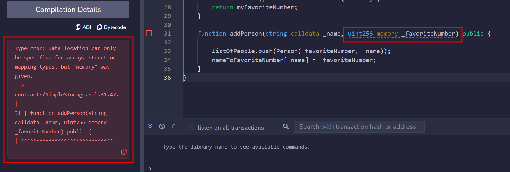

- https://updraft.cyfrin.io/courses/solidity
- https://docs.soliditylang.org/zh-cn/latest/
## 基础 ：Simple Storage
### 初始Remix
- https://remix.ethereum.org 
- 文件管理                                       
- 搜索字符串                                                                            
- solidty编译器                                                                                             

```rust

//SPDX-License-Identifier: MIT
pragma solidity 0.8.18;   // 只有solidity 0.8.18版本是有效的
pragma solidity ^0.8.18; // 这样solidity 0.8.18及其以上的版本都是有效的
pragma solidity >=0.8.18<0.9.0; // 这样solidity 0.8.18及其以上小于0.9.0的版本都是有效的


contract SimpleStorage{

}     // 命名合同
```
  

#### 本地部署
- https://github.com/ethereum/remix-project
- https://docs.soliditylang.org/zh-cn/latest/installing-solidity.html#remix
<!--ID: 1743494398848-->


```bash
npm install --global yarn
yarn global add nx

```
  
```bash
git clone https://github.com/ethereum/remix-project.git
cd remix-project
yarn
yarn run build:libs
yarn build
yarn serve:hot


```
- http://localhost:8080/index.html
### 基本变量类型
```rust
//SPDX-License-Identifier: MIT
pragma solidity 0.8.18;

contract SimpleStorage{
	// 基本数据类型：boolean，uint,int, address,bytes,string
	int morenzhi; //此时变量默认值为0
	
	bool hasFavoriteNumber = false; // 定义并初始化变量
	uint favoriteNumber = 88; // 无符号整数
	uint256 notfavoriteNumber = 20;  //指定unit大小为256字节
	int256 hiroki = -77;
	string favoriteNumberInText = "88"; //定义字符串
	address myAddress = 0xAac50eFe121296fA80514578a3F0024eCF64A350;
	bytes32 favoriteBytes32 = "cat";
}
```
  

### 函数 / 方法

```rust
//SPDX-License-Identifier: MIT
pragma solidity ^0.8.18;

contract SimpleStorage{
	int favoriteNumber; //此时变量默认值为0

	function store(int fanumber) public {
		favoriteNumber = fanumber;
	}
}
```

1. 编译代码                                                                     
2. 将代码部署到合约上                                                                                     
3. 部署完成后会发现一笔交易（部署合约就是修改区块链，所以会产生交易）
4. 调用store函数（每调用一次也会修改一次区块链状态，所以也会产生交易）  


#### [可见性和 getter 函数](https://docs.soliditylang.org/zh-cn/latest/contracts.html#getter)
```rust
//SPDX-License-Identifier: MIT
pragma solidity ^0.8.18;
<!--ID: 1743494398854-->


contract SimpleStorage{
	int  public favoriteNumber; //将favoriteNumber属性修改为public

	function store(int fanumber) public {
		favoriteNumber = fanumber;
	}
}
```
1. favoriteNumber被设置为公开可见  
2. [状态变量的可见性](https://docs.soliditylang.org/zh-cn/latest/contracts.html#getter)                                         
3. [函数的可见性](https://docs.soliditylang.org/zh-cn/latest/contracts.html#id4)                                                                          

```rust
//SPDX-License-Identifier: MIT
pragma solidity ^0.8.18;

contract SimpleStorage{
	int internal favoriteNumber; // internal 内部状态变量
	
	function store(int fanumber) public {
		favoriteNumber = fanumber;
	}
	function retrieve() public view returns(int256){
		/*
		view , pure
		view 只是检索区块链内容，没有修改区块链状态，不需要产生交易
		同时，如果在view函数中添加修改区块链状态的语句将会报错
		*/
		return favoriteNumber;
	}
}
```
1. 注意变化  
2. favoriteNumber不可见了，但可以调用retrieve()函数拿到favoriteNumber的值
3. `store`函数是橘色的，`retrieve`函数是蓝色的（favoriteNumber可见是也是蓝色的），一个修改了区块链状态（需要产生交易），一个只是在区块链上索引内容（无需产生交易）


### 数组和结构体
```rust
//SPDX-License-Identifier: MIT
pragma solidity ^0.8.18;

contract SimpleStorage{
	int internal myFavoriteNumber; // internal 内部状态变量
	
	// uint256[] listofFavoriteNumbers; // [0,18,90] 数组 索引从0开始

	struct Person{   // 结构体，想象成自己构造数据类型
		int256 favoriteNumber;
		string name;
	}

	Person public hiroki = Person({favoriteNumber:7,name:"pat"});
	
	
	// 动态数组 dynamic array
	Person[] public listOfPeople;

	// 静态数组 static array
	//Person[3] public listOfPeople;

	function addPerson(string memory _name, int256 _favoriteNmuber) public{
	Person memory newPerson = Person(_favoriteNmuber,_name);
	listOfPeople.push(newPerson);
	//listOfPeople.push(Person(_favoriteNmuber,_name));
	}
}
```

1. `Person public hiroki = Person({favoriteNumber:7,name:"pat"});`
2. `Person[] public listOfPeople;`


### 错误和警告
1. Errors（红色） ：代码无法编译
2. warnings（黄色）：不会妨碍编译，部署代码
3. ai解决所有问题：http://phind.com/  

### Memory storage and calldata
1. 
2. 重点：


Solidity 可以将数据存储在六个不同的位置，我们重点关注前三个：
- Calldata 调用数据
- Memory 内存
- Storage 存储
- Stack 堆栈
- Code 代码
- Logs 日志


####  Calldata and Memory
在 Solidity 中，调用数据和内存是函数执行期间变量的临时存储位置。调用数据是只读的，用于无法修改的函数输入。相反，内存允许读写访问，允许在函数内更改变量。要修改调用数据变量，必须先将它们加载到内存中。
<!--ID: 1743494398859-->


>🚧 警告 
>大多数变量类型自动默认为内存。但是，对于字符串，由于数组在内存中的处理方式，您必须指定内存或调用数据。

```rust
string memory variableName = "someValue";
```

#### Calldata
调用数据变量是只读的，比内存便宜。它们主要用于输入参数。 在以下示例中，如果我们尝试用`calldata`替换`memory`，我们会收到错误，因为无法操作`calldata`。
```rust
function addPerson(string calldata _name, uint256 _favoriteNumber) public {
    _name = "cat";
    listOfPeople.push(Person(_favoriteNumber, _name));
}
```
<!--ID: 1743494398864-->


  

####  Storage
存储在`storage`中的变量在区块链上是持久的，在函数调用和交易之间保留它们的值。
<!--ID: 1743494398870-->


在我们的合约中，变量“myFavoriteNumber”是一个存储变量。在任何函数之外声明的变量都会隐式转换为存储变量。

```rust
contract MyContract {
    uint256 favoriteNumber; // this is a storage variable
};
```


#### Strings and primitive types

如果您尝试为 `uint256` 变量指定 `memory` 关键字，则会遇到此错误：
```rust
> Data location can only be specified for array, struct, or mapping type
```
  
在 Solidity 中，`string`被识别为**字节数组**。另一方面，像`uint256`这样的原始类型具有内置机制，可以规定如何以及在何处存储、访问和操作它们。
<!--ID: 1743494398876-->


> 🚧 **警告**:
>  您不能在函数内部对变量使用 `storage` 关键字。这里只允许使用 `memory` 和 `calldata`，因为变量只是暂时存在的。
```rust
function addPerson(string memory _name, uint256 _favoriteNumber) public {  // cannot use storage as input parameters
    uint256 test = 0; // variable here can be stored in memory or stack
    listOfPeople.push(Person(_favoriteNumber, _name));
}
```


### Mappings
```rust

pragma solidity ^0.8.18;

contract SimpleStorage{
	int internal myFavoriteNumber; // internal 内部状态变量

	struct Person{   // 结构体，想象成自己构造数据类型
		int256 favoriteNumber;
		string name;
	}
	
	//动态数组
	Person[] public listOfPeople;
	

	// 创建一个string ---> int的映射 名字为 nameToFavoriteNumver
	mapping (string => int256) public nameToFavoriteNumver;


	function store(int256 _favoriteNumber) public {
		myFavoriteNumber = _favoriteNumber;
	}


	function retrieve() public view returns(int256){
		return myFavoriteNumber;
	}


	function addPerson(string memory _name, int256 _favoriteNmuber) public{
		listOfPeople.push(Person(_favoriteNmuber,_name));
		nameToFavoriteNumver[_name]=_favoriteNmuber;

	}
}
```

通过创建映射我们可以从name拿到favoritenumber
  


### 部署第一个合约


#### 部署到测试网中
1. 连接到metamask（将用户连接到测试网）  
2. 部署  
3. 如果我们metamask的测试网使用的是sepolia 我们就可以点击view直接查看  
4. 我是在tendely自建的测试网 在这个地方查看信息https://dashboard.tenderly.co/hiroki/test/testnet/95191a89-8053-4363-a8f3-acd57dd4c598    
5. 我们点击蓝色的（读取内容）并不会发生交易（并没有修改区块链）  
6. 但当我们addperson的时候，就会弹出交易内容（修改了区块链上的内容）    
<!--ID: 1743494398881-->


#### 部署Zksync（暂停）

随着部署到以太坊主网的成本不断上升，对扩展解决方案（如汇总和第2层网络）的需求越来越大。以下课程将指导您将智能合约部署到L2 zkSync。
<!--ID: 1743494398887-->


要在zkSync上部署合约，您需要testnet资金。有两种方法可以获得它们：
1. zkSync水龙头：类似于使用Sepolia水龙头，这种方法允许您直接请求testnet资金。
2. zkSync Bridge：这种方法涉及将资金从以太坊测试网转移到zkSync测试网。虽然免费的插件有时可能不可靠，但桥接提供了一个更一致的解决方案。


## 进阶：Storage Factory
Storage factory introduction


您可以在 [Remix Storage Factory Github 仓库](https://github.com/cyfrin/remix-storage-factory-f23)中找到本节的代码。在接下来的九个课程中，我们将处理三个新的合约：

1. `SimpleStorage.sol` - 这是在前一章节构建的合约，并作了一些修改。
2. `AddFiveStorage.sol` - `SimpleStorage` 的子合约，利用了`继承`的概念。
3. `StorageFactory.sol` - 一个将要部署`SimpleStorage` 合约并与其交互的合约。

