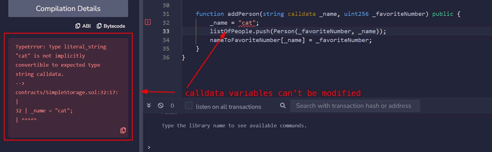
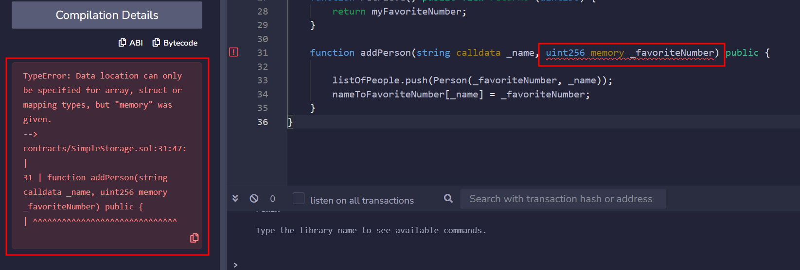

- https://updraft.cyfrin.io/courses/solidity
- https://docs.soliditylang.org/zh-cn/latest/
- https://github.com/chertes01/Solidity-study-notes
## 基础 ：Simple Storage
### 初始Remix
- https://remix.ethereum.org 
- 文件管理                                       
- 搜索字符串                                                                            
- solidty编译器                                                                                             

```rust

//SPDX-License-Identifier: MIT
pragma solidity 0.8.18;   // 只有solidity 0.8.18版本是有效的
pragma solidity ^0.8.18; // 这样solidity 0.8.18及其以上的版本都是有效的
pragma solidity >=0.8.18<0.9.0; // 这样solidity 0.8.18及其以上小于0.9.0的版本都是有效的


contract SimpleStorage{

}     // 命名合同
```
  

#### 本地部署
- https://github.com/ethereum/remix-project
- https://docs.soliditylang.org/zh-cn/latest/installing-solidity.html#remix


```bash
npm install --global yarn
yarn global add nx

```
  
```bash
git clone https://github.com/ethereum/remix-project.git
cd remix-project
yarn
yarn run build:libs
yarn build
yarn serve:hot
```
- http://localhost:8080/index.html
### 基本变量类型
```rust
//SPDX-License-Identifier: MIT
pragma solidity 0.8.18;

contract SimpleStorage{
	// 基本数据类型：boolean，uint,int, address,bytes,string
	int morenzhi; //此时变量默认值为0
	
	bool hasFavoriteNumber = false; // 定义并初始化变量
	uint favoriteNumber = 88; // 无符号整数
	uint256 notfavoriteNumber = 20;  //指定unit大小为256字节
	int256 hiroki = -77;
	string favoriteNumberInText = "88"; //定义字符串
	address myAddress = 0xAac50eFe121296fA80514578a3F0024eCF64A350;
	bytes32 favoriteBytes32 = "cat";
}
```
  

### 函数 / 方法

```rust
//SPDX-License-Identifier: MIT
pragma solidity ^0.8.18;

contract SimpleStorage{
	int favoriteNumber; //此时变量默认值为0

	function store(int fanumber) public {
		favoriteNumber = fanumber;
	}
}
```

1. 编译代码                                                                     
2. 将代码部署到合约上                                                                                     
3. 部署完成后会发现一笔交易（部署合约就是修改区块链，所以会产生交易）
4. 调用store函数（每调用一次也会修改一次区块链状态，所以也会产生交易）  


#### [可见性和 getter 函数](https://docs.soliditylang.org/zh-cn/latest/contracts.html#getter)
```rust
//SPDX-License-Identifier: MIT
pragma solidity ^0.8.18;

contract SimpleStorage{
	int  public favoriteNumber; //将favoriteNumber属性修改为public

	function store(int fanumber) public {
		favoriteNumber = fanumber;
	}
}
```
1. favoriteNumber被设置为公开可见  
2. [状态变量的可见性](https://docs.soliditylang.org/zh-cn/latest/contracts.html#getter)                                         
3. [函数的可见性](https://docs.soliditylang.org/zh-cn/latest/contracts.html#id4)                                                                          

```rust
//SPDX-License-Identifier: MIT
pragma solidity ^0.8.18;

contract SimpleStorage{
	int internal favoriteNumber; // internal 内部状态变量
	
	function store(int fanumber) public {
		favoriteNumber = fanumber;
	}
	function retrieve() public view returns(int256){
		/*
		view , pure
		view 只是检索区块链内容，没有修改区块链状态，不需要产生交易
		同时，如果在view函数中添加修改区块链状态的语句将会报错
		*/
		return favoriteNumber;
	}
}
```
1. 注意变化  
2. favoriteNumber不可见了，但可以调用retrieve()函数拿到favoriteNumber的值
3. `store`函数是橘色的，`retrieve`函数是蓝色的（favoriteNumber可见是也是蓝色的），一个修改了区块链状态（需要产生交易），一个只是在区块链上索引内容（无需产生交易）


### 数组和结构体
```rust
//SPDX-License-Identifier: MIT
pragma solidity ^0.8.18;

contract SimpleStorage{
	int internal myFavoriteNumber; // internal 内部状态变量
	
	// uint256[] listofFavoriteNumbers; // [0,18,90] 数组 索引从0开始

	struct Person{   // 结构体，想象成自己构造数据类型
		int256 favoriteNumber;
		string name;
	}

	Person public hiroki = Person({favoriteNumber:7,name:"pat"});
	
	
	// 动态数组 dynamic array
	Person[] public listOfPeople;

	// 静态数组 static array
	//Person[3] public listOfPeople;

	function addPerson(string memory _name, int256 _favoriteNmuber) public{
	Person memory newPerson = Person(_favoriteNmuber,_name);
	listOfPeople.push(newPerson);
	//listOfPeople.push(Person(_favoriteNmuber,_name));
	}
}
```

1. `Person public hiroki = Person({favoriteNumber:7,name:"pat"});`
2. `Person[] public listOfPeople;`


### 错误和警告
1. Errors（红色） ：代码无法编译
2. warnings（黄色）：不会妨碍编译，部署代码
3. ai解决所有问题：http://phind.com/  

### Memory storage and calldata
1. 
2. 重点：


Solidity 可以将数据存储在六个不同的位置，我们重点关注前三个：
- Calldata 调用数据
- Memory 内存
- Storage 存储
- Stack 堆栈
- Code 代码
- Logs 日志


####  Calldata and Memory
在 Solidity 中，调用数据和内存是函数执行期间变量的临时存储位置。调用数据是只读的，用于无法修改的函数输入。相反，内存允许读写访问，允许在函数内更改变量。要修改调用数据变量，必须先将它们加载到内存中。


>🚧 警告 
>大多数变量类型自动默认为内存。但是，对于字符串，由于数组在内存中的处理方式，您必须指定内存或调用数据。

```rust
string memory variableName = "someValue";
```

#### Calldata
调用数据变量是只读的，比内存便宜。它们主要用于输入参数。 在以下示例中，如果我们尝试用`calldata`替换`memory`，我们会收到错误，因为无法操作`calldata`。
```rust
function addPerson(string calldata _name, uint256 _favoriteNumber) public {
    _name = "cat";
    listOfPeople.push(Person(_favoriteNumber, _name));
}
```


  

####  Storage
存储在`storage`中的变量在区块链上是持久的，在函数调用和交易之间保留它们的值。

在我们的合约中，变量“myFavoriteNumber”是一个存储变量。在任何函数之外声明的变量都会隐式转换为存储变量。

```rust
contract MyContract {
    uint256 favoriteNumber; // this is a storage variable
};
```


#### Strings and primitive types

如果您尝试为 `uint256` 变量指定 `memory` 关键字，则会遇到此错误：
```rust
> Data location can only be specified for array, struct, or mapping type
```
  
在 Solidity 中，`string`被识别为**字节数组**。另一方面，像`uint256`这样的原始类型具有内置机制，可以规定如何以及在何处存储、访问和操作它们。
<!--ID: 1743494398876-->


> 🚧 **警告**:
>  您不能在函数内部对变量使用 `storage` 关键字。这里只允许使用 `memory` 和 `calldata`，因为变量只是暂时存在的。
```rust
function addPerson(string memory _name, uint256 _favoriteNumber) public {  // cannot use storage as input parameters
    uint256 test = 0; // variable here can be stored in memory or stack
    listOfPeople.push(Person(_favoriteNumber, _name));
}
```


### Mappings
```rust

pragma solidity ^0.8.18;

contract SimpleStorage{
	int internal myFavoriteNumber; // internal 内部状态变量

	struct Person{   // 结构体，想象成自己构造数据类型
		int256 favoriteNumber;
		string name;
	}
	
	//动态数组
	Person[] public listOfPeople;
	

	// 创建一个string ---> int的映射 名字为 nameToFavoriteNumver
	mapping (string => int256) public nameToFavoriteNumver;


	function store(int256 _favoriteNumber) public {
		myFavoriteNumber = _favoriteNumber;
	}


	function retrieve() public view returns(int256){
		return myFavoriteNumber;
	}


	function addPerson(string memory _name, int256 _favoriteNmuber) public{
		listOfPeople.push(Person(_favoriteNmuber,_name));
		nameToFavoriteNumver[_name]=_favoriteNmuber;

	}
}
```

通过创建映射我们可以从name拿到favoritenumber
  


### 部署第一个合约


#### 部署到测试网中
1. 连接到metamask（将用户连接到测试网）  
2. 部署  
3. 如果我们metamask的测试网使用的是sepolia 我们就可以点击view直接查看  
4. 我是在tendely自建的测试网 在这个地方查看信息https://dashboard.tenderly.co/hiroki/test/testnet/95191a89-8053-4363-a8f3-acd57dd4c598    
5. 我们点击蓝色的（读取内容）并不会发生交易（并没有修改区块链）  
6. 但当我们addperson的时候，就会弹出交易内容（修改了区块链上的内容）    


#### 部署Zksync（暂停）

随着部署到以太坊主网的成本不断上升，对扩展解决方案（如汇总和第2层网络）的需求越来越大。以下课程将指导您将智能合约部署到L2 zkSync。


要在zkSync上部署合约，您需要testnet资金。有两种方法可以获得它们：
1. zkSync水龙头：类似于使用Sepolia水龙头，这种方法允许您直接请求testnet资金。
2. zkSync Bridge：这种方法涉及将资金从以太坊测试网转移到zkSync测试网。虽然免费的插件有时可能不可靠，但桥接提供了一个更一致的解决方案。


## 进阶：Storage Factory
Storage factory introduction


您可以在 [Remix Storage Factory Github 仓库](https://github.com/cyfrin/remix-storage-factory-f23)中找到本节的代码。在接下来的九个课程中，我们将处理三个新的合约：

1. `SimpleStorage.sol` - 这是在前一章节构建的合约，并作了一些修改。
2. `AddFiveStorage.sol` - `SimpleStorage` 的子合约，利用了`继承`的概念。
3. `StorageFactory.sol` - 一个将要部署`SimpleStorage` 合约并与其交互的合约。


### 通过New 部署合约
- 允许按需创建任意数量的合约实例
- 实现合约的批量部署和管理

```go

// SPDX-License-Identifier: MIT
pragma solidity ^0.8.18;

contract SimpleStorage{
	.........
}

contract StorageFactory {
    // 变量定义： 类型-可见性-名称
    SimpleStorage public simpleStorage; // 声明一个类型为 SimpleStorage 的公共状态变量

    function createSimplestorageContract() public {
        simpleStorage = new SimpleStorage(); // 使用 new 关键字部署一个新的 SimpleStorage 合约实例并赋值给状态变量
    }
}
```


### Import导入合约
```go

// SPDX-License-Identifier: MIT
pragma solidity ^0.8.18;

// import "../SimpleStorage.sol"
// 指定合约导入:节省gas费
import {SimpleStoage1,SimpleStoage2} from "../SimpleStorage.sol"


contract StorageFactory {
    // 变量定义： 类型-可见性-名称
    SimpleStorage public simpleStorage; // 声明一个类型为 SimpleStorage 的公共状态变量

    function createSimplestorageContract() public {
        simpleStorage = new SimpleStorage(); // 使用 new 关键字部署一个新的 SimpleStorage 合约实例并赋值给状态变量
    }
}
```


### ### ABI 合约交互

​
#### SimpleStorage 升级
##### 存储已部署的合约地址

- **问题**：原版本每次部署新合约都会覆盖之前的合约地址，无法追踪历史部署。
- **解决方案**：使用动态数组存储所有已部署的合约。

```sol
// 声明公共动态数组，存储所有部署的SimpleStorage合约
SimpleStorage[] public listOfSimpleStorageContracts;
```

##### 修改合约创建函数

更新部署函数，将新合约地址添加到数组中：
```solidity
function createSimpleStorageContract() public {
    SimpleStorage simpleStorageContractVariable = new SimpleStorage();
    listOfSimpleStorageContracts.push(simpleStorageContractVariable);
}
```
- **访问方式**：在 Remix 中通过 `uint256`类型的索引访问数组中的合约。
​

#### ABI合约交互功能
- **合约地址**​ - 目标合约在区块链上的部署地址
- **合约 ABI**​ - 应用程序二进制接口
- `SimpleStorage(address(合约地址)).函数名();`

##### 存储函数实现

创建 `sfStore`函数调用特定合约的存储功能：

```solidity
function sfStore(uint256 _simpleStorageIndex, uint256 _simpleStorageNumber) public {
    listOfSimpleStorageContracts[_simpleStorageIndex].store(_simpleStorageNumber);
}
```
##### 读取函数实现

创建 `sfGet`函数读取特定合约的存储值：
```solidity
function sfGet(uint256 _simpleStorageIndex) public view returns (uint256) {
    // 方法1：类型转换方式
    // return SimpleStorage(address(listOfSimpleStorageContracts[_simpleStorageIndex])).retrieve();
    
    // 方法2：直接调用（推荐）
    return listOfSimpleStorageContracts[_simpleStorageIndex].retrieve();
}
```


### 继承与重写

#### 继承
##### 创建继承合约

在 `AddFiveStorage.sol`文件中继承 `SimpleStorage`合约：

```
// SPDX-License-Identifier: MIT
pragma solidity ^0.8.18;
import {SimpleStorage} from "./SimpleStorage.sol";

contract AddFiveStorage is SimpleStorage {}
```

**`is`关键字**：表示继承关系，将父合约 `SimpleStorage`连接到子合约 `AddFiveStorage`

##### 继承的功能特性

1. 添加新功能： 可以在子合约中添加全新的函数：

```
function sayHello() public pure returns(string memory) {
    return "Hello";
}
```

2. 重写现有功能： 可以修改从父合约继承的函数，这需要用到 `override`和 `virtual`关键字。

#### 重写机制

1.  步骤1：在父合约中标记虚拟函数
在 `SimpleStorage.sol`中将需要重写的函数标记为 `virtual`：

```
function store(uint256 favNumber) public virtual {
    favoriteNumber = favNumber;
}
```

2. 步骤2：在子合约中正确重写

在 `AddFiveStorage`合约中重写函数时需要：
- 复制完全相同的函数签名
- 添加 `override`关键字
- 实现新的功能逻辑

```
function store(uint256 _newFavNumber) public override {
    favoriteNumber = _newFavNumber + 5;
}
```


## 最终：FundMe

- 去中心化众筹合约

1. 合约组成
	- **FundMe**：主众筹合约
	- **PriceConverter**：价格转换辅助合约
2. 核心功能
	- **资金筹集**：允许用户发送任意原生区块链加密货币
	- **资金提取**：合约所有者可以提取所有筹集到的资金


### 项目初始化


#### 项目规划
1. 资金存入功能
	1. 允许用户向FundMe合约存入资金
2. 资金提取功能
	1. 允许合约所有者提取所有存入的资金
3. 最低金额限制
	1. 设置以USD计价的最低存款金额


#### 合约基础结构


```solidity
// SPDX-License-Identifier: MIT
pragma solidity ^0.8.18;

contract FundMe {
	//合约主体
}
```

#### 核心函数设计
1. fund函数 - 资金存入
2. withdraw函数 -- 资金提取

```solidity
contract FundMe{
	// 向合约发送资金
	function fund() public{}
	
	// 所有者可以提取资金
	function withdraw() public{}
}
```


### 支付功能实现

> 创建fund函数向只能合约转账ETH，并设置最低转账金额要求

#### payable关键字 
- 功能： 允许函数接受原生加密货币（如：ETH）
```solidity
function fund() public payable{
	// 允许用户发送资金
	// 设置最低发送金额
	// 如何向此合约发送ETH？
	msg.value; // 获取交易金额

}

```

#### msg.value 属性  
1. 全局对象msg的一部分
2. 以wei计价的交易金额
3. 1 ETH = $10^{18}$ Wei 
```solidity
// 获取当前交易的转账金额
uint256 amount = msg.value;
```


**wei 、gwei、ETher的区别**

- Wei : 最小单位，1 ETH = $10^{18}$ wei
- Gwei： 中间单位 1 ETH = $10^9$ Gwei， 常用于Gas计价
- Ether：主要计价单位

####  require语句 :交易回滚机制

- require 语句：用于强制执行条件检查，确保交易满足特定要求：

```solidity
// 基本条件检查
require(msg.value > 1e18); //1e18 = 1ETH

// 带错误信息的条件检查
require(msg.value > 1e18,"Didn't send enough ETH");
```

 条件不满足时的行为
- 条件为 false 时回滚（revert）整个交易
- 状态更改被撤销
- 显示自定义错误信息
- 燃气费用仍被消耗


### 交易回滚与 Gas 机制详解

#### 回滚

1.  回滚的作用原理 ： 回滚操作会撤销函数中所有已执行的操作，并将**剩余Gas**返还给交易发送者
```solidity
uint256 public myValue =1;

function fund() public{
	myValue = myValue + 2;
	require(msg.value > 1e18,"didn't send enough ETH")
	// 如果require条件失败，将回滚到函数开始前的状态
	// myValue将恢复为初始值1
}

```

2. 交易失败：如果交易回滚，则被定义为失败交易。失败交易仍然会被记录在区块链上，但不会改变状态。

#### Gas机制

##### Gas 消耗规则
> 🔥 **重要提示**：如果交易因回滚而失败，已使用的 Gas 不会被退还。代码已经被计算机执行，即使交易最终被回滚。

##### Gas 限制设置

用户可以指定愿意为交易分配的 Gas 数量：
- **Gas 价格**：愿意为每单位 Gas 支付的价格
- **Gas 限制**：愿意为交易使用的最大 Gas 量


##### 交易字段

1. 价值转移交易（纯转账)

| 字段        | 说明           | 示例值        |
| --------- | ------------ | ---------- |
| Nonce     | 账户交易计数器      | 0, 1, 2... |
| Gas Price | 每单位 Gas 最高价格 | 20 Gwei    |
| Gas Limit | 最大 Gas 使用量   | ~21000     |
| To        | 接收方地址        | 0x...      |
| Value     | 转账金额（Wei）    | 1e18       |
| Data      | 数据内容         | 🫙 空       |
| v, r, s   | 交易签名组件       | 数字签名       |

2. 合约交互交易

|字段|说明|示例值|
|---|---|---|
|Nonce|账户交易计数器|0, 1, 2...|
|Gas Price|每单位 Gas 最高价格|20 Gwei|
|Gas Limit|最大 Gas 使用量|~21000|
|To|目标合约地址|0x...|
|Value|转账金额（Wei）|1e18|
|Data|函数调用和参数|📦 包含数据|
|v, r, s|交易签名组件|数字签名|


### Oracle
####  💰 USD 价值转换需求
- Oracles：获取真实世界价格数据
```solidity
// 设置最小 USD 金额
uint256 public minimumUSD = 5; // 5美元

// 问题：msg.value 是 ETH，如何与 USD 比较？
require(msg.value >= minimumUSD, "Not enough USD value");
```


- **单位不匹配**：`msg.value`是以 Wei 为单位的 ETH，而 `minimumUSD`是美元
- **价格获取**：ETH 的美元价格无法从区块链本身获取
- **解决方案**：需要外部数据源（Oracle）

#### ChainLink工作原理

1. ⚡模块化去中心化 Oracle 网络：Chainlink 允许智能合约结合链上和链下数据，创建**混合智能合约**，实现功能丰富的应用
2. 🛠️核心产品
	- 数据馈送（Data Feeds）
		- 解决问题 ： 智能合约获取可靠外部价格数据的问题  
		- 应用场景：加密货币价格获取 、大宗商品价格、汇率数据
	- 可验证随机函数（VRF）
		- 解决问题：在区块链上生成可验证的随机数，确保公正性
		- 应用场景：NFT随机属性生成、彩票和赌博应用、游戏随机事件
	- 自动化（Automation）
		- 解决问题：智能合约  需要定时或条件触发执行的问题
		- 应用场景：定时支付、条件触发交易、合约状态维护
	- 函数（Functions）
		- 解决问题：智能合约需要进行去中心化API调用的需求
		- 应用场景：获取任意外部数据、复杂计算任务、跨链数据交互
3. 🔄Chainlink 数据流通过程（价格数据获取流程）
	1. 数据聚合：每隔Chainlink节点从不同交易所收集数据
	2. 独立验证：每个节点验证资产价格
	3. 参考合约：数据被传递到价格馈送合约
	4. 智能合约访问：dApp从参考合约读取最新价格


#### 在FundMe合约中的应用
- 实现USD价值交换
```solidty

// 使用ChainLink数据 馈送 获取ETH/USD价格
function fund() public payable{
	// 获取当前ETH的USD价格
	uint256 ethPrice = getEthPriceInUSD();
	
	// 计算转账金额的USD价值
	uint256 usdVelue =(msg.value * ethPrice) / 1e18;
	
	//  验证是否达到最小USD金额
	require(usdValue >= minimunmUSD,"Didn't send enough USD");

}
```


### ETH 转 USD 转换
- Solidity + ChainLink

#### 基本步骤
1. 导入接口
```solidity
// 导入 Chainlink 接口
import "@chainlink/contracts/src/v0.8/interfaces/AggregatorV3Interface.sol";

//AggregatorV3Interface接口 用于与priceFeed合约交互

contract FundMe {
    // 使用接口类型声明变量
    AggregatorV3Interface internal priceFeed;
    
    constructor(address _priceFeedAddress) {
        priceFeed = AggregatorV3Interface(_priceFeedAddress);
    }
}
```
2. 实现价格获取函数
```solidity
function getPrice() public view returns (uint256) {
		// latestRoundData 函数 获取最新价格数据
    (, int256 answer, , , ) = priceFeed.latestRoundData();
    // 返回 ETH 的 USD 价格（考虑小数位）
    return uint256(answer);
}
```
3. 实现转换率函数
```solidity
function getConversionRate(uint256 ethAmount) public view returns (uint256) {
    uint256 ethPrice = getPrice();
    uint256 ethAmountInUsd = (ethPrice * ethAmount) / 1e18;
    return ethAmountInUsd;
}
```
4. 在fund函数中使用
```solidity
function fund() public payable {
    // 将 ETH 转换为 USD
    uint256 usdValue = getConversionRate(msg.value);
    require(usdValue >= 50 * 1e18, "You need to spend more ETH!"); // 最低 $50
}
```


#### 完整实现
```solidity
// 获取价格馈送的小数位数
function getDecimals() public view returns (uint8) {
    return priceFeed.decimals();
}

// 完整的 FundMe 合约示例
contract FundMe {
    AggregatorV3Interface internal priceFeed;
    
    constructor(address _priceFeedAddress) {
        priceFeed = AggregatorV3Interface(_priceFeedAddress);
    }
    
    function getVersion() public view returns (uint256) {
        return priceFeed.version();
    }
    
    function getDecimals() public view returns (uint8) {
        return priceFeed.decimals();
    }
    
    function getPrice() public view returns (uint256) {
        (, int256 answer, , , ) = priceFeed.latestRoundData();
        // 考虑价格的小数位数
        uint8 decimals = priceFeed.decimals();
        return uint256(answer) * (10 ** (18 - decimals));
    }
    
    function getConversionRate(uint256 ethAmount) public view returns (uint256) {
        uint256 ethPrice = getPrice();
        uint256 ethAmountInUsd = (ethPrice * ethAmount) / 1e18;
        return ethAmountInUsd;
    }
    
    function fund() public payable {
        uint256 usdValue = getConversionRate(msg.value);
        require(usdValue >= 50 * 1e18, "Minimum $50 required");
        // 资金处理逻辑...
    }
}
```