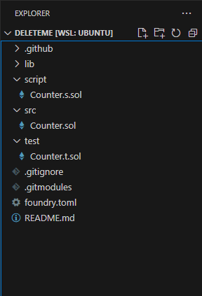

- https://updraft.cyfrin.io/courses/security
- https://github.com/Cyfrin/security-and-auditing-full-course-s23

## Tools🔨
- vscode
- wsl （linux环境）
- Foundry
	- Foundry 是一个用于以太坊智能合约的开发工具包，特别适合用 Solidity 编写的合约。
	- https://book.getfoundry.sh/getting-started/installation
	- `cast` / `chisel`

## Solidity Prerequisites 🖊
### Solidty
- [solidty基础](../0.基础知识/1.Solidity.md)

### Foundry

1. `forge init`  //初始化一个新的项目                                                                                                                                                                                   
2. 基础命令
	1. 创建项目 `mkdir basic-solc-project  && cd basic-solc-project`
	2. `forge init  //初始化一个新的项目`  
	3. `forge build //编译项目智能合约`    4. `forge test //查找测试文件，编译测试合约，运行测试，报告结果`   
3. 熟悉Foundry的基本代码
```rust
// SPDX-License-Identifier: UNLICENSED
pragma solidity ^0.8.13;

// 定义一个名为 Counter 的合约
contract Counter {
    // 定义一个公共的 uint256 类型的状态变量 number
    uint256 public number;

    // 定义一个公共函数 setNumber，用于设置 number 的值
    function setNumber(uint256 newNumber) public {
        number = newNumber; // 将传入的新值赋给 number
    }

    // 定义一个公共函数 increment，用于将 number 的值加 1
    function increment() public {
        number++; // 将 number 的值加 1
    }
}

```


### 测试
- 常规测试
- 模糊测试


#### 探索测试类型

- 在**常规测试**中，我们只是接收计数器合约并将其递增，以确保计数器数量等于1。
- 然而，**Fuzz测试**涉及向我们的测试传递一个随机数。

使用不同的随机数，以一定的运行次数运行此测试。无论选择X的值，测试将始终保持。

我们如何改变模糊运行的次数？只需浏览到Foundry的TOML文件并复制变量。
```rust
[fuzz]
runs = 256
max_test_rejects = 65536
seed = "0x3e8"
dictionary_weight = 40
include_storage = true
include_push_bytes = true
```
在TOML文件中，可以设置试验次数。例如，将其从256更改为600。  
```rust
$ forge test
```
这个测试Fuzz运行了600次。这表明测试使用了600个不同的随机数。 
## Fuzzing and invariants

### 什么是模糊测试？

**FUZZ**也被称为**fuzzing**，这是所有关于提供随机数据到您的系统，试图破坏它。想象你的代码是一个坚不可摧的气球。Fuzzing涉及您对气球做随机的事情（如戳，挤压，甚至踢），目的是打破它。

1. 理解不变量
2. 为不变量写fuzz测试

### 基本原则：测试不变量（Invariants）

每个系统，从函数到整个程序，都有一个完整的属性，通常被称为`Invariants`。此属性必须始终为真。例如，你可以有一个名为`doStuff`的函数，它应该总是返回零，而不管输入的值是什么。在这种情况下，返回零将是该函数的不变量(`Invariants`)。

让我们更深入地了解这样一个函数可能是什么样子：
```rust
function doStuff(uint256 data) public {
        if (data == 2){ // 如果data等于2，则设置shouldAlwaysBeZero为1
            shouldAlwaysBeZero = 1;
        }
        if(hiddenValue == 7) { // 如果hiddenValue等于7，则设置shouldAlwaysBeZero为1
            shouldAlwaysBeZero = 1;
        }
        hiddenValue = data; // 设置hiddenValue的值为data
    }
}
```
  

这个函数的单元测试看起来像这样：  
```rust
// SPDX-License-Identifier: UNLICENSED
pragma solidity ^0.8.13;

import {MyContract} from "../script/MyContract.sol";

contract MyContractTest {
    MyContract exampleContract; // 声明 MyContract 类型的变量 exampleContract
    
    // 测试函数，验证 exampleContract 的 shouldAlwaysBeZero 函数是否总是返回 0
    function testIAlwaysGetZero() public {
        uint256 data = 0; // 初始化数据为 0
        exampleContract.doStuff(data); // 调用 exampleContract 的 doStuff 函数
        assert(exampleContract.shouldAlwaysBeZero() == 0); // 断言 shouldAlwaysBeZero 函数的返回值为 0
    }
}
```
上面的测试会通过，因为在特定的情况下（`data == 0`），我们的不变量没有被破坏。

1. `data=0` 时 ，测试`forge test --match-test testIAlwaysGetZero` 成功  
2. `data=1`  


>如果我们有一个看起来稍微复杂一点的功能怎么办？为每个场景编写测试用例可能很乏味或不可能。我们需要采取更具程序性的方法来全面测试这些案例。
###  Fuzz Tests and Invariant Tests

处理这种情况时有两种流行的方法：使用`fuzz`测试/`不变测试`或`symbolic execution`

>"Fuzz testing and Invariant testing are great tools to assess the robustness of your code."

让我们考虑Foundry中模糊测试的一个示例。在这里，我们在测试参数中正确设置数据，使Foundry能够自动化测试期间提供随机输入数据的过程。
```rust
function testIsAlwaysGetZeroFuzz(uint256 data) public {
    exampleContract.doStuff(data);
    assert(exampleContract.shouldAlwaysBeZero() == 0);
}
```

  
Foundry将自动随机化数据并使用大量示例来运行测试脚本。此测试将提供从0到`uint256.max（）`的随机数据，次数与您配置的运行次数相同。
>提醒：您可以在`foundation.toml`下在中配置`[fuzz]`变量运行次数  


>值得注意的是，这种伪随机机制并不详尽。它不会为每个可能的数据输入提供场景。这就是为什么进一步了解Fuzzer如何生成随机数据至关重要。

### 无状态模糊与有状态模糊

- 上面是“无状态模糊”`Stateless Fuzzing`的一个例子。
	- 缺陷：
		- 上个例子中 如果`data=7` 那下一次调用private时`hiddenValue=7`，则此时`shouldAlwaysBeZero!=0`
		- 但我们使用无状态模糊测试时它检测不到（因为它不会保存上一个状态的）  
- 另一个值得理解的是“状态模糊化”。
	- “状态模糊”`Stateful Fuzzing`不会为每次新运行重置合同状态，而是将上一次运行的结束状态用作下一次运行的开始状态。   

状态模糊测试将利用我们刚刚触发的相同契约并调用其中的另一个函数，在单次运行中创建连锁的函数序列。在Foundry中实现这一点需要使用`invariant`关键字和一些设置： 

首先，我们需要从`forge-std`导入`StdInvariant`
```rust
//SPDX-License-Identifier: MIT
pragma solidity ^0.8.0

import {StdInvariant} from "forge-std/StdInvariant.sol";

contract MyContractTest is StdInvariant, Test {...}
```

然后，在设置测试合同时，我们需要告诉Foundry，我们将在哪个合同上调用随机函数。
```rust
function setUp() public {
    exampleContract = new MyContract();
    targetContract(address(exampleContract));
}
```
现在我们的“有状态模糊”测试看起来像这样：
```rust
function invariant_testAlwaysReturnsZero() public {
    assert(exampleContract.shouldAlwaysBeZero() == 0);
}
```
通过上述测试，Foundry将在`targetContract`上调用随机函数（在我们的例子中，重复调用`doStuff`，但如果还有其他函数，则将以随机顺序调用它们）并向这些函数传递随机数据。
  
```rust
// SPDX-License-Identifier: UNLICENSED

pragma solidity ^0.8.13;

import {MyContract} from "../script/MyContract.sol";
import {Test} from "forge-std/Test.sol";
import {StdInvariant} from "forge-std/StdInvariant.sol";

  

contract MyContractTest is StdInvariant, Test {
    MyContract exampleContract; // 声明 MyContract 类型的变量 exampleContract

    function setUp() public {
        exampleContract = new MyContract(); // 初始化 exampleContract 变量
        address targetContract = address(exampleContract); // 设置 targetContract 为 exampleContract 的地址
    }

    function invariant_ShouldAlwaysBeZero() public  {
        assert(exampleContract.shouldAlwaysBeZero() == 0); // 断言 exampleContract.shouldAlwaysBeZero() 的值为0
    }

  

}
```


## Installing Libraries
1. 安装
```bash
forge install githubname/githubxxxx  --no-commit
```
2. 配置foundry.toml
  
  
3. 在代码中导入库
```rust
import {ERC20} from "@openzeppelin/comtracts/token/EPC20/EPC20.sol"
```
  


## 代币标准
### ERC20
- 代币标准

### ERC721
- NFT（艺术品）
- 不可替代，不可互换的代币
- 依旧是代币标准
-  token url (直接上传图片gas太贵了)   A tokenUrl is just a simple API call


## Advanced Solidity


### Storage
1. unit 256 public number --> 一个槽storage
2. unit256 public constant number3 =1 ; 变量不占用存储槽，直接存储在合约字节码中

  

  
- bool占1个位


### Fallback and Receive

### ABI encode


