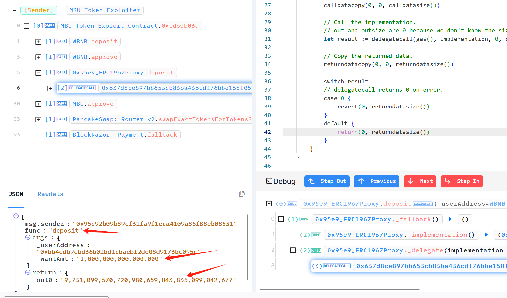
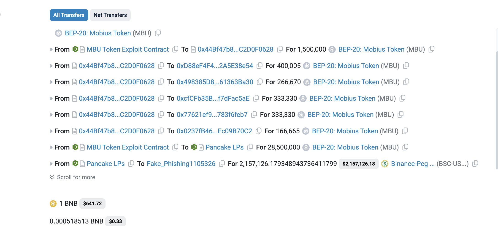
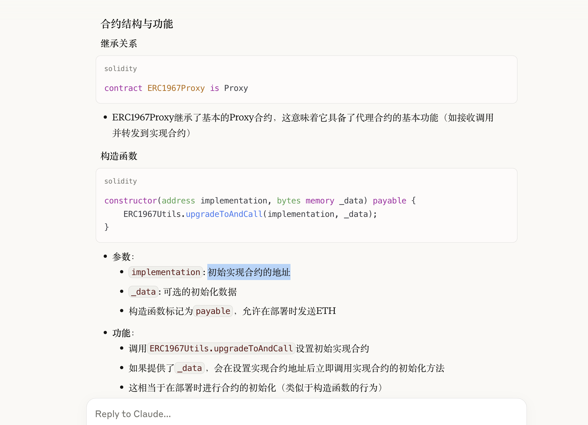

## 基础
- 写个方法发布到链上 ，调用它，直接调用他的地址
```Solidty
contract xxxx {
}
```

1. 
2.     


## 漏洞分析
- https://app.blocksec.com/explorer/tx/bsc/0x2a65254b41b42f39331a0bcc9f893518d6b106e80d9a476b8ca3816325f4a150 
- 
1. 这个漏洞是价格错误 ，所以我们关心代币转换  
	1. 补充：精度18 位 `1，000，000，000，000，000 = 0.001`
2. `Debug` -- > `Step in` 
	1. 不断不进，发现一个函数arg为`100....`,返回却异常大  
	2. 回退查看代理合约地址 `_fallback   --- implementation(代理合约地址)`  
3.  https://app.dedaub.com/binance/address/0x637d8ce897bb653cb83ba436cdf76bbe158f05b1/overview     
4. 关键在于
	- 关键代码：
		- `0x371b`
		- `0x3039`
	- 伪代码（便于理解）：

### POC&&EXP
- https://x.com/rotcivegaf/status/1921780773499138535
- 可以用攻击者的合约写exp  


## 补充

- https://bscscan.com/tx/0x2a65254b41b42f39331a0bcc9f893518d6b106e80d9a476b8ca3816325f4a150
- 为什么在tx看不到代理合约地址  
	- [ERC1967Proxy](https://eips.ethereum.org/EIPS/eip-1967)
	-   