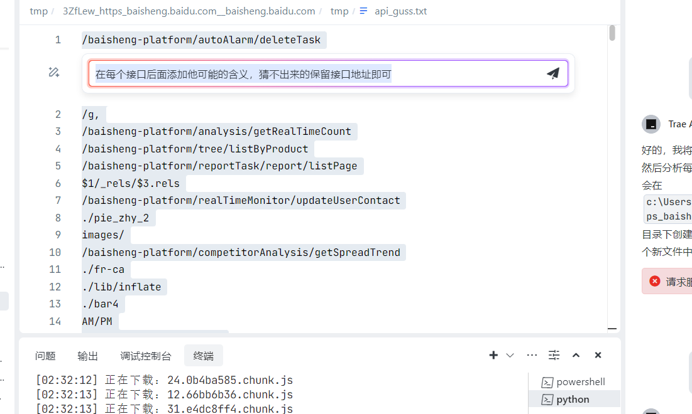

## 目标站点
- vue
- react
- webpack

## 更新内容
- 原项目改： https://github.com/rtcatc/Packer-Fuzzer
	- 下载node.js
- 解决了多urls无法使用的功能（会莫名奇妙产生`b'[https://baidu.com]`  `b'`无法解析，编码后可以使用）
- PackUrls.py 只执行api提取功能`python PackUrls.py`
- 加入了一些api提取的正则表达式
	- 养小猫：`r'(?:"|\')(/(?!\d+$)[\w\-/]+)(?:"|\')'`    
	- findsomethins：
		- ` extract_data['path'] = data.match(/['"](?:\/|\.\.\/|\.\/)[^\/\>\< \)\(\{\}\,\'\"\\]([^\>\< \)\(\{\}\,\'\"\\])*?['"]/g);`
		- `extract_data['incomplete_path'] = data.match(/['"][^\/\>\< \)\(\{\}\,\'\"\\][\w\/]*?\/[\w\/]*?['"]/g);`
	- 暴力匹配：`r'''['"](/[^'"\?]*?)['"\?]'''`
-

### Todo
- [ ] `print( )`调试未删干净
- [ ] `node_vm2` 已经被已弃用，但貌似不影响使用
- [ ] 前端打包器匹配准则不准确
- [ ] 经常存在请求错误情况 且 貌似站点不使用打包器会出问题*（卡死不动）
- [ ] apicollect有问题，不是我之前的了，但是勉强能用

## 使用方法
1. 在urls.txt中加入你要测试的网站  
2. 执行`python PackUrls.py`
3. 在tmp中查找对应网站的api, AI猜测接口含义来判断可能存在的漏洞  
4. 抓一个正常业务的包，爆破  取消url编码
5. 找200或者按长度来找可能存在漏洞的包  
6. 不知参数可在Trae搜素可能api路径  
7. 然后让Trae分析可能的请求包  `通过这个文件构造api/user/checkIdentity接口的http请求包`

理论：理论上不存在404页面 ，既然是js提取除非提取错误或者后台删除，一般都存在api接口，所以我们可以tare搜索构造请求包

