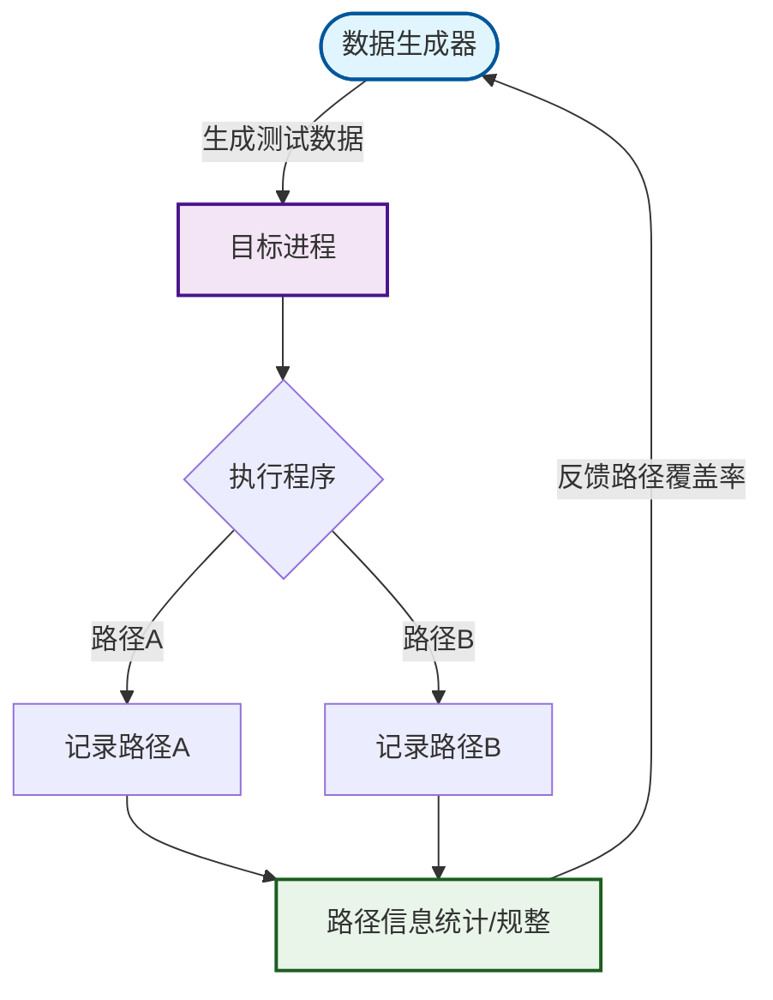
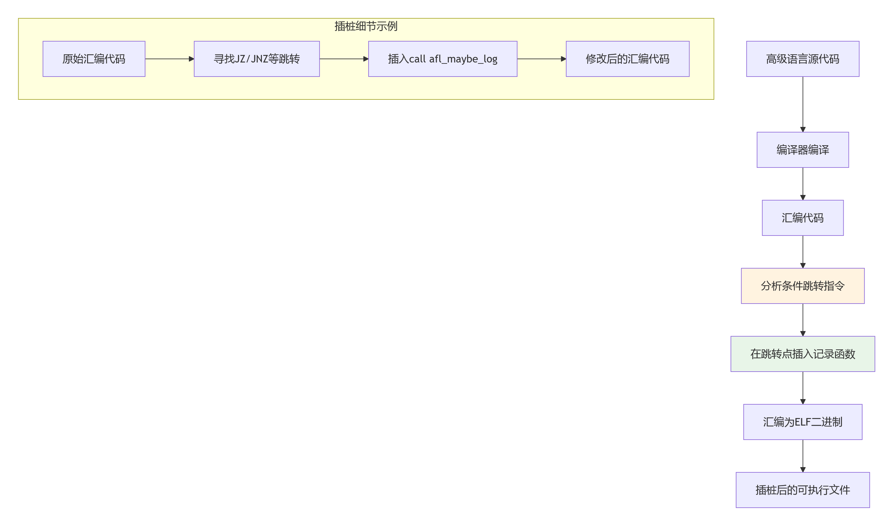
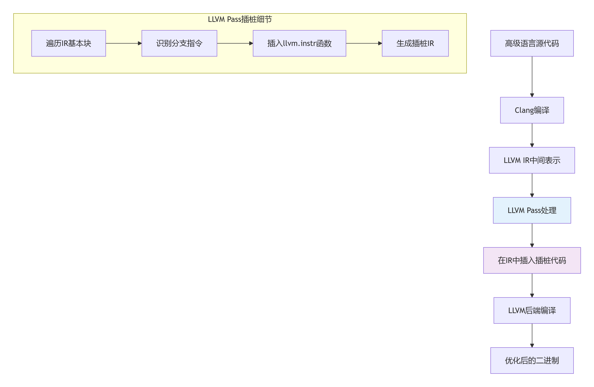

## AFL架构

```C
					----->  {数据输入} ---------------——插桩--->
{数据生成器}                                       {进程}
					<-反馈-- {路径信息统计/规整} <——传递路径信息——
					
					
数据生成器 ：基于反馈针对性编译

插桩：
void fun() {
    data = input();
    // 插桩点：记录基本块执行
    afl_maybe_log(0x1000);
    
    if (data[0] == "a") {
        // 路径A
        afl_maybe_log(0x2000);  // 记录路径A
        // 执行A路径代码
    } else {
        // 路径B
        afl_maybe_log(0x3000);  // 记录路径B
        // 执行B路径代码
    }
}
```



## 覆盖率插桩

### 如何插桩

#### 汇编层
- 与架构相关

- 数据输入后，通过if和else 找路径信息 ----   ELF文件
- 高级语言 --> 汇编 --> bin   
- 在汇编这里， 寻找条件跳转点（JNI ADDR），插入func
  
#### llvm pass（官方API）
- 与架构无关 

- clang / llvm
- {高级语言} ---clang ---> {IR}  ----LLVM --->{汇编/bin}
- 在IR这里插桩
  
### 桩函数的功能


## forkserver


## afl-fuzz&forkserver交互


## AFL源码相关测试


