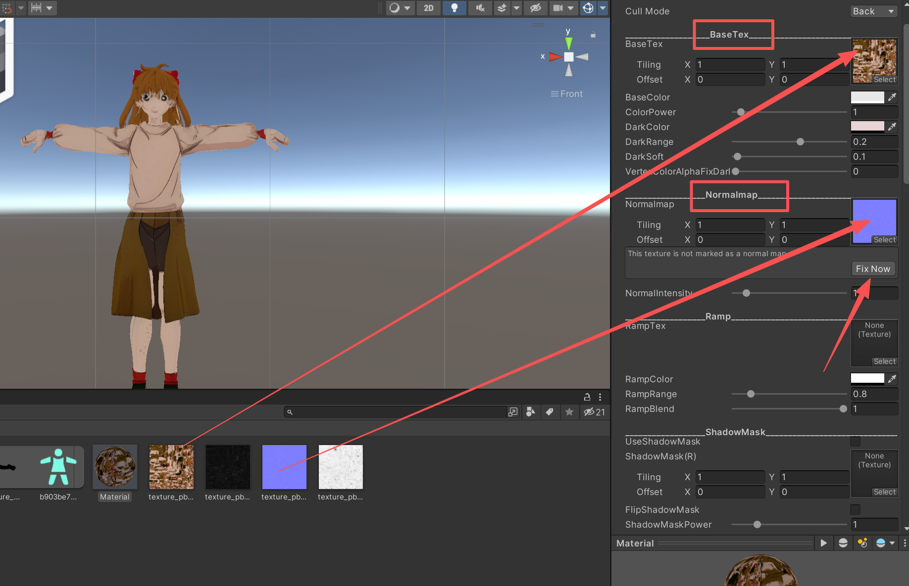

#uninty #3d建模 #money

>动漫人物不要发布 自己玩，容易有版权纠纷！！！
## 动漫人物转3D  

###  tripo3d

- https://studio.tripo3d.ai

1. 动漫任务 生成3D模型 --- 上传图片 
	1. 提示词 ：保留动漫角色的纹路细节，保持站立姿势，去除背景   
	2. T-pose 
	3. Nano Banana 模型     
2. 重拓扑 --- 三角面 15000  

3. 导出模型  ： FBX -- 底部中心轴点 有钱就导出骨骼 没钱再说   

### 腾讯混元
1.  https://3d.hunyuan.tencent.com/studio/creation/role/rs    绑骨蒙皮  
 2. 下载FBX   然后把[unity和抖音sdk](#Unity+抖音SDk) 下载一下
 3. 明日香拖进Unity中，点击模型 然后rig 人体 --- 骨骼 --- apply    
 4. materials  ---   导出    
 5. 点这个球 --- 然后 把Shader 改成 douyin 
 6. 点击这下面两个图片，把size改为1024   
 7. 还是这个球，按照下面把图拖到指定位置，然后fix now   
 8.  https://vcreate.douyin.com/pet/wiki/m2fyknwy/popuqgpp  
 9.  调整容器高度和容器位置，把角色圈主就行   
 10. 上传的时候自动修复高度就可以 
  

 

## Unity+抖音SDk

- https://vcreate.douyin.com/tutorial?book=m2fyknwy&doc=ng6bocaz
- https://vcreate.douyin.com/pet/wiki/m2fyknwy/gmjvfw79

1. Unity Hub 下载   https://unity.cn/releases?signup=true#undefined   
2. 安装[Unity 特定版本](unityhub://2021.3.14f1/eee1884e7226)
3. 新建项目   
4. 导入DouyinPet SDK   ---  将下载好的DouyinPet SDK的Unity Package，拖入Assets文件夹内     
容器高度

  