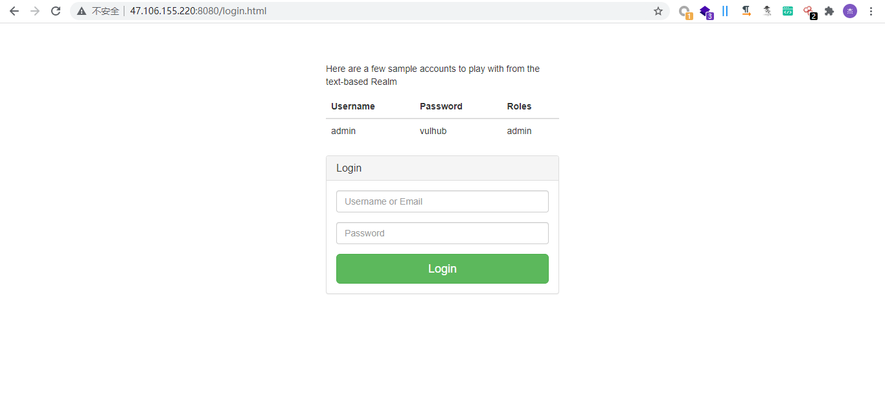
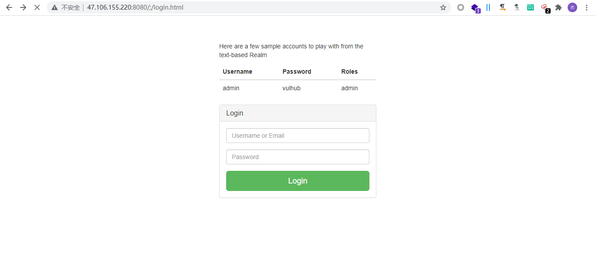

## Shiro
- Apache 下常见的 Java 安全框架，提供身份验证、授权、密码学和会话管理。
- 用户在登录时如果勾选了 remember me 选项，那么在下一次登录时浏览器会携带 cookie 中的 remember me 字段发起请求，就不需要重新输入用户名和密码。

## Shiro权限绕过漏洞
### 漏洞原理

在带有 Spring 动态控制器的 1.5.2 之前的 Apache Shiro 版本中，攻击者可以构造恶意制作的请求/..;/admin等字符来绕过目录身份验证。

### 漏洞危害

Apache Shiro 是一个功能强大且易于使用的 Java 安全框架，可执行身份验证、授权、加密和会话管理，绕过身份验证后可以进入后台操作站点功能。

### 检测条件

使用shiro框架。

### 检测方法
1. 访问网站登陆页面http:/x.x.x.x/login.html为正常页面，如图所示  
2. 接下来访问页面http:/x.x.x.x/;/login.html，依旧返回正常登录页面  
3. 通过信息泄露或是枚举接口路径找到管理地址接口，此次的管理接口为/admin。
4. 构造url的payload: http://x.x.x.x:8080/xxx/..;/admin/ ,以绕过身份验证检查并访问管理页面。 

### 修复建议
建议升级至最新版本

## Shiro反序列化漏洞

- Apache Shiro 1.2.4及以前版本中，加密的用户信息序列化后存储在名为remember-me的Cookie中。攻击者可以使用Shiro的默认密钥伪造用户Cookie，触发Java反序列化漏洞，进而在目标机器上执行任意命令。
- Shiro 为什么会有反序列化漏洞，
	- rememberme 所传递的数据就是一个序列化后的 PrincipalCollection 对象
	- 而这个 encrypt 就是通过 AES 来加密序列化后的数据，
	- 密钥是硬编码在 AbstractRememberMeManager 类中的这段 base64 编码后的字符串
	- Shiro 会将这段加密后的数据 base64 编码一遍，然后放入 Cookie 中

通过shiro反序列化攻击链可以导致在目标服务器上非授权执行任意命令，危害极大。

### 检测条件

使用shiro框架。

### 检测方法

1. 发起请求时查看返回包是否有Set-Cookie: rememberMe=deleteMe字样。
2. 寻找使用的默认key，可以用通过工具枚举发现，可以使用burp的插件shiroscan。
3. 构造payload放在cookie中的rememberMe值内，发送数据包查看回显。
也可以单独使用综合利用工具来进行利用
从猜解秘钥到执行命令都有对应的功能
执行命令时要选好合适的回显方式才能成功

### 修复建议
- 升级shiro到最新版本
- 删除代码里的默认密钥
- 如果需要配置密钥，不要使用网上和默认的密钥