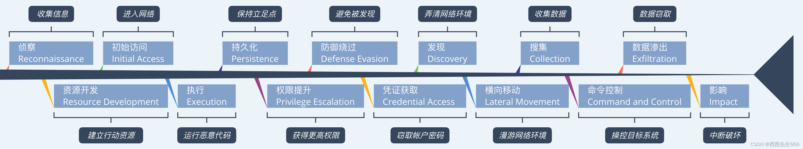
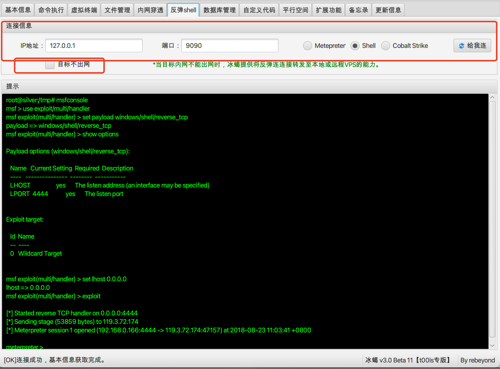
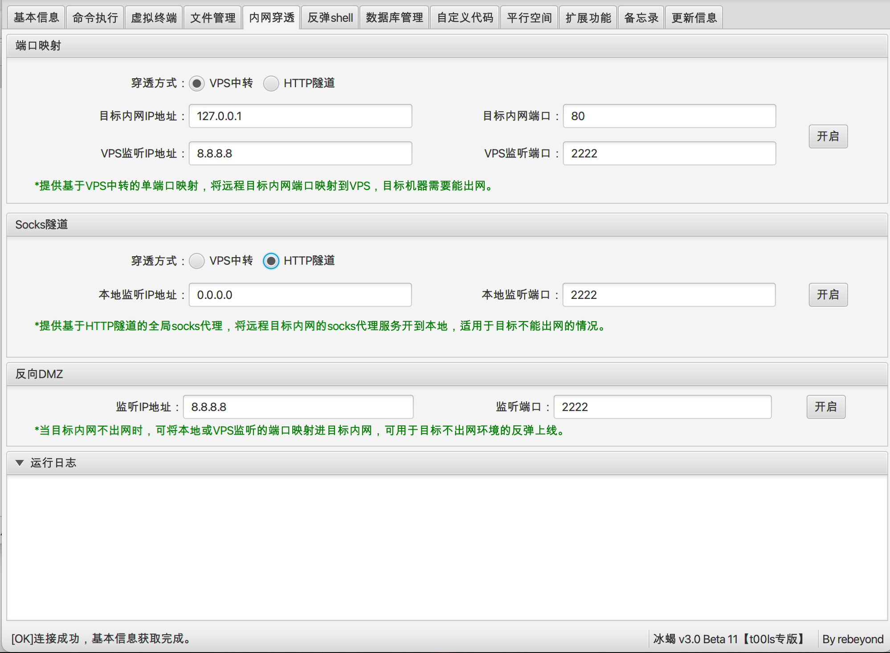
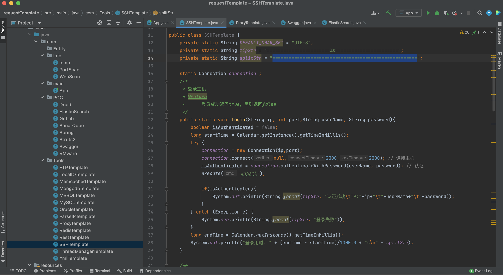
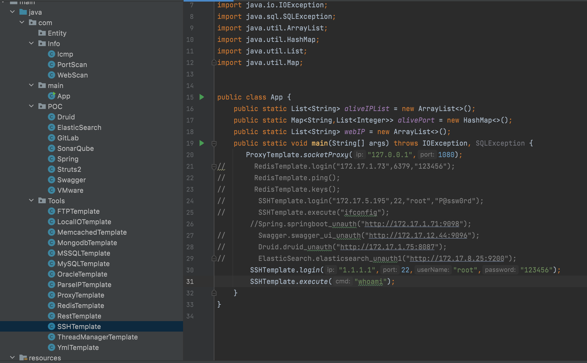

> 渗透的本质是信息收集，攻防的体系是知识点的串联。
> 人是解决渗透难题的，并非需要把时间花费到基础漏洞上

- [ATT&CK](https://attack.mitre.org/)
  
- [杀伤链](https://www.lockheedmartin.com/en-us/capabilities/cyber/cyber-kill-chain.html)
## 打点的艺术
### 对靶标的分析
在HW当中，获取到的目标存在多种行业，对不同的靶标存在不同的打法，通常分为两个方向
- 机关单位
- 集团公司
二者的区别：资产的散落程度
- 地级市的机关单位通常将网站托管在政务云，大数据通等，通常两三个C段部署着当地者大量的机关单位网站集群
- 集团公司等靶标应当采取”老式“的打点方式

### 工具的使用
#### 机关单位
对于机关单位的打法，因为其资产通常散落在多个大的C段当中，所以首要的目标C段权重的寻找，切入点应该选择手中的靶标为机关单位的目标，以此为打点
- [棱眼](https://github.com/EdgeSecurityTeam/Eeyes)：https://github.com/EdgeSecurityTeam/Eeyes
```JavaScript
baidu.com ---> 找子域名（fofa：domain=baidu.com, 去掉cdn） --> 子域名解析ip --> ip做c段处理
```
对目标的子段对应IP进行C段权重的判断
- 棱洞
```bash
EHole -f 110.0.242.68.1/24
本质还是fofa ip=
```
#### 集团打法
对于集团打法还是常用手法，oneforall/百分百控股/目录等
1. 常用手法对目标框架的了解是前提
	- 如React、Vue、AngularJS的xss的问题？jquery // vue{{var}} 、v-html=var（配置不对可能存在xss）
	- Sprintboot不解析jsp🐎的问题？文件上传漏洞❌（tomcat-jsper）
	- Java应用的SQL注入应不应该打的问题？后端数据库 
		- mysql --> 写文件 root 绝对路径 udf提权（几率很小）
		- c# mssql oracle 写文件 root 绝对路径 udf提权（几率很小）
	- fofa的资产打开404真的是关站了嘛？扫端口
	- 对目标技术栈springboot分布式 ，k8s云新架构的入手问题（软柿子捏的问题），框架的演变史讲解
	- php/asp/aspx (一定有sql注入/rce)--> jp/servlet --> ssh hiberna,spring,struts2 --> ssm mybatls,spring,springmvc --> springboot ssm 约定大于配置 --> 前后端分离 json ajax 前端和后端分开来部署 --> springcloud 分布式

>人是解决渗透难题的，并非需要把时间花费到基础漏洞上（与扫描的艺术大相径庭，只是内外网的区分）

2. Goby和xray结合往往效果显著，`EZ`
>HW前通常会准备七八台云服务器，部署Xray和Goby(分布式版本)，将信息收集到的资产经过Goby的全端口扫描之后导出Web服务转入xray和Rad的批量扫描，例如机关单位的几个C段进行Goby全端口扫描

- [Goby](https://gobies.org/)
- [EZ](https://github.com/m-sec-org/EZ)
- [Xray](https://github.com/chaitin/xray)

3. 资产的整理
渗透的本质是信息收集，汇总到xlsx当中
  


## 上线的艺术
> 打点之后，判断其出网性是首要工作

### 到底该不该上线
> MSF和CS都是及其出色的后渗透工具，但是面对这种复杂多样的环境，上不上线是个我们要去认真考虑的问题，CS和MSF究竟能给我们后渗透带来什么东西？（打点后是否都应该上线cs和msf呢？特征明显容易被告警）

- 只要不钓鱼 尽量不用cs
- webshell能搞定的就用webshell
- 或者能上机器搞就上机器

假设目标不出网的情况，TCP不出网，DNS不出网，ICMP不出网，出口端口限制，对应这种种场合，Github上给了我们很多优秀项目的选择，但是是我们真的需要的嘛？
- 例如DNS的CS上线，它可以帮助DNS隧道使我们上线CS，但是真正在实战中使用过就会发现，慢是他的一个很重要的一个弊端。一个抓取当前主机的密码我甚至需要等待两分钟。这个弊端甚至让我可以放弃使用它。
- 或许这样的上线也毫无意义，上线之后CS或者MSF给我们带来的东西不上线是否可以？在某些场景下，浪费很大的时间去上线cs这或许不值得。
- 上线还需要免杀，不上线还可以借助webshell天然的免杀优势。当然，说这些是当我们在上线遇到无法阻碍的困难时应该考虑的，毫无疑问的是C2带来的利大于弊。


### 工具的使用
  
借助冰蝎本身的上线特性，其采用内存动态代理注入的形式进行上线，本身可以过掉不具备内存查杀的杀软给我们的上线犹如神助，且支持目标不出网的形式上线。(拖死进程)

当然，我们也可以使用我们自己制作的EXE木马上传运行的方式，这种朴实无华的方式恰恰是最稳定的。

发现进程中存在向日葵，TV等进行抓取密码进行远程桌面，这是再轻松不过的方式。

上线的情况下，CS的socket4a隧道建立，MSF的socket5隧道的建立。或许socket4是CS的殇。

- [https://github.com/L-codes/Neo-reGeorg](https://github.com/L-codes/Neo-reGeorg) 这款工具让我们在不上线的情况下进行内网渗透
- 不用反向代理(要求出网，特征明显)

如果出了些意外我们还可以使用冰蝎的代理
  
通过端口映射的方式进行隧道代理，通过本地映射的方式进行隧道代理。这两种方式都为我们的后渗透提供了代理，但是稍微有点慢也是殇。

隧道对于我本人的经验来说，这几种就够了。他们的优缺点权重并非很极端，让我总能欣然接受。

#### 值得一提的是

值得一提的是，3389是永远的神。


因为在后渗透的过程中会牵扯很多工具，这些大规模工具的免杀是一件成本很高的事情。

如果3389对外开放，可以通过密码直接登录。

不对外开放时，走隧道内网进行3389连接。

如果版本高于2012密文解不开时，使用添加用户的api免杀进行用户添加，3389在当前桌面退出杀软，进行工具上传后渗透。

没有隧道，没有免杀api等情况下，可以进行中找到向日葵，TV进程连接。进程中没有，可在文件中找到运行然后连接。

都没有的情况下，可以尝试CS中的VNC的模块远程操控然后关闭杀软。


## 扫描的艺术
### 扫描的时间
随着内网安全设备的普及，各种行为都在日志捕捉在内展现给蓝方面前。至今好的绕过方法我还是没有找到，所以我们能做的就是去在蓝方下手，通常HW是24小时制，但是真正做到24小时制的或许只有金融行业。即使是半夜24小时制，夜晚的职守人员也会睡觉。所以，在生物学的角度考虑，傍晚的三四点是人困意最严重的时候，所以通常在此时进行内网大规模的扫描相对稳中求胜一点。

### 扫描前的事项

扫描是最容易丢失权限的方式，其对内网机器发送大量的探测包触发报警。所以在扫描前应当注意权限维持，通常在拿下机器之后，首先在web目录下写入多个webshell，包括冰蝎，哥斯拉，蚁剑等等。但是这种情况针对目标没有关闭web服务，所以通常我还会创建计划任务等等，探测目标杀软进程，免杀的计划任务添加方式。

当然，这或许还不是最保险的，如果其关闭当前服务器的情况下，将前功尽弃。所以，还会查看当前服务器的mstsc的登录记录，有时因为这种情况可能会获取到几台服务器权限做权限维持。然后当前机器关闭之后也无关痛痒。

对连通网段的收集往往意味着这个内网能拿下多少分，网段越多资产越多

```
常见的ipconfig查看通向网段
netstat -ano查看网段
route print查看网段
arp -a 查看网段
```

这些命令都可以查看网段，但是这些网段远远不够。我通常使用御剑的b段80端口判断存活，这种暴力破解在我看来是最能细致入微的。

也可以使用fscan直接/8 ，/16去过。

### 技巧扫描
在我看来，拿下其内网的机器可能不需要很多漏洞。在内网，或许更重要的是凭据，也叫密码。我们应该去搜集机器上的所有密码，榨干这台机器的价值。或许我们在当前机器搜集到的3389密码，xlsx文档中的信息，翻阅web服务中配置文件中的密码，浏览器的记录，这些都会在SSH，3389，3306等等 需要登录的应用中派上用场，而不仅仅依赖”弱口令”。


## 复现的艺术（写报告）

### 思考工具
我们应该去思考，当前我们使用的，以及市面上流传的工具仍然存在哪些不足，他缺少哪一部分？给我们的渗透还带来哪些阻力？怎么去解决。

fscan是一款很好的工具，集成的各种服务的弱口令爆破，公开漏洞POC的检测。

但是我在使用fscan的过程中发现以下弊端:

1. 当前内网的连通性，如扫描前注意的事项中提到，连通的网段其实决定着这个网段可以拿下的分数，个人认为fscan缺少一个对连通的网段的判断。(当然，我现在仍然想 不出一个除了爆破以外的技术来准确判断连通网段)

2. 缺少对漏洞的复现，不得不承认的是，fscan的poc大多数来源于xray，这种yml的方式不可为不精彩。他的准确率很高，这点我们都清楚，但是对红队而言不是要我们清楚，更应该是裁判清楚。我们不能将扫描结果截图写上报告，这无论是在报告篇幅上还是规范性上都不合理。所以接下来我们需要对应不同的漏洞使用不同的工具进行复现，Navicat，浏览器代理，SSH连接等等进行截图…..可是内网的殇是隧道及其卡顿，这些工具发了多少“多余”的包……..

### 先使用，在构思，然后超越
一个红队和一个安服的区别我认为在于 是否动手，同样在使用一款工具的时候，不管是红队还是安服，我认为都会去思考，这个工具不方便的地方在哪里，好用的地方在哪里。但是我认为一个专业的红队应该是在思考完这个工具的弊端之后想方设法去弥补 ，而安服却截然相反。这是一个落地的过程。

所以针对上文提出的第二点，我对一些fscan中需要进行验证的漏洞写了一个框架

如我们需要复现SSH的弱口令，写一款SSH认证的类，和命令执行的代码。
  
  
然后调用此模块，执行whoami命令得到结果然后截图。做到的最小的发包量…..

又例如redis，mysql等等
